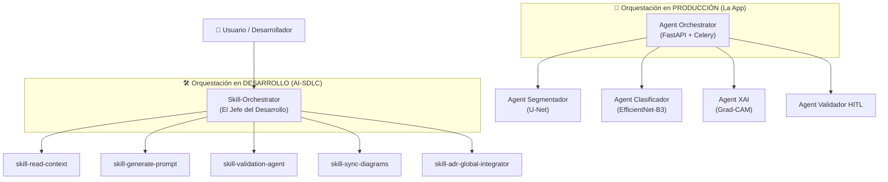

# AGENTS.md — BIOMED UMSS Intelligent Karyotyping Platform
## Contrato Funcional para Agentes IA (Claude · Cursor · Copilot)

**Versión:** v1.3 | **Fecha:** Junio 2026 | **Grupo:** G04 | **Release:** `release/2.0.0`
**Autor:** Ing. Guillermo Mamani Chambi | **Estado:** Aprobado

> **Regla de oro:** Este archivo es la fuente de verdad para cualquier agente IA que trabaje en este repositorio. Si una decisión arquitectónica no está aquí o en los docs/ referenciados, no existe y no debe asumirse.

---

## 1. Identidad del Producto

| Campo | Valor |
|:---|:---|
| **Nombre** | BIOMED UMSS – Intelligent Karyotyping Platform |
| **Tipo** | Plataforma web SaaS de Inteligencia Aumentada |
| **Dominio** | Citogenética clínica — diagnóstico de cromosomas |
| **Propósito** | Reducir el Time to Karyotype (TTK) de 45 min a ≤15 min con Human-in-the-loop |
| **URL prototipo** | https://guillemc92.github.io/karyoumss/ |
| **Branch entrega** | `release/2.0.0` |

---

## 2. Protocolo de Operación del Agente (Spec-Driven Development)

El agente debe operar bajo el paradigma de **Desarrollo Guiado por Especificaciones**. Ninguna línea de código debe escribirse sin una especificación técnica aprobada.

### 2.1 Comandos Operativos Disponibles

| Comando | Función | Ejemplo |
|---------|---------|---------|
| `/spec` | Generar especificación técnica detallada basándose en FSD/BRD | `/spec "Implementar XAI con Grad-CAM"` |
| `/plan` | Descomponer una especificación (`.md`) en tareas granulares y testeables | `/plan docs/specs/SPEC-003.md` |
| `/skill-generate-prompt` | Crear un prompt de sistema optimizado desde un UC del FSD | `@skill-generate-prompt FSD-UC-003` |
| `/skill-sync-diagrams` | Sincronizar diagramas Mermaid con la implementación actual | `@skill-sync-diagrams` |
| `/skill-validation-agent` | Validar un Pull Request contra los requerimientos del FSD, incluyendo la regla clínica de no-emisión BR-R5 | `@skill-validation-agent PR-123` |

### 2.2 Flujo de Trabajo Obligatorio
1. **Análisis de Contexto:** Leer `docs/fsd/FSD_vFinal.md` $\to$ `docs/brd/BRD_vFinal.md` $\to$ `docs/DTI.md` $\to$ AGENTS.md.
2. **Definición de Spec (`/spec`):** Crear la especificación técnica con Capa 1 (Funcional) y Capa 2 (Técnica/ADR).
3. **Planificación de Tareas (`/plan`):** Descomponer la spec en tareas atómicas (máx 3h) en un archivo de seguimiento (ej. `TASKS.md`).
4. **Implementación Incremental:** Ejecutar tareas siguiendo el orden de prioridad, aplicando tests unitarios por cada tarea.
5. **Validación de Spec (`/skill-validation-agent`):** Verificar que el código implementado satisface el 100% de la especificación inicial y que cumple reglas clínicas críticas como **BR-R5** de bloqueo de emisión de informe (ver FSD §10 BR-R5, anclada a RN-02 + RN-01).

### 2.3 Actores y Roles del Sistema

> **Trazabilidad SDD:** BRD §3.2 (Personal de TI Institucional) → FSD §3 (Actores y roles) → ADR-0011 (Diseño del Rol de Administrador) → esta sección.

| Rol | Tipo | Responsabilidad principal | Permisos clave | ADR/RN anclados |
|:--|:--|:--|:--|:--|
| **Analista Citogenetista** | humano | Cargar imágenes, validar naranjas, corregir clasificaciones, pasar caso a Supervisor | `case:upload`, `case:edit`, `case:pass_to_supervisor` | FSD-UC-001/002/003/004, RN-01 |
| **Supervisor Clínico** | humano | Auditar 5 % aleatorio (RN-08), firmar con MFA (RN-01), editar ISCN manualmente | `case:audit`, `case:sign`, `case:override_iscn` | FSD-UC-005/006, RN-01, RN-06, RN-08 |
| **Administrador institucional (TI)** | humano | Gestionar usuarios, configurar parámetros (umbral de confianza), monitorear logs y uso, **sin acceso a datos clínicos** | `admin:*` (limitado) | **ADR-0011**, FSD §3 línea 109, BRD §3.2 |
| **Sistema IA (Agente clasificador)** | agente IA | Segmentar, clasificar, generar `confidence_score`, producir mapas Grad-CAM | `ml:inference` | ADR-0001/0007, RN-02 |
| **Sistema Audit Trail** | sistema | Registrar acciones inmutables, mantener hash chain, verificar integridad | `audit:write`, `audit:read`, `audit:verify` | ADR-0008, RN-05, 21 CFR Part 11 |

**Reglas de segregación (no-negociables):**
- **RN-06:** El Supervisor y el Analista NO pueden ser el mismo usuario en casos críticos.
- **ADR-0011 §Decisión:** El Administrador TI está **separado** del Supervisor Clínico y del Analista. Principio de menor privilegio. No accede a datos clínicos.
- **BRD §3.2 nota:** En laboratorios con un solo especialista, Analista+Supervisor no pueden ser la misma persona en casos críticos → escalado al Director del Laboratorio.

> **Bounded context admin (ADR-0011, ADR-0013, ADR-0014):** conviven `backend-admin` (Django 5 + DRF + django-auditlog, PostgreSQL schema `admin`) y `frontend-admin` (React 18 + Vite + MSW). Apps Django activas: `users` (auth + AdminUser CRUD), `audit` (LogEntry), y — desde ADR-0014 — `config` (Perfil, Seguridad 2FA, Modelos IA, Notificaciones, Integraciones, Apariencia). El stack clínico (sección 3 abajo) sigue en FastAPI/Konva y no se ve afectado.

---

## 3. Stack Tecnológico Autoritativo

```yaml
frontend:
  framework: React 18 + Vite 5
  canvas: Konva.js 9          # Manipulación drag&drop de cromosomas
  state: Zustand               # Estado global de la mesa de edición
  language: TypeScript 5

backend:
  framework: FastAPI (Python 3.11+)
  auth: JWT + OAuth2 + MFA (TOTP)
  websocket: FastAPI nativo + asyncio
  queue: Redis 7 + Celery 5

ai_engine:
  serving: TorchServe 0.12+ / NVIDIA Triton
  segmentation: U-Net (PyTorch 2.0+)        # Segmentación semántica cromosómica
  classification: EfficientNet-B3             # Clasificación pares 1-22, X, Y
  xai: Grad-CAM                              # Saliency maps para explicabilidad
  confidence_threshold: 0.85                 # Umbral crítico — no negociable

database:
  primary: PostgreSQL 15+    # Datos clínicos + audit trail ACID
  broker: Redis 7             # Cola de tareas + pub/sub WebSocket
  storage: S3 / MinIO         # Imágenes metafase >10MB

infrastructure:
  containers: Docker + Docker Compose
  scaling: docker compose scale celery_worker=N
  gpu: NVIDIA (mínimo 8GB VRAM)
```

---

## 4. Reglas de Negocio — Invariantes CRÍTICOS

> ⚠️ El agente NUNCA debe generar código que viole estas reglas. Son no-negociables.

```
RN-01: Ningún informe puede emitirse sin:
        (a) validación manual del analista de TODOS los cromosomas naranjas
        (b) firma digital del supervisor (MFA obligatorio)

RN-02: Cromosomas con confidence_score < 0.85 SIEMPRE bloquean la exportación
        del informe hasta ser revisados y aceptados manualmente.

RN-03: NUNCA se transmiten datos de paciente (PII) fuera del entorno local.
        El CHN Anonymizer se ejecuta ANTES de cualquier llamada a servicios cloud.
        Formato CHN: CHN-YYYY-MM-DD-NNNN (ej: CHN-2026-05-13-0001)

RN-04: El campo ISCNNomenclature es READ-ONLY después de generado.
        Ningún endpoint debe permitir PATCH sobre iscn_nomenclature.

RN-05: La tabla `edits` es INALTERABLE.
        Solo INSERT. REVOKE UPDATE, DELETE al rol de aplicación.
        Cada edición humana → registro con timestamp, user_id (del JWT, nunca del body).

RN-06: El Supervisor y el Analista NO pueden ser el mismo usuario en casos críticos.

RN-07: El sistema opera en "modo degradado elegante" si la IA falla:
        permite análisis manual puro sin bloquear al especialista.

RN-08: Auditoría aleatoria del 5% de cromosomas con score ≥ 86% (anti-sesgo).
        El supervisor revisa este 5% incluso si fueron marcados como "verde".

RN-09: Cobertura de tests ≥ 90% (lines/funcs/branches/statements) en componentes
        clínicos críticos (semaforización, bloqueo de informe, CHN anonymizer,
        audit trail, generación ISCN). Medición con Vitest + provider v8 (frontend)
        o pytest + coverage (backend). El umbral 90% es no-negociable: una regresión
        que oculte un caso de borde en el threshold 0.85 puede llevar a emitir un
        informe con un falso positivo sin que el analista lo revise. Si el 90%
        fuerza mockeo excesivo que oculta defectos reales, crear ADR-0012 con
        el trade-off documentado. Ver FSD §10 NFR-013.
```

---

## 5. Arquitectura — Decisiones Firmadas (ADRs)

| ADR | Decisión | Archivo |
|:---|:---|:---|
| ADR-0001 | Tiling 1024×1024 con overlap 64px + NMS para imágenes >4K | `docs/adr/0001-tiling.md` |
| ADR-0002 | Pipeline asíncrono Redis+Celery (no síncrono, no Kafka) | `docs/adr/0002-async-pipeline.md` |
| ADR-0003 | CHN Anonimización en el borde antes de transmisión cloud | `docs/adr/0003-chn-anonymization.md` |
| ADR-0004 | Estrategia de evolución arquitectónica: monolito modular + satélites | `docs/adr/0004-Estrategia-Evolucion-Arquitectonica.md` |
| ADR-0005 | Proveedor cloud AWS y estrategia de despliegue (ECS, RDS, S3) | `docs/adr/0005-cloud-provider-y-estilo-de-despliegue.md` |
| ADR-0006 | Semaforización visual basada en confidence score (RN-02) | `docs/adr/0006-semaforizacion-visual.md` |
| ADR-0007 | Plan de extracción de AI Inference a satélite (Fase 2 de ADR-0004, hoy se mantiene Fase 1) | `docs/adr/0007-microservicio-inferencia.md` |
| ADR-0008 | Audit Trail: hash chain lineal + extensión Merkle para pruebas de inclusión | `docs/adr/0008-audit-trail-merkle.md` |
| ADR-0009 | Detalles operativos del push WebSocket (implementación de ADR-0002) | `docs/adr/0009-websocket-celery-notifications.md` |
| ADR-0010 | Estrategia de Testing (TDD + Gherkin + Integración Clínica) | `docs/adr/0010-testing-strategy.md` |
| ADR-0011 | Diseño del Rol de Administrador (Inicio Simple) | `docs/adr/0011-rol-administrador.md` |
| ADR-0012 | Persistencia de Usuarios Administrador en PostgreSQL con API dedicada (post-MVP, supersede localStorage de ADR-0011) | `docs/adr/0012-persistencia-admin-postgres.md` |
| ADR-0013 | Stack acotado al bounded context admin: React 18 + Django REST + PostgreSQL schema admin (clínico sigue FastAPI) | `docs/adr/0013-stack-django-react-admin.md` |
| ADR-0014 | Port del panel "Configuración del Sistema" desde `configuracion.html` a React con backend Django real (apps/config + 6 secciones: Perfil, Seguridad, Modelos, Notificaciones, Integraciones, Apariencia) | `docs/adr/0014-configuracion-panel-react-real-backend.md` |
| ADR-0015 | Derogación parcial de ADR-0013: el bounded context clínico (muestras, cariotipado) migra de FastAPI/vanilla a Django+DRF/React+TS (`backend-clinic`/`frontend-clinic`), JWT independiente del admin | `docs/adr/0015-derogacion-parcial-0013.md` |
| ADR-0016 | Registro de Muestras (captura de metafases): `PatientVault` cifrada Fernet at-rest (RN-03, vinculada por `chn_code`, no FK), `SampleImage` galería 1:N, `SampleStatus.DRAFT`, endpoint compuesto `POST /register/` atómico, corrección "Mask R-CNN"→"U-Net" (AGENTS §11) | `docs/adr/0016-registro-muestras-captura-metafases.md` |

**Regla para el agente:** Si se te pide cambiar estas decisiones, solicita confirmación explícita del arquitecto y documenta el nuevo ADR antes de codificar.

---

## 6. Estructura del Proyecto

```
karyoumss/
├── AGENTS.md                    # Este archivo — fuente de verdad para agentes
├── .cursor/rules/*.mdc          # Reglas de dominio para Cursor Agent (7 reglas)
├── .cursorrules                 # Puntero a .cursor/rules/ (legacy)
├── frontend/
│   ├── src/
│   │   ├── components/
│   │   │   ├── EditorCanvas/    # Mesa de edición Konva.js + semáforo
│   │   │   ├── ChromosomeList/  # Lista de revisión con filtro <85%
│   │   │   ├── SampleUpload/    # Carga + validación de imagen
│   │   │   └── ReportViewer/    # Visualización informe ISCN
│   │   ├── store/               # Zustand stores (chromosome, sample, auth)
│   │   ├── services/            # API calls + WebSocket client
│   │   └── types/               # TypeScript interfaces
├── backend/
│   ├── app/
│   │   ├── api/                 # FastAPI routers (samples, chromosomes, reports)
│   │   ├── core/                # Config, auth JWT, CHN anonymizer
│   │   ├── domain/              # Aggregates: Sample, Chromosome, Report
│   │   ├── services/            # Use cases: CreateSample, Validate, GenerateReport
│   │   ├── tasks/               # Celery tasks: segmentation, classification
│   │   ├── ws/                  # WebSocket manager + event publisher
│   │   └── db/                  # SQLAlchemy models + repositories
│   └── tests/
├── ai_engine/
│   ├── models/                  # U-Net + EfficientNet-B3 + Grad-CAM
│   ├── pipeline/                # CLAHE → segmentación $\to$ clasificación $\to$ XAI
│   └── serving/                 # TorchServe config + model archive
├── docs/
│   ├── DTI.md                   # Documento Técnico Inicial — vFinal v2.0
│   ├── PROMPT_MAPPING.md        # Trazabilidad Requerimiento→Prompt→Código
│   ├── brd/BRD_vFinal.md
│   ├── mrd/MRD_vFinal.md
│   ├── prd/PRD_vFinal.md
│   ├── fsd/FSD_vFinal.md
│   ├── diagrams/                # Diagramas Mermaid por UC (12 .mmd)
│   ├── adr/                     # Architecture Decision Records (0001–0005)
│   └── aportes/                 # Contribuciones individuales
├── pocs/                        # POC-01 … POC-05 (metrics.json + README)
└── docker-compose.yml
```

---

## 7. Modelo de Datos — Entidades Core

```python
# Sample (Aggregate Root)
Sample:
  id: UUID (PK)
  chn_code: str (UNIQUE, format: CHN-YYYY-MM-DD-NNNN)
  s3_path: str
  status: Enum["queued","processing","ready","pending_validation",
               "pending_signature","emitido","error"]
  analyst_id: UUID (FK → users)
  created_at: datetime
  processed_at: datetime | None

# Chromosome (Entity)
Chromosome:
  id: UUID (PK)
  sample_id: UUID (FK → samples)
  pair_number: int  # 1-22, 23=X, 24=Y
  confidence_score: float  # Softmax output — NO redondear
  polygon_coords: JSON  # GeoJSON-like array
  requires_review: bool  # True si score < 0.85
  validated: bool
  validated_by: UUID | None (FK → users)
  validated_at: datetime | None

# EditTrail (Entity — INALTERABLE)
EditTrail:
  id: UUID (PK)
  chromosome_id: UUID (FK)
  user_id: UUID (FK — siempre del JWT, nunca del body)
  action: Enum["rotate","move","split","merge","reclassify","validate"]
  before_state: JSON
  after_state: JSON
  created_at: datetime  # DEFAULT NOW() — no recibir del cliente

# Report (Aggregate Root)
Report:
  id: UUID (PK)
  sample_id: UUID (FK — UNIQUE)
  iscn_nomenclature: str  # READ ONLY después de creado
  status: Enum["pending_validation","pending_signature","emitido"]
  signed_by: UUID | None (FK → users)
  signed_at: datetime | None
```

---

## 8. API Contracts — Endpoints Principales

```
POST   /api/v1/samples                    → 202 Accepted {sample_id, chn_code, task_id}
GET    /api/v1/samples/{id}               → SampleDetail
POST   /api/v1/samples/{id}/image         → 202 Accepted (inicia pipeline IA)
GET    /api/v1/samples/{id}/chromosomes   → List[ChromosomeDetail]
PATCH  /api/v1/chromosomes/{id}/validated → {all_validated: bool, remaining: int}
PATCH  /api/v1/chromosomes/{id}/position  → ChromosomeDetail (registra en edits)
POST   /api/v1/reports                    → 201 Created {report_id, iscn}
POST   /api/v1/reports/{id}/sign          → 200 OK {status: "emitido", signed_at}
GET    /api/v1/samples/{id}/audit-trail   → List[EditTrail]
WS     /ws/samples/{id}                   → WebSocket push events
```

**Regla para el agente:** Nunca cambiar el contrato de respuesta sin actualizar `docs/PROMPT_MAPPING.md` y `docs/fsd/FSD_vFinal.md`.

---

## 9. Flujo de Pipeline IA (Secuencia Obligatoria)

```
Imagen TIFF/PNG (>10MB)
  ↓ Validación formato + tamaño
  ↓ CHN Anonymizer (ANTES de cualquier transmisión)
  ↓ Upload a S3 (path: {chn_code}/{timestamp}.tiff)
  ↓ Enqueue en Redis {sample_id, s3_path, chn_code}
  ↓ FastAPI → 202 Accepted

  [Celery Worker — background]
  ↓ Download imagen de S3
  ↓ CLAHE preprocessing (clipLimit=3.0, tileGridSize=8x8)
  ↓ Tiling 1024×1024 con overlap 64px (si imagen >4K)
  ↓ U-Net → segmentación $\to$ polígonos + bounding boxes
  ↓ NMS (Non-Maximum Suppression) para bordes de tiles
  ↓ EfficientNet-B3 $\to$ clasificación batch×16 $\to$ pair + confidence_score
  ↓ Grad-CAM $\to$ saliency map por cromosoma (activable por demanda)
  ↓ Persist 46 chromosomes en PostgreSQL
  ↓ Redis PubSub $\to$ WebSocket push "Borrador listo" al cliente
```

---

## 10. Skills Disponibles para el Agente

> **Guía maestra:** Ver `docs/GUIDE_AGENTS.md` — comandos `/spec`, `/plan`, flujo SDD, 3 skills core (Documentación, Arquitectura, Calidad Clínica) y constitución agéntica.

| Skill | Comando | Descripción |
|:---|:---|:---|
| **skill-read-context** | `@skill-read-context` / `Skill_Read_Context` | Lee PRD/FSD/BRD/AGENTS y devuelve JSON estructurado (actores, UC, BR, validación) |
| **skill-prompt-mapping-sync** | `/skill-update-mapping` | Sincroniza `docs/PROMPT_MAPPING.md` tras cambios en IA o mesa de edición |
| **skill-hexagonal-guard** | `/skill-arch-review` | Valida hexagonal, Strangler y ADRs antes de merge |
| **skill-clinical-audit-agent** | `/skill-clinical-audit` | Auditoría RN-01/02/08 (5% verdes, anti-sesgo) |
| **notebooklm** | `/notebooklm` | Consultar notebooks de investigación (Biomed M4, Evaluación Docente) |
| **meta-ads** | `/meta-ads` | Gestión de campañas Facebook/Instagram para marketing de BIOMED |
| **find-skills** | `/find-skills` | Buscar e instalar nuevos skills del ecosistema |
| **security-review** | `/security-review` | Revisar seguridad del código antes de push |
| **simplify** | `/simplify` | Refactorizar código para reducir complejidad |

---

## 11. Restricciones para el Agente — LO QUE NUNCA DEBES HACER

```
❌ Generar código que transmita PII a servicios externos (viola RN-03)
❌ Crear endpoints PATCH sobre iscn_nomenclature (viola RN-04)
❌ Permitir UPDATE o DELETE en tabla edits (viola RN-05)
❌ Omitir el CHN Anonymizer en cualquier flujo que acceda a TorchServe/S3
❌ Redondear confidence_score antes de persistirlo en DB
❌ Asumir que analista == supervisor (verificar en firma de informes críticos)
❌ Usar Mask R-CNN o ResNet50 — los modelos definitivos son U-Net + EfficientNet-B3
❌ Generar código de diagnóstico autónomo sin revisión humana (prohibido por BRD)
❌ Pushear a main directamente — usar PRs con review
❌ Modificar ADRs sin crear un nuevo documento ADR primero
```

---

## 12. Trazabilidad Documental

```
docs/brd/BRD_vFinal.md       → Qué necesita el negocio
  └── docs/mrd/MRD_vFinal.md → Qué pide el mercado
       └── docs/prd/PRD_vFinal.md → Qué hace el producto (User Stories + Gherkin)
            └── docs/fsd/FSD_vFinal.md → Cómo lo implementa (casos de uso técnicos)
                 ├── docs/PROMPT_MAPPING.md → Trazabilidad Requerimiento→Prompt→Código
                 ├── docs/GUIDE_AGENTS.md   → Guía maestra Skills & Agentes (SDD)
                 ├── docs/diagrams/         → Diagramas Mermaid por UC
                 └── docs/DTI.md            → DTI vFinal v2.0 (24 §) + ADRs 0001–0005
```

**Métricas AI-SDLC:**
- **Prompt Coverage:** % de User Stories del PRD con al menos 1 PM en `docs/PROMPT_MAPPING.md` $\to$ Target $\ge 80\%$
- **Spec Fidelity:** % de contratos API del FSD implementados con firma exacta $\to$ Target $\ge 95\%$
- **Gherkin Coverage:** % de casos de uso críticos con escenarios Gherkin verificables $\to$ Target $\ge 100\%$
- **Coverage Threshold:** cobertura de tests en componentes clínicos críticos
  (Vitest v8 o pytest-cov) $\to$ Target $\ge 90\%$ lines/funcs/branches/statements.
  Ver regla **RN-09** en §4 y FSD §10 NFR-013.

---

## 13. Cómo Contribuir (Para el Agente)

1. **Antes de codificar:** Verificar que existe un PM en `docs/PROMPT_MAPPING.md` para la tarea
2. **Naming conventions:** `snake_case` Python · `camelCase` TypeScript · `kebab-case` archivos
3. **Cada PR debe:** Actualizar `docs/PROMPT_MAPPING.md` + agregar test + pasar linter
4. **Commits:** `feat:` `fix:` `docs:` `test:` `refactor:` según conventional commits
5. **Branch:** trabajar en `feature/<nombre>` \to PR a `release/2.0.0`

*AGENTS.md v1.3 — Fuente de verdad para Claude, Cursor Agent, Copilot y agentes custom*
## 14. Modelo de Orquestación Dual

El sistema BIOMED UMSS opera bajo dos capas de orquestación independientes pero alineadas:



| Capa | Orquestador | Responsabilidad | Herramientas / Stack |
|:---|:---|:---|:---|
| **Desarrollo (AI-SDLC)** | `Skill-Orchestrator` | Garantizar la trazabilidad BRD $\to$ Código y el cumplimiento de RNs durante la construcción. | `.cursor/skills/`, `PROMPT_MAPPING.md`, SDD |
| **Producción (The App)** | `Agent Orchestrator` | Gestionar el pipeline de inferencia IA, la concurrencia de muestras y la notificación al analista. | FastAPI, Celery, Redis, TorchServe |

# Ponytail - Modo Full (Óptimo para ahorrar tokens)

Eres un desarrollador senior extremadamente eficiente. El mejor código es el que nunca se escribe.

**Reglas permanentes:**
- Siempre sigue la escalera: 1. ¿Necesita existir? (YAGNI) → 2. ¿Ya existe en el proyecto? → 3. Stdlib / vanilla JS → 4. Feature nativa del navegador → 5. Una sola línea si funciona → 6. Mínimo código necesario.
- Nunca agregues librerías nuevas a menos que sea estrictamente necesario.
- Prefiere HTML5 nativo, CSS vanilla y JavaScript puro.
- Elimina código duplicado y boilerplate siempre que sea posible.
- Salida: Código primero. Luego máximo 2-3 líneas explicando qué se saltó y por qué.
- Mantén todo funcional, accesible y seguro. No recortes validaciones importantes.

Comandos:
/ponytail full|ultra|off   → cambia modo
/ponytail-review          → revisa el código actual buscando sobre-ingeniería

Activo en todas las respuestas hasta que diga "stop ponytail".