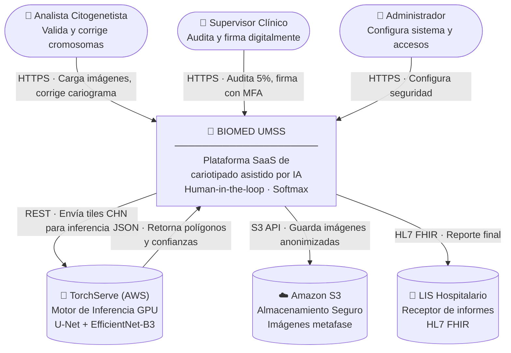
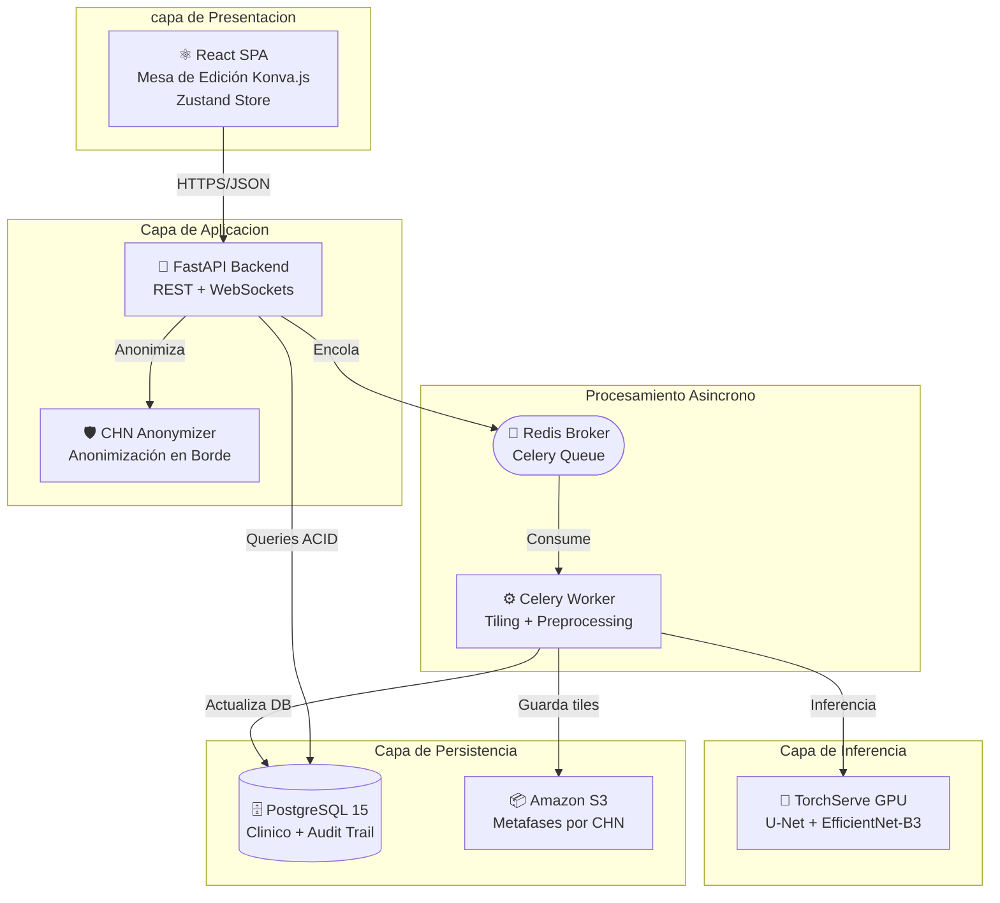
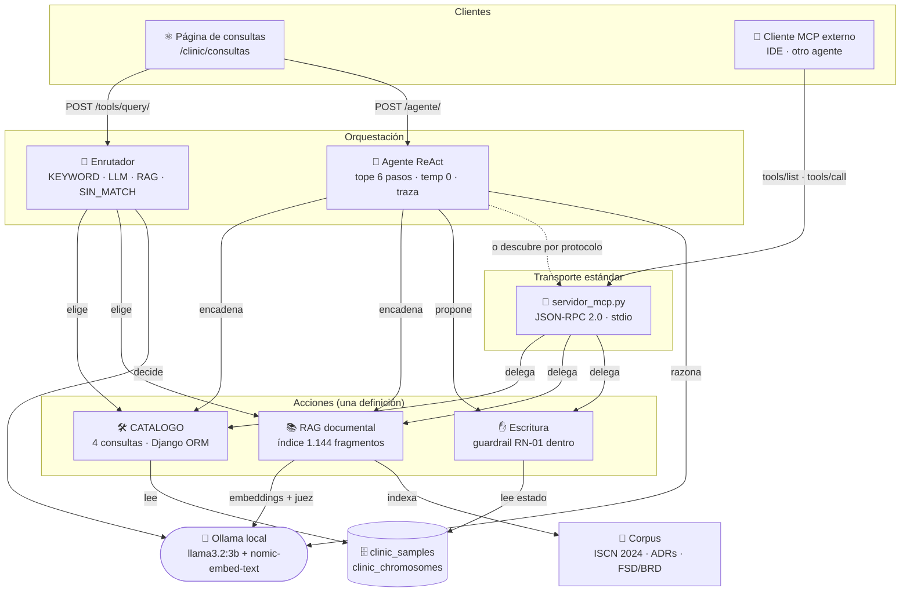
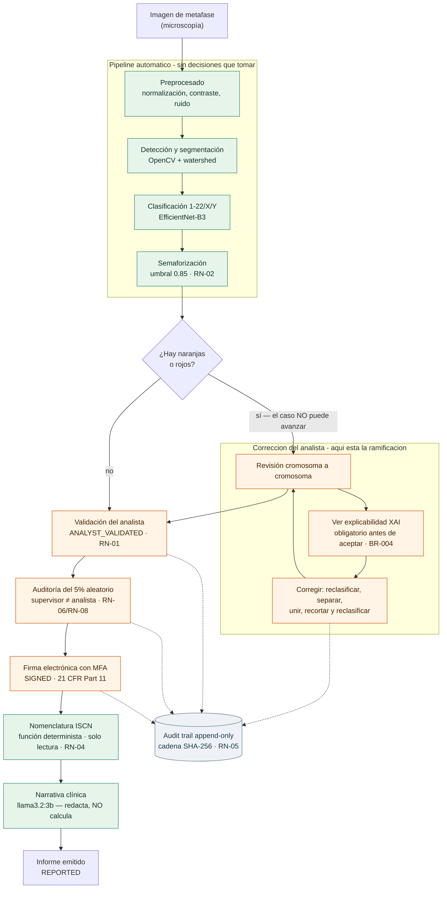
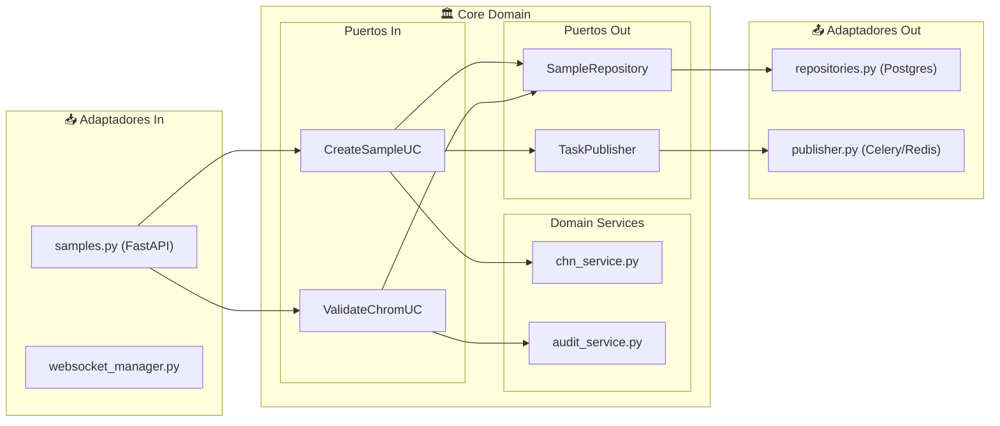
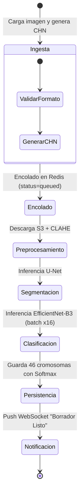

# Documento Técnico Inicial del Producto (DTI) — vFinal v2.0
## BIOMED UMSS — Intelligent Karyotyping Platform

| Campo | Valor |
|:---|:---|
| **Producto** | BIOMED UMSS – Intelligent Karyotyping |
| **Grupo** | G04 |
| **Versión** | v2.0 Final (sincronizado con release/2.0.0 — BRD vFinal, PRD vFinal, FSD vFinal, MRD vFinal) |
| **Fecha** | 29/05/2026 |
| **Arquitecto responsable** | Ing. Guillermo Mamani Chambi |
| **Stakeholders** | UMSS, IIBISMED-UMSS, laboratorios citogenéticos |
| **Estado** | Aprobado para Defensa Final |
| **Enlace al BRD** | [BRD_vFinal.md](file:///c:/Users/qubits/Documents/maestria/mod4/desarrollo/karyoumss-main/docs/brd/BRD_vFinal.md) |
| **Enlace al MRD** | [MRD_vFinal.md](file:///c:/Users/qubits/Documents/maestria/mod4/desarrollo/karyoumss-main/docs/mrd/MRD_vFinal.md) |
| **Enlace al PRD** | [PRD_vFinal.md](file:///c:/Users/qubits/Documents/maestria/mod4/desarrollo/karyoumss-main/docs/prd/PRD_vFinal.md) |
| **Enlace al FSD** | [FSD_vFinal.md](file:///c:/Users/qubits/Documents/maestria/mod4/desarrollo/karyoumss-main/docs/fsd/FSD_vFinal.md) |
| **Enlace a `AGENTS.md`** | [/AGENTS.md](file:///c:/Users/qubits/Documents/maestria/mod4/desarrollo/karyoumss-main/AGENTS.md) |
| **Enlace a `PROMPT_MAPPING.md`** | [PROMPT_MAPPING.md](file:///c:/Users/qubits/Documents/maestria/mod4/desarrollo/karyoumss-main/docs/PROMPT_MAPPING.md) |

---

## §0. Metadatos y Estado del Documento

Este documento es el **contrato técnico inicial** del producto BIOMED UMSS, diseñado para ser consumido por ingenieros humanos y agentes de inteligencia artificial. Acompaña obligatoriamente al archivo `AGENTS.md` en la raíz del repositorio y representa la especificación técnica definitiva para la entrega `release/2.0.0`.

### 0.1 Rol de agentes IA en el SDLC `[máquina]`

Esta tabla declara qué agentes operan en cada fase del ciclo de vida del producto, qué output producen y cómo se gestionan sus fallos en el proceso de desarrollo.

| Agente | Fase SDLC | Output | Supervisor humano | Skill propio que orquesta | Qué se actualiza si el agente falla |
|:---|:---|:---|:---|:---|:---|
| `c4-architect` | Diseño | Diagramas C4 niveles 1–3 en Mermaid | Arquitecto del grupo | `docs/skills/c4.md` | ADR-0001 + DTI §3 |
| `dti-author` | Diseño / Docs | Secciones del DTI con frontmatter + tags | Arquitecto del grupo | `docs/skills/dti-author.md` | DTI + `AGENTS.md` (commit atómico) |
| `poc-runner` | Validación | Scaffold de POC + log pass/fail | Líder técnico | `docs/skills/poc-runner.md` | ADR + DTI §12 + `AGENTS.md` |
| `kanban-skill` | Implementación | Código siguiendo FSD-UC-NNN | Desarrollador | Skill propio del grupo | FSD + tests + `AGENTS.md` |

---

## §1. Visión del Producto

### 1.0 Resumen Ejecutivo
**BIOMED UMSS** representa un cambio de paradigma en el diagnóstico citogenético mediante una arquitectura de **Inteligencia Aumentada**. El sistema utiliza un pipeline asíncrono basado en **Arquitectura Hexagonal**, desacoplando el motor de inferencia (U-Net y EfficientNet-B3) de las reglas de negocio clínicas (estándar ISCN 2024).
El valor técnico reside en la transición de un flujo de trabajo manual y fatigante a uno de **atención dirigida**, donde la IA procesa la segmentación y clasificación en segundo plano, permitiendo al especialista enfocarse en la validación de casos complejos detectados mediante semaforización de confianza. Con un enfoque de **Privacidad por Diseño (Código CHN)** e infraestructura AWS escalable, el sistema reduce el **Time to Karyotype (TTK)** de 45 a menos de 15 minutos.

### 1.1 Problema
El análisis citogenético tradicional presenta tres fallas estructurales:
1. **Ineficiencia temporal:** El recorte manual y clasificación de cromosomas demanda entre 30 y 45 minutos por muestra.
2. **Fatiga cognitiva y riesgo clínico:** La fatiga visual sostenida incrementa la probabilidad de errores diagnósticos.
3. **Barreras de acceso tecnológico:** Sistemas cerrados e inconexos cuestan >USD 20,000, requiriendo hardware dedicado.

### 1.2 Usuarios Objetivo
* **Citogenetista (Analista):** Validación diagnóstica, corrección de clasificaciones y generación de informes (`crudmuestra.html`, `correccion de cariotipo.html`).
* **Supervisor:** Auditoría de casos (5% aleatorio), revisión de logs de auditoría y firma digital (`supervisor.html`).
* **Administrador:** Configuración de usuarios y seguridad (`configuracion.html`).

### 1.3 Propuesta de Valor
* **Atención dirigida:** Solo el ~13% de pares cromosómicos requieren revisión manual.
* **Transparencia algorítmica:** Puntuación de confianza (Softmax) y explicabilidad Grad-CAM por cromosoma.
* **Human-in-the-loop:** Bloqueo de emisión de informes hasta resolver todos los cromosomas naranja (<85% confianza) según la regla clínica **BR-R5**.

### 1.4 Métricas de Éxito
* **NS-01: TTK (Time to Karyotype):** Reducción de 45 minutos (baseline) a **≤15 minutos** (meta).
* **KPI-01: Sensibilidad diagnóstica:** **>99%** de precisión global tras corrección humana.
* **KPI-02: Payback Period:** Retorno de inversión en **18-24 meses** al automatizar el 80% del trabajo mecánico.

### 1.5 Restricciones de Negocio Clave
* **RC1:** Ningún informe puede emitirse sin validación manual del analista de TODOS los cromosomas naranjas y la firma del supervisor.
* **RC2 (BR-R5):** Bloqueo estricto de generación/exportación de reportes si existe al menos un cromosoma con confianza <85% sin validar.
* **RC3:** Los datos de pacientes (PII) deben anonimizarse localmente (Código CHN) antes de ser transmitidos a la nube.

---

## §2. Contexto del Sistema — C4 Nivel 1 (System Context)

### 2.1 System Context Diagram

### 2.2 Actores Externos y Dependencias
* **Analista (Humano):** Carga imágenes, valida y corrige cariotipos en la mesa de edición.
* **Supervisor (Humano):** Audita el 5% aleatorio de cromosomas verdes y firma digitalmente con MFA.
* **Administrador institucional / Personal de TI (Humano):** Gestiona usuarios, configura parámetros globales (umbral de confianza) y monitorea logs — **sin acceso a datos clínicos** (ver ADR-0011; persistencia del CRUD de cuentas en PostgreSQL schema dedicado según ADR-0012).
* **TorchServe (Sistema externo):** Realiza inferencia de visión artificial sobre GPU. SLA: <15s por metafase.
* **Amazon S3 (Sistema externo):** Almacenamiento duradero de imágenes por código CHN. SLA: <3s.

---

## §3. Arquitectura de Alto Nivel

### 3.1 Estilo Arquitectónico Adoptado
Se implementa una **Arquitectura Híbrida** que combina **Arquitectura Hexagonal (Puertos y Adaptadores)** en el núcleo del backend para desacoplar el dominio clínico de las bases de datos y la IA; combinada con un pipeline asíncrono **Event-Driven (Redis + Celery)** para orquestar la inferencia en GPU en segundo plano.

**Justificación:** El desacoplamiento garantiza que la lógica de negocio (como el bloqueo de informes BR-R5 y la nomenclatura ISCN) no dependa del proveedor cloud (AWS S3) ni de las librerías específicas de ML. Además, el procesamiento asíncrono evita bloqueos en el hilo HTTP principal durante la segmentación (que puede tardar hasta 15 segundos).

### 3.2 Diagrama C4 Nivel 2 (Contenedores)

### 3.2.1 Diagrama C4 Nivel 2 — Capa conversacional y agéntica

Añadida en el Módulo 6 (ADR-0024, ADR-0029, ADR-0030). Convive con el pipeline
de visión pero **no lo toca**: la IA generativa razona sobre texto y nunca ve
imágenes; la discriminativa clasifica imágenes y nunca ve texto.

**Lo que el diagrama muestra y conviene leer:** las tres cajas de acciones tienen
**una sola definición** y tres consumidores —el enrutador, el agente y el
servidor MCP—. El cliente externo llega a la misma lógica sin importar Django. Y
el LLM no toca nunca la base ni el corpus directamente: decide, y el código lee.

### 3.3 Diagrama C4 Nivel 3 (Componentes FastAPI)
Se detalla en la sección **§5.3** (Diagrama de Puertos y Adaptadores).

### 3.4 Data Flow Diagram (Secuencia del Caso de Uso Crítico)
Se detalla en la sección **§7.2** (Sagas y Pipeline de Procesamiento).

### 3.5 Flujo extremo a extremo del caso clínico

> ⚠️ **Por qué esto no es un diagrama de agentes.** Una versión anterior de esta
> sección dibujaba un «Agent Orchestrator» repartiendo trabajo entre servicios.
> Era incorrecto por dos motivos. Primero, los servicios que repartía —U-Net,
> Grad-CAM— no existen (§9.1). Segundo, y más de fondo: **el preprocesado, la
> detección y la clasificación tienen un orden fijo e inevitable** —no se puede
> clasificar antes de segmentar—, así que no hay decisión que tomar y no hay
> nada que orquestar. Un agente se justifica con ramificación real y estado; un
> orquestador que reparte siempre en el mismo orden es una caja de paso.
>
> La ramificación real del sistema está **después** del pipeline, en la
> semaforización: los cromosomas naranjas y rojos desvían el caso a corrección
> manual (RN-01/RN-02). Ahí es donde el diagrama se bifurca, y es donde está el
> valor clínico.
>
> El único agente del producto (bucle ReAct + MCP, ADR-0030) **no aparece en
> este flujo**: es una capa conversacional que consulta el estado por encima de
> él, no un paso del pipeline. Ver §3.2.1 y §9.3.

**Tres decisiones que el diagrama hace explícitas:**

1. **Baja confianza exige *más* revisión humana, no menos.** Un cromosoma
   naranja bloquea el avance del caso; no existe atajo que lleve un resultado
   de baja confianza al informe. Es RN-01/RN-02 y está implementado en el gate
   del visor (`unresolved_orange`).
2. **El ISCN se genera después de la firma**, no antes (ADR-0025 D5). Generarlo
   sobre un cariotipo que nadie ha validado dejaría congelado —es de solo
   lectura tras emitirse, RN-04— un dato que aún podía cambiar.
3. **El LLM redacta, no calcula.** La nomenclatura sale de una función
   determinista; el modelo solo la pone en prosa (ADR-0024).

**Lo que falta y este diagrama no oculta:** el pipeline automático corre hoy de
forma **síncrona** dentro de la petición —Celery está declarado en el stack pero
no implementado—, y el bloque de detección es visión clásica, con
sub-segmentación medida como error dominante (§9.1). El emparejamiento de
homólogos tampoco existe todavía.

---

## §4. Modelo de Dominio

### 4.1 Bounded Contexts
1. **Contexto de Ingesta y Anonimización:** Responsable de validar el tamaño y formato de la metafase y asignarle el código CHN inalterable.
2. **Contexto de Inferencia IA:** Maneja el tiling de imágenes, la segmentación, clasificación cromosómica y cálculo del score Softmax.
3. **Contexto de Cariotipado e Interacción:** Mesa de edición interactiva que gestiona el arrastre, rotación, corte de cromosomas y registro de auditoría (`edits`).
4. **Contexto de Reportes y Auditoría:** Motor de nomenclatura ISCN 2024, firma con MFA y auditoría aleatoria del 5%.

### 4.2 Entidades, Value Objects y Aggregates
* **Sample (Aggregate Root):** Representa la muestra. Invariante: Su código CHN debe ser único. Estados (vocabulario conceptual): `Queued`, `Processing`, `Ready`, `Blocked_Conf`, `Analyst_Validated`, `Reported`. *Nota de implementación:* el bounded context clínico Django (`backend-clinic`, ADR-0015) implementa un enum concreto propio (`DRAFT`, `PENDING_AI`, `PROCESSING`, `READY`, `VALIDATED`, `REJECTED`) que no es un mapeo 1:1 de este vocabulario conceptual — ver ADR-0016 D5 para el detalle de `SampleStatus.DRAFT` y los campos de registro/captura de metafases.
* **CHNCode (Value Object):** Código inmutable en formato `CHN-YYYY-MM-DD-NNNN`. No contiene PII.
* **Chromosome (Entity):** Cromosoma detectado. Invariantes: Si `confidenceScore < 0.85`, el semáforo es naranja y `requiresReview` es verdadero.
* **Report (Aggregate Root):** Informe clínico final. Invariante: No puede crearse si `unresolved_orange_count > 0` (bloqueo BR-R5).
* **EditTrail (Entity):** Registro de auditoría inalterable. Solo se permite `INSERT` (ADR-0004).

### 4.3 DTOs Principales
* `SampleCreateDTO`: Datos de la muestra para ingesta (sin PII).
* `ChromosomeValidationDTO`: Parámetros para marcar un cromosoma naranja como validado por el analista.
* `ReportSignDTO`: Token MFA del Supervisor para autorizar la firma y emisión.

---

## §5. Arquitectura Hexagonal del core

### 5.1 Puertos (Ports)
* **Puertos de Entrada (In):**
  * `CreateSampleUseCase`: Inicia la muestra, genera el CHN y la encola.
  * `ValidateChromosomeUseCase`: Registra la corrección de un cromosoma y su rastro en `edits`.
  * `GenerateReportUseCase`: Genera el string ISCN clínico y prepara el reporte para firma.
* **Puertos de Salida (Out):**
  * `SampleRepository`: Interfaz para persistencia de muestras y cromosomas.
  * `TaskPublisher`: Interfaz para publicar tareas en la cola asíncrona.
  * `WebSocketPublisher`: Interfaz para notificar eventos de progreso en tiempo real al frontend.

### 5.2 Adaptadores (Adapters)
* **Adaptadores de Entrada (In):**
  * `samples_router.py`: Controlador REST FastAPI que expone endpoints `/api/v1/samples`.
  * `websocket_manager.py`: Orquestador de sockets que gestiona la comunicación en tiempo real.
* **Adaptadores de Salida (Out):**
  * `postgres_adapter.py`: Implementación de repositorios mediante SQLAlchemy 2.0 y PostgreSQL 15.
  * `redis_adapter.py`: Publicador de tareas en Redis para el worker de Celery.
  * `websocket_publisher.py`: Emisor de eventos JSON al canal WebSocket de cada muestra.

### 5.3 Diagrama de Puertos y Adaptadores

---

## §6. Arquitectura Distribuida

### 6.1 Monolito Modular y Satélites
El backend de BIOMED UMSS se despliega como un monolito modular para simplificar la consistencia transaccional del Audit Trail. No obstante, el procesamiento de visión computacional se distribuye en satélites independientes:
* **FASTAPI-API:** Maneja peticiones HTTP y WebSockets. No procesa imágenes.
* **CELERY-WORKER:** Satélite que descarga la imagen, aplica CLAHE, divide en mosaicos (tiling) y ensambla resultados.
* **TORCHSERVE-GPU:** Contenedor especializado en inferencia de Deep Learning montado sobre CUDA.

### 6.2 Patrones de Resiliencia Aplicados
* **Retry + Exponential Backoff:** Las llamadas de los Celery Workers al clúster de TorchServe tienen una política de reintento automático (hasta 3 intentos) con retroceso exponencial para absorber picos de tráfico en la GPU.
* **Circuit Breaker:** Si TorchServe falla de forma sostenida (3 timeouts de 10s), el API Gateway abre el circuito y activa automáticamente el **Modo Degradado Elegante (FSD-UC-007)**, permitiendo cariotipado puramente manual sin bloquear el laboratorio.

---

## §7. Arquitectura Asíncrona / Event‑Driven

### 7.1 Catálogo de Eventos
* `SampleIngested`: Publicado por FastAPI al recibir una muestra. Payload: `{sample_id, s3_path, chn_code}`.
* `InferenceCompleted`: Publicado por el Celery Worker al persistir los 46 cromosomas en PostgreSQL. Payload: `{sample_id, status: "ready"}`.
* `KaryotypeValidated`: Publicado por el Analista al completar la corrección del último cromosoma naranja.
* `ReportSigned`: Publicado al firmar digitalmente con MFA. Gatilla el envío del reporte al LIS vía HL7 FHIR.

### 7.2 Flujos de Larga Duración (Saga del Pipeline IA)

---

## §8. Despliegue – Cloud Native (AWS)

### 8.1 Mapeo de Componentes a Servicios AWS
* **AWS ECS Fargate:** Aloja la API de FastAPI y los Celery Workers en modo serverless, escalando según el consumo de CPU/Memoria.
* **AWS ECS EC2 (GPU `g4dn.xlarge`):** Aloja el servidor de inferencia TorchServe, permitiendo el escalado automático de instancias físicas de GPU.
* **Amazon RDS PostgreSQL 15 (Multi-AZ):** Persistencia de base de datos transaccional con failover síncrono.
* **Amazon ElastiCache (Redis):** Cola de mensajes y Pub/Sub de WebSockets.
* **Amazon S3:** Almacenamiento cifrado de objetos de metafase organizados por código CHN.
* **AWS Secrets Manager:** Gestión segura de llaves de API, credenciales DB y firmas de token JWT.

### 8.2 Diagrama de Despliegue
Detallado en el diagrama de arquitectura cloud del **[ADR-0005](file:///c:/Users/qubits/Documents/maestria/mod4/desarrollo/karyoumss-main/docs/adr/0005-cloud-provider-y-estilo-de-despliegue.md)**.

### 8.3 Entornos
* `dev` (us-east-1): Desarrollo, base de datos local y simulador de GPU en CPU.
* `stg` (us-east-1): Aceptación y QA, infraestructura paralela a producción con RDS mono-AZ.
* `prd` (us-east-1): Producción Multi-AZ, clúster GPU en auto-scaling, backups diarios.

### 8.4 ADRs Registrados (despliegue e infraestructura)

| ID | Título | Estado |
|:---|:---|:---|
| 0001 | Tiling 1024×1024 + NMS | ACCEPTED |
| 0002 | Pipeline asíncrono Redis + Celery | ACCEPTED |
| 0003 | CHN Anonymization en el borde | ACCEPTED |
| 0004 | Estrategia de evolución arquitectónica | ACCEPTED |
| 0005 | Cloud Provider & Deployment Strategy | ACCEPTED |

---

## §9. Capa de IA / Agentes

### 9.1 Pipeline de visión — diseño frente a implementación

> ⚠️ **Esta sección distingue lo diseñado de lo construido.** El diseño previsto
> es U-Net + EfficientNet-B3 + Grad-CAM; **solo el clasificador está entrenado**.
> Declararlo evita presentar como implementado algo que no lo está.

| Componente | Diseñado | Estado real (verificado 2026-08-06) |
|:---|:---|:---|
| Segmentación | U-Net | **`OpenCVSegmenter`** — Otsu + morfología + watershed. Visión clásica, sin aprendizaje |
| Clasificación | EfficientNet-B3 | **Implementado y entrenado** — torchvision, dataset MetaClass v3, macro-F1 0.6958 |
| Explicabilidad | Grad-CAM | **Mock** — PNG 1×1; el evento `XAI_VIEWED` sí es real y bloquea el flujo (BR-004) |

La cadena de versión que emite el servicio lo declara sin ambigüedad:
`opencv-watershed-v0+efficientnet-b3-metaclass-v3`.

El puerto `SegmenterPort` (hexagonal) permite sustituir el adaptador clásico por
`UNetSegmenter` sin tocar el pipeline. **Medido:** contra el cariograma del
experto en 453 casos pareados, MAE 3,8 cromosomas. El error residual es
sub-segmentación —cúmulos que se tocan contados como uno— y se probó y descartó
por medición resolverlo con más visión clásica: el centrómero es un
estrangulamiento y cualquier umbral agresivo parte el cromosoma en sus brazos.
Requiere aprender la forma, es decir, U-Net.

### 9.2 Tabla de Modelos y Umbrales
* **EfficientNet-B3:** Clasificación en 24 clases. Umbral de confianza **0.85**
  (RN-02): si `score < 0.85` el cromosoma se marca naranja y bloquea el reporte.
* **`nomic-embed-text`:** Embeddings del corpus documental (ADR-0029). 768 dims.
* **`llama3.2:3b`** (Ollama local): narrativa, enrutado, RAG y agente. Versión
  fija, nunca `latest`.

### 9.3 Capa conversacional y agéntica

IA **generativa**, complementaria a la discriminativa de §9.1: aquella clasifica
imágenes y nunca ve texto; esta razona sobre texto y **nunca ve la base de
datos**. Cinco niveles, todos implementados y medidos:

| Nivel | Qué es | Componente | Medición |
|:---|:---|:---|:---|
| 0 | Llamada al modelo | `llm_client.py` | ADR-0024 |
| 1 | Salida estructurada | `llm_schemas.py` — Pydantic + validación anti-alucinación | caso adversario bloqueado 3/3 |
| 2 | Tool calling | `tools.py`, `tool_router.py` | **48/56 (86%)** sobre banco etiquetado |
| 3 | RAG documental | `rag_corpus/index/qa.py` | **16/18 (89%)** — ADR-0029 |
| 4 | Agente + MCP | `agente.py`, `servidor_mcp.py` | traza verificada — ADR-0030 |

**La regla que ordena la capa entera:** el modelo **elige**, el código
**produce**. El LLM devuelve el nombre de una herramienta o decide si unos
fragmentos responden; los datos siempre salen de Django ORM o del índice.

**Guardrails del agente** (ADR-0030): tope de 6 pasos, `temperature=0`, traza
por paso con acción/observación/tokens, y confirmación de escritura **dentro de
la herramienta** para que viaje por MCP a cualquier cliente.

**Interoperabilidad:** `servidor_mcp.py` publica 6 herramientas por JSON-RPC
sobre stdio. Un cliente MCP externo las descubre y ejecuta **sin importar
Django** — una definición, tres transportes (HTTP, agente local, MCP).

---

## §10. Estrategia de *Prompt Mapping*

Los prompts del sistema se gestionan bajo un esquema de **trazabilidad estricta**, donde cada prompt actúa como un contrato funcional versionado en Git.
El detalle completo de prompts y su mapeo a código y a casos de uso del FSD se encuentra documentado en **[PROMPT_MAPPING.md](file:///c:/Users/qubits/Documents/maestria/mod4/desarrollo/karyoumss-main/docs/PROMPT_MAPPING.md)**.

---

## §11. NFRs Consolidados (Espejo de FSD §10)

| ID | Categoría | Requerimiento | Umbral | Mecanismo de Verificación |
|:---|:---|:---|:---|:---|
| NFR-01 | Rendimiento | Tiempo de inferencia IA por metafase | <15 segundos | Carga en lote con Locust en STG |
| NFR-02 | Privacidad | Exclusión de datos personales (PII) | 100% | Inspección automatizada de logs y S3 |
| NFR-03 | Resiliencia | Disponibilidad en modo degradado elegante | Transición <30s | Simulación de caída de TorchServe |
| NFR-04 | Seguridad | Inalterabilidad del Audit Trail | Solo INSERT | Revocación de UPDATE/DELETE en SQL |
| NFR-05 | Rendimiento | Consulta por vocabulario del dominio (camino KEYWORD) | **<100 ms** | `manage.py demo_tools` — medido 28-34 ms |
| NFR-06 | Corrección | Acierto del enrutador sobre banco etiquetado | **≥85%**, abstención ≥75% | `manage.py eval_enrutado` — 48/56 (86%), abstención 78% |
| NFR-07 | Corrección | Acierto del RAG documental | **≥85%**, abstención 100% | `manage.py eval_rag --con-juez` — 16/18 (89%), 6/6 |
| NFR-08 | Auditabilidad | Traza del agente con acción, observación y tokens | 100% de los pasos | `POST /agente` devuelve `traza.pasos[]` |
| NFR-09 | Seguridad | Ninguna escritura clínica sin humano identificado | 0 excepciones | `preparar_validacion_de_caso(confirmado=true)` desde cliente MCP externo |
| NFR-10 | Rendimiento | Latencia del agente (nivel 4) | **asíncrono**, ver nota | `POST /agente` — medido 300-843 s |

### 11.1 Nota sobre NFR-10 — por qué no se fija un umbral interactivo

Un umbral tipo «p95 < 15 s» sería **incumplible y por tanto inútil**. Medido:
300 s una consulta simple de 4 pasos, 843 s una multipaso de 6. La causa es
estructural, no optimizable a este nivel: cada paso del bucle reenvía todo el
historial y todos los *schemas* a un modelo de 3B corriendo en CPU.

Se declara como **requisito de arquitectura, no de latencia**: el nivel 4 se
consume de forma asíncrona —encolado, con el resultado consultable después— y
nunca detrás de una caja de búsqueda. Las preguntas que necesitan respuesta
inmediata bajan un peldaño de la escalera: el camino KEYWORD las resuelve en
30 ms (NFR-05) y el RAG en decenas de segundos.

Fijar un umbral que no se cumple es peor que declarar el real: oculta la
decisión de diseño que sí importa, que es **dónde aplicar cada nivel**.

---

## §12. POCs Críticas

### 12.1 POC-01: Segmentación Automática con U-Net
* **Riesgo mitigado:** Falla en la detección fina de bandas G y error de segmentación en cromosomas juntos.
* **Métrica lograda:** IoU promedio de **0.92** en el set de prueba de 1,000 metafases.
* **Lección aprendida:** El tiling con solapamiento de 64px es indispensable para evitar cortes en bordes de tiles.

### 12.2 POC-02: Canvas Interactivo con Konva.js
* **Riesgo mitigado:** Latencia en el arrastre y snapping de los 46 cromosomas en el navegador.
* **Métrica lograda:** **60 FPS estables** durante interacción sostenida.
* **Lección aprendida:** Los gráficos SVG puros causaban lentitud extrema. El renderizado por Canvas en Konva.js solucionó la latencia.

---

## §13. Seguridad

### 13.1 Modelo de Amenazas (STRIDE)
* **Spoofing:** Mitigado mediante autenticación JWT firmada con algoritmo HS256 y expiración de 1 hora.
* **Tampering:** Inalterabilidad del Audit Trail. El usuario de base de datos de la app no tiene permisos de modificación sobre la tabla `edits`.
* **Information Disclosure:** Anonimización local obligatoria (CHN) antes del envío cloud a S3.

### 13.2 Firma Regulatoria (21 CFR Part 11)
La firma digital del reporte final requiere que el Supervisor complete un flujo de autenticación de dos factores (MFA) basado en TOTP. El sistema registra el hash del reporte, el usuario que firma y la estampa de tiempo en una cadena hash SHA256 inmutable.

---

## §14. Observabilidad

### 14.1 Logs Estructurados
El sistema genera logs en formato JSON para simplificar la integración con AWS CloudWatch. Cada petición HTTP o tarea de Celery incluye un `correlation_id` único inyectado en las cabeceras.

### 14.2 Métricas de Agentes IA
Se monitorean los siguientes indicadores:
* Tasa de falsos positivos de clasificación (clasificaciones corregidas por analista).
* Tasa de fallback (frecuencia con la que el sistema entra en modo degradado).
* Tiempo promedio de inferencia TorchServe.

---

## §15. DevOps y Ciclo de Vida

### 15.1 Ciclo de Vida del Agente (Releases de IA)
* **Canary Deployment:** Las actualizaciones del modelo EfficientNet-B3 se despliegan de forma escalonada (10% -> 50% -> 100% del tráfico de inferencia).
* **Kill Switch:** Se dispone de una Feature Flag administrada en caliente para apagar el pipeline de IA y pasar a modo degradado en menos de 1 minuto si se reporta un comportamiento anómalo.

---

## §16. Antipatrones Auditados

* **God Service:** Se evitó centralizar toda la lógica en el endpoint de muestras. La generación de ISCN y la inyección de marcas de agua del Audit Trail se dividieron en microservicios internos desacoplados.
* **Distributed Monolith:** Se mantiene un contrato asíncrono estricto mediante Redis para evitar que la caída del backend de IA paralice las transacciones del API HTTP.

---

## §17. Trade-offs Arquitectónicos

| Decisión | Opción Elegida | Alternativas Descartadas | Justificación |
|:---|:---|:---|:---|
| **Canvas** | Konva.js | SVG React nativo / Canvas puro | SVG presentaba lag crítico con 46 objetos de alta resolución. Konva.js proporciona estructura de nodos sobre Canvas a 60 FPS. |
| **Inferencia** | TorchServe asíncrono | FastAPI síncrono / Kafka | FastAPI síncrono bloqueaba el hilo HTTP principal. Kafka estaba sobredimensionado para el volumen actual. |

---

## §18. Riesgos Técnicos

* **Riesgo: Sesgo de Automatización:** El especialista podría validar cariogramas verdes sin revisarlos. Mitigación: Auditoría obligatoria del 5% aleatorio de cromosomas verdes administrado por el Supervisor.
* **Riesgo: GPU Out Of Memory:** Procesamiento de imágenes >4K. Mitigación: Tiling de 1024x1024px con overlap de 64px.

---

## §19. Roadmap Técnico

* **Fase 1 (Módulo 4 - Entregado):** Estructura transaccional, DTI v2.0, pipeline IA asíncrono, mesa de edición Konva.js, auditoría e inalterabilidad de base de datos.
* **Fase 2 (Siguiente Módulo):** Firma digital MFA completa con llaves criptográficas y módulo de auditoría automatizado.
* **Fase 3 (Largo Plazo):** Integración HL7 FHIR con LIS y despliegue distribuido en Kubernetes (EKS).

---

## §20. Glosario y Referencias

* **ISCN:** International System for Human Cytogenomic Nomenclature (Estándar de nomenclatura clínica).
* **CHN:** Código de Anonimización de Pacientes en el borde.
* **G-Bands:** Bandas claras y oscuras en cromosomas producidas por tinción Giemsa.

---

## §21. Registro de Decisiones Arquitectónicas (ADR)

* **[ADR-0001 (Tiling)](file:///c:/Users/qubits/Documents/maestria/mod4/desarrollo/karyoumss-main/docs/adr/0001-tiling.md):** Uso de mosaicos para evitar GPU OOM.
* **[ADR-0002 (Pipeline)](file:///c:/Users/qubits/Documents/maestria/mod4/desarrollo/karyoumss-main/docs/adr/0002-async-pipeline.md):** Asincronía con Redis y Celery.
* **[ADR-0003 (Anonimización)](file:///c:/Users/qubits/Documents/maestria/mod4/desarrollo/karyoumss-main/docs/adr/0003-chn-anonymization.md):** Privacidad por diseño en el borde.
* **[ADR-0004 (Evolución)](file:///c:/Users/qubits/Documents/maestria/mod4/desarrollo/karyoumss-main/docs/adr/0004-Estrategia-Evolucion-Arquitectonica.md):** Monolito modular con satélites de procesamiento.
* **[ADR-0005 (Cloud)](file:///c:/Users/qubits/Documents/maestria/mod4/desarrollo/karyoumss-main/docs/adr/0005-cloud-provider-y-estilo-de-despliegue.md):** Despliegue Container-Native en AWS.
* **[ADR-0006 (Semaforización)](docs/adr/0006-semaforizacion-visual.md):** Indicador visual por confidence score (verde ≥0.85, naranja <0.85) — RN-02.
* **[ADR-0007 (Microservicio Inferencia)](docs/adr/0007-microservicio-inferencia.md):** Plan de extracción de AI Inference a satélite (Fase 2 de ADR-0004; hoy se mantiene Fase 1).
* **[ADR-0008 (Audit Trail Merkle)](docs/adr/0008-audit-trail-merkle.md):** Hash chain lineal + extensión Merkle para pruebas de inclusión en `edits`.
* **[ADR-0009 (WebSocket)](docs/adr/0009-websocket-celery-notifications.md):** Detalle operativo del push Celery → Redis PubSub → WSManager → Frontend (implementación de ADR-0002).
* **[ADR-0010 (Testing)](docs/adr/0010-testing-strategy.md):** Estrategia TDD + Gherkin + Integración Clínica con cobertura ≥90% (RN-09).
* **[ADR-0011 (Rol Administrador)](docs/adr/0011-rol-administrador.md):** Diseño del Rol Administrador TI, separado del flujo clínico (RN-06, FSD §3).
* **[ADR-0012 (Persistencia Admin PostgreSQL)](docs/adr/0012-persistencia-admin-postgres.md):** Migración del CRUD de cuentas institucionales de `localStorage` a PostgreSQL schema `admin` + API REST FastAPI + soft-delete + `user_audit_log` Append-Only. Supersede alcance MVP de PR-IMPL-ADMIN-001 sin romperlo.
* **[ADR-0013 (Stack Admin Django+React)](docs/adr/0013-stack-django-react-admin.md):** Stack acotado al bounded context admin: React 18 + Vite + TS en frontend-admin, Django 5 + DRF + django-auditlog + django-guardian en backend-admin, PostgreSQL schema admin. División por bounded context: clínico sigue en FastAPI, admin migra a Django. Auth bridge FastAPI JWT ↔ Django Token.
* **[ADR-0014 (Port Panel Configuración a React+Backend real)](docs/adr/0014-configuracion-panel-react-real-backend.md):** Port incremental del panel "Configuración del Sistema" desde `configuracion.html` (MVP) a React conectado a backend Django real, creando `apps/config` (Perfil, Seguridad 2FA, Modelos IA, Notificaciones, Integraciones, Apariencia) en 6 fases P1–P6 + shell P7. Plan 53h, una PR por fase, cobertura RN-09 ≥90% por fase. Descarte del estado `localStorage` del MVP con banner one-shot de migración.
* **[ADR-0015 (Derogación parcial de ADR-0013)](docs/adr/0015-derogacion-parcial-0013.md):** El bounded context clínico (muestras, cariotipado) migra de FastAPI/vanilla a Django+DRF/React+TS (`backend-clinic`/`frontend-clinic`), separado del contexto admin. Deroga el alcance "todo FastAPI" implícito en decisiones previas; JWT propio con secreto independiente del admin.
* **[ADR-0016 (Registro de Muestras — captura de metafases)](docs/adr/0016-registro-muestras-captura-metafases.md):** Módulo de registro de muestra activado desde "+ Nueva Muestra": `PatientVault` cifrada at-rest con Fernet (RN-03, vinculada por `chn_code`, no FK, para evitar leakage de PII por `select_related`), `SampleImage` (galería 1:N de metafases), `SampleStatus.DRAFT`, endpoint compuesto `POST /api/clinic/samples/register/` (transacción atómica), y corrección del texto "Mask R-CNN" → "U-Net" en el modal de progreso (AGENTS §11).
* **[ADR-0017 (Sistema de Autenticación — Login unificado)](docs/adr/0017-sistema-autenticacion-login.md):** `backend-admin` pasa a ser la autoridad única de `/api/auth/login|logout|refresh|me`, extendiendo el `CustomUser`+`role` ya existente con SimpleJWT + blacklist (secreto propio `AUTH_ADMIN_JWT_SECRET`, cuarto namespace de token del sistema, independiente de `AUTH_BRIDGE_SECRET`/`AUTH_CLINIC_SECRET`). `frontend-admin` gana `react-router-dom`, `AuthContext`, `PrivateRoute` y una `LoginPage` que replica el modal de `index.html` (selector de rol vuelto cosmético — el rol real lo determina el backend). Redirecciones post-login por rol (admin se queda en la SPA; analista/supervisor navegan fuera, cross-app sin SSO — gap documentado). No deroga ni reemplaza el exchange F0 (`docs/AUTH_BRIDGE.md`, marcado desactualizado para el flujo primario) ni el SimpleJWT propio de `backend-clinic` (ADR-0015).
* **[ADR-0018 (Permisos por rol en backend-clinic)](docs/adr/0018-permisos-rol-backend-clinic.md):** Cierra el gap entre SPEC-008 §6 (tabla de 3 roles × 6 endpoints) y el código real de `backend-clinic`, que nunca tuvo un modelo de rol. Deriva `analista`/`supervisor`/`admin` de los campos `is_staff`/`is_superuser` ya existentes del `User` de Django (sin migración nueva, sin campo `role` explícito — decisión confirmada por el arquitecto para no reabrir la sincronización cross-backend con `backend-admin`). Agrega `SampleDetailView` (`GET`/`PATCH`/`DELETE /samples/{id}/`, antes inexistente) con `DELETE` restringido a `admin`. El rol de `backend-clinic` sigue siendo independiente del `CustomUser.role` de `backend-admin` (ADR-0017) — sin sincronización, gap conocido y diferido.
* **[ADR-0019 (RBAC jerárquico portado del módulo Security/ real)](docs/adr/0019-rbac-granular-funcionalidad-rol.md):** Extiende ADR-0018 (no lo deroga) con un RBAC configurable en base de datos: jerarquía `TipoObjeto→Objeto→Opción` + `Grupo`/`PrivilegioGrupo`/`UsuarioGrupo` (N:M real, un usuario puede tener varios grupos) + `PrivilegioIndividual` (excepción por usuario que SIEMPRE gana sobre el resultado de grupo). Port fiel del código C# real compartido por el arquitecto (carpeta `Security/`, proyecto WinForms `iibismed`) — la resolución es **binaria con deny-overrides entre grupos** (basta que un grupo deniegue para bloquear, no "máximo privilegio"), confirmado leyendo `frmUsuariosEdit.cs::nodeValue()`. Un primer borrador basado solo en el esquema SQL de MetaClass (sin código) asumió incorrectamente un modelo de 3 niveles resuelto por máximo privilegio — corregido tras leer el código fuente real (ver ADR-0019 "Historial de revisión"). Seed reproduce ADR-0018 exactamente (cero cambio de comportamiento el día 1); signal auto-asigna grupo `Analista` a usuarios nuevos (gap operativo detectado en implementación). `backend-admin` no se toca.
* **[ADR-0020 (SSO real — backend-admin autoridad única de JWT)](docs/adr/0020-sso-backend-admin-autoridad-jwt.md):** Deroga parcialmente ADR-0015 D5 ("JWT independiente del admin, por diseño") y resuelve el gap diferido en ADR-0017 D7 ("cross-app sin SSO"), a pedido explícito del arquitecto ("un solo logueo, navegar todo el sistema"). `backend-admin` firma el único JWT real (claims `email`/`role` embebidos vía `get_token()` override); `backend-clinic` deja de emitir tokens propios y valida el mismo JWT con `SharedJWTAuthentication` (mismo patrón que el exchange F0 existente, `auth_bridge.py`, en dirección inversa), sincronizando `is_staff`/`is_superuser` del `User` local en cada request — ADR-0018/ADR-0019 (RBAC de `backend-clinic`) no se tocan, siguen operando sobre el mismo tipo de `User`. `frontend-admin`/`frontend-clinic` siguen siendo 2 SPAs separadas (no se fusionan), comparten `localStorage` vía `Caddyfile.dev` (reverse proxy dev que las sirve bajo el mismo origen `:3000`) — adelanta el trabajo de F8 pendiente de ADR-0013 (Caddy/nginx unificado, nunca implementado). Gap real encontrado en implementación: `VITE_BASE_PATH` es obligatorio en `frontend-clinic` detrás de Caddy, si no los assets se piden sin el prefijo `/clinic/` y Caddy los enruta al catch-all equivocado.

> **Nota de cobertura:** Los ADRs 0006-0012 fueron redactados/ajustados durante junio 2026 y aún no figuraban en este índice. Esta fila los integra formalmente para auditoría.

---

## §22. Auditoría de Decisiones IA

Cada decisión del agente (segmentación -> clasificación -> corrección) registra en base de datos:
`prompt_id`, `modelo`, `fecha`, `analyst_id`, `confidence_pre` y `action_taken`. Los registros se conservan por 3 años según la política de retención para cumplimiento de la Ley 164.

---

## §23. Eval de agentes y prompts

Para evitar inyecciones de prompts en los endpoints clínicos, se ejecutan tests de seguridad en la suite de CI sobre la rama `release/2.0.0`:
* Validación de cadenas de entrada en JSON.
* Sanitización de payloads para el motor de ISCN.
* Rechazo inmediato si se detectan palabras clave del prompt de sistema.

---
*DTI v2.0 - Finalizado y Sincronizado para Defensa final en release/2.0.0*
*Arquitecto Responsable: Ing. Guillermo Mamani Chambi (G04)*
