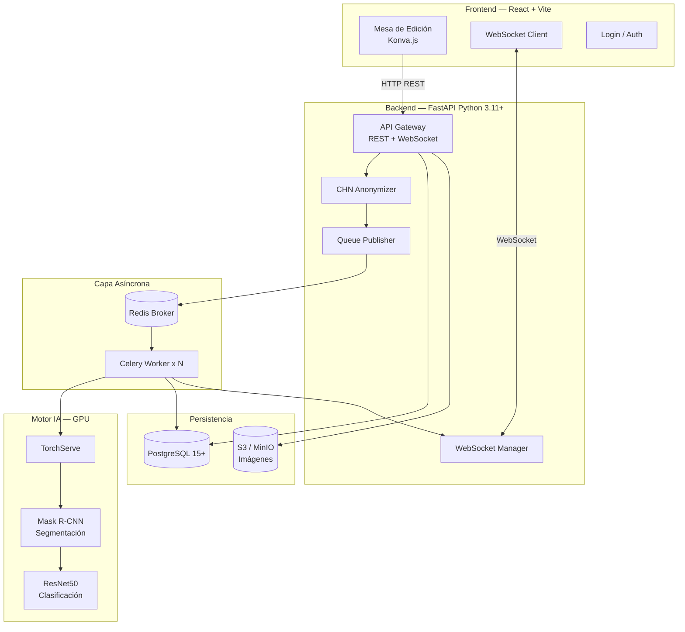
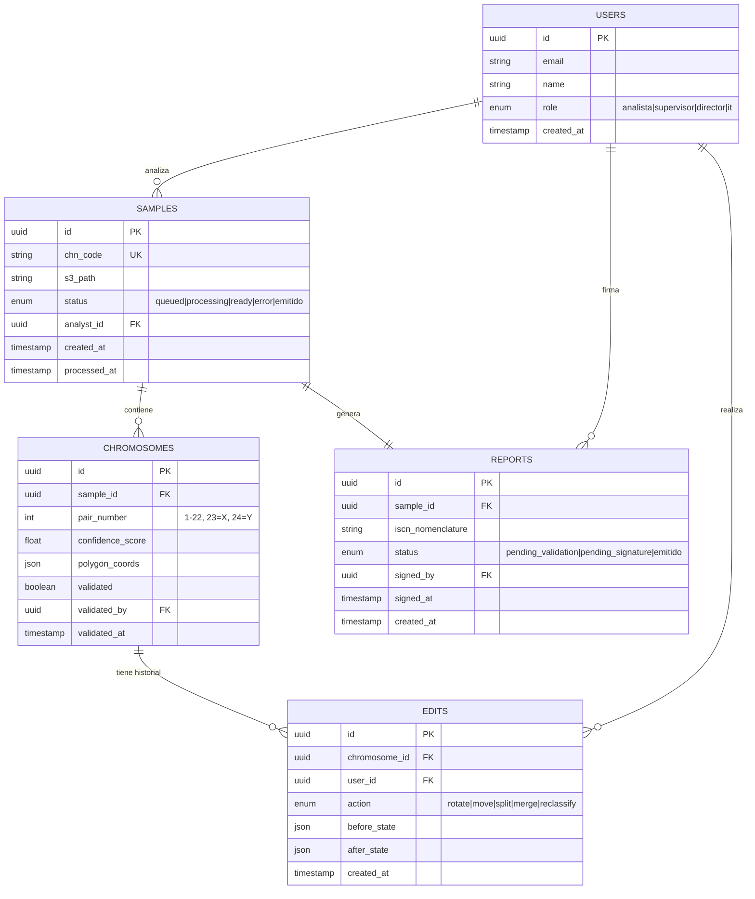

# Functional Specification Document (FSD) v1.0
## BIOMED UMSS — Intelligent Karyotyping Platform
### ⚠️ Versión a priori / Borrador — sujeto a refinamiento en iteraciones

| Campo | Detalle |
|---|---|
| **Producto** | BIOMED UMSS – Intelligent Karyotyping |
| **Versión** | 1.0 (borrador a priori) |
| **Fecha** | Mayo 2026 |
| **Autor** | Ing. Guillermo Mamani Chambi |
| **Trazabilidad** | PRD_v1.md → BRD_v2.md |
| **Estado** | Draft — pendiente validación técnica |

---

## 1. Metadatos y Trazabilidad

| Documento fuente | Secciones vinculadas |
|---|---|
| BRD_v2.md | §4 Propuesta de valor, §8 Restricciones |
| PRD_v1.md | §5 User Stories US-01 a US-17, §6 Criterios Gherkin |

---

## 2. Plan Técnico

### 2.1 Stack Tecnológico

| Capa | Tecnología | Justificación |
|---|---|---|
| **Frontend** | React 18 + Vite + TypeScript | Componentes reactivos, hot reload, tipado fuerte |
| **State Management** | Zustand | Liviano, sin boilerplate, ideal para estado de mesa de edición |
| **Canvas/Editor** | Konva.js | Manipulación 2D de cromosomas (drag & drop, rotar, escalar) |
| **Backend** | FastAPI (Python 3.11+) | Asíncrono nativo, compatible con ecosistema CV |
| **Cola de tareas** | Redis + Celery | Desacoplamiento frontend/AI engine, escalabilidad horizontal |
| **Motor IA** | TorchServe / NVIDIA Triton | Serving de modelos PyTorch en GPU con batching |
| **Modelos IA** | Mask R-CNN (segmentación) + ResNet50 (clasificación) | Precisión probada en citogenética |
| **Notificaciones** | WebSocket (FastAPI nativo) | Push inmediato al cliente sin polling |
| **Base de datos** | PostgreSQL 15+ | Integridad referencial, audit trail, ACID |
| **Almacenamiento** | S3-compatible (MinIO en dev) | Imágenes de metafase de alta resolución |
| **Contenedores** | Docker + Docker Compose | Reproducibilidad, escalabilidad horizontal |
| **Autenticación** | JWT + OAuth2 (FastAPI Security) | Estándar, stateless |

### 2.2 Arquitectura del Sistema



### 2.3 Estructura del Proyecto

```
biomed-umss/
├── frontend/
│   ├── src/
│   │   ├── components/
│   │   │   ├── EditorCanvas/      # Mesa de edición Konva.js
│   │   │   ├── ChromosomeList/    # Lista de revisión con semáforo
│   │   │   ├── SampleUpload/      # Carga de imágenes
│   │   │   └── ReportViewer/      # Visualización informe ISCN
│   │   ├── store/                 # Zustand stores
│   │   ├── services/              # API calls + WebSocket
│   │   └── types/                 # TypeScript types
├── backend/
│   ├── app/
│   │   ├── api/                   # Routers FastAPI
│   │   ├── core/                  # Config, seguridad, CHN
│   │   ├── models/                # SQLAlchemy models
│   │   ├── schemas/               # Pydantic schemas
│   │   ├── services/              # Lógica de negocio
│   │   ├── tasks/                 # Celery tasks
│   │   └── ws/                    # WebSocket manager
│   └── tests/
├── ai_engine/
│   ├── models/                    # Mask R-CNN + ResNet50
│   ├── pipeline/                  # CLAHE, segmentación, clasificación
│   └── serving/                   # TorchServe config
├── docker-compose.yml
└── docs/
```

### 2.4 Restricciones Técnicas

- Imágenes de entrada: TIFF, PNG, JPEG 2000, máx 50MB por muestra
- GPU mínima: NVIDIA con 8GB VRAM (tiling para imágenes >4K)
- Navegadores soportados: Chrome 120+, Firefox 121+, Edge 120+
- Tiempo máximo de inferencia: 15s por muestra (SLA interno)
- Datos de paciente: nunca deben llegar a TorchServe — solo código CHN

---

## 3. Descomposición en Tasks (Spec Kit)

Cada task debe poder cerrarse como un Pull Request autocontenido.

| ID | Task | Estimación | PR esperado |
|---|---|---|---|
| T-01 | Setup proyecto: Docker Compose (FastAPI + Redis + PostgreSQL + React) | 3h | `feat: project-scaffold` |
| T-02 | Modelo de datos: tablas `samples`, `chromosomes`, `edits`, `reports`, `users` | 2h | `feat: database-schema` |
| T-03 | Endpoint POST `/samples` con anonimización CHN | 3h | `feat: sample-create-chn` |
| T-04 | Upload de imagen a S3/MinIO con validación de formato | 2h | `feat: image-upload` |
| T-05 | Celery task: pre-procesamiento CLAHE + segmentación Mask R-CNN | 5h | `feat: ai-segmentation-task` |
| T-06 | Celery task: clasificación ResNet50 + score Softmax por cromosoma | 4h | `feat: ai-classification-task` |
| T-07 | WebSocket: notificación push al cliente al completar inferencia | 2h | `feat: websocket-notification` |
| T-08 | Mesa de edición: renderizado de cromosomas con Konva.js | 6h | `feat: editor-canvas` |
| T-09 | Semaforización visual: borde verde/naranja según score <85% | 2h | `feat: confidence-semaphore` |
| T-10 | Lista de revisión: filtrado de cromosomas <85% con orden de prioridad | 2h | `feat: review-queue` |
| T-11 | Operaciones de edición: drag & drop, rotar, unir, dividir | 5h | `feat: chromosome-editing` |
| T-12 | Bloqueo de exportación si existen cromosomas <85% sin validar | 2h | `feat: report-lock` |
| T-13 | Generación automática nomenclatura ISCN | 3h | `feat: iscn-generator` |
| T-14 | Endpoint de firma digital del supervisor | 2h | `feat: supervisor-signature` |
| T-15 | Audit trail: log inalterable de ediciones en PostgreSQL | 2h | `feat: audit-trail` |
| T-16 | Dashboard de estado de muestras (analista + director) | 3h | `feat: sample-dashboard` |
| T-17 | Autenticación JWT + roles (analista, supervisor, director, IT) | 3h | `feat: auth-roles` |
| T-18 | Tests de integración: pipeline completo end-to-end | 4h | `test: e2e-pipeline` |

---

## 4. Casos de Uso Funcionales

### UC-01: Procesamiento asíncrono de muestra

**Actores:** Analista, Sistema (FastAPI, Redis, Celery, TorchServe)
**Precondición:** Analista autenticado, muestra registrada con código CHN

**Flujo principal:**
1. Analista sube imagen TIFF/PNG vía `POST /samples/{id}/image`
2. FastAPI valida formato (TIFF/PNG/JP2, <50MB)
3. FastAPI almacena imagen en S3 con nombre CHN
4. FastAPI publica tarea en Redis: `{sample_id, s3_path, chn_code}`
5. FastAPI retorna `202 Accepted` con `task_id`
6. Celery Worker consume tarea de Redis
7. Worker descarga imagen de S3
8. Worker aplica CLAHE (pre-procesamiento)
9. Worker ejecuta Mask R-CNN → obtiene máscaras y bounding boxes
10. Worker ejecuta ResNet50 → obtiene clase y score Softmax por cromosoma
11. Worker persiste resultado en PostgreSQL: `chromosomes` table con `pair`, `score`, `polygon_coords`
12. Worker envía evento WebSocket: `{sample_id, status: "ready", chromosome_count: 46}`
13. React recibe evento y renderiza mesa de edición con semáforo visual

**Flujo alternativo — Imagen inválida:**
- En paso 2: si formato inválido → `422 Unprocessable Entity` con mensaje descriptivo

**Flujo alternativo — Error de inferencia:**
- En paso 9–10: si TorchServe falla → Worker reintenta hasta 3 veces → si persiste, WebSocket envía `{status: "error"}` → Analista recibe notificación de error

**Datos de entrada:** `multipart/form-data {image: File, sample_id: UUID}`
**Datos de salida:** `202 Accepted {task_id: UUID}` → WebSocket `{sample_id, status, chromosome_count}`

---

### UC-02: Validación de cromosomas con semaforización

**Actores:** Analista
**Precondición:** Muestra con estado "ready", mesa de edición abierta

**Flujo principal:**
1. React carga lista de cromosomas desde `GET /samples/{id}/chromosomes`
2. Kanva.js renderiza cromosomas en mesa: borde verde (score ≥0.85), naranja (<0.85)
3. Panel lateral muestra lista de revisión ordenada por score ascendente
4. Analista hace clic en cromosoma naranja → sistema lo resalta en la mesa
5. Analista edita (rotar/mover) si es necesario → `PATCH /chromosomes/{id}/position`
6. Analista marca como validado → `PATCH /chromosomes/{id}/validated`
7. Sistema verifica: si todos los cromosomas <85% están validados → desbloquea botón "Generar Informe"

**Flujo alternativo — Edición manual de par cromosómico:**
- En paso 5: analista puede cambiar el par asignado manualmente → `PATCH /chromosomes/{id}/pair`
- Sistema registra la corrección en audit trail con timestamp

**Datos de entrada:** `PATCH /chromosomes/{id}/validated {validated_by: user_id, timestamp: ISO8601}`
**Datos de salida:** `200 OK {all_validated: boolean, remaining: number}`

---

### UC-03: Generación y firma de informe final

**Actores:** Analista, Supervisor
**Precondición:** Todos los cromosomas validados, analista y supervisor con roles distintos en caso crítico

**Flujo principal:**
1. Analista hace clic en "Generar Informe"
2. Sistema verifica: ¿todos los cromosomas <85% están validados? → si no, bloquea
3. Sistema genera nomenclatura ISCN basada en la clasificación final
4. Sistema crea registro en tabla `reports` con estado "pending_signature"
5. Sistema notifica al supervisor disponible: `{report_id, sample_id, analyst_name}`
6. Supervisor abre informe → revisa audit trail de ediciones
7. Supervisor hace clic en "Firmar y emitir"
8. Sistema verifica: ¿supervisor ≠ analista? (en caso crítico) → si no, bloquea
9. Sistema registra firma: `{supervisor_id, timestamp, report_id}`
10. Estado del informe cambia a "emitido"
11. Informe disponible para exportación PDF / envío LIS

**Datos de entrada:** `POST /reports/{id}/sign {supervisor_id: UUID}`
**Datos de salida:** `200 OK {report_id, status: "emitido", iscn: string, signed_at: ISO8601}`

---

## 5. Reglas de Negocio Formales

| ID | Regla | Implementación |
|---|---|---|
| RN-01 | Ningún informe puede emitirse sin validación del analista Y firma del supervisor | `reports.status` solo llega a "emitido" tras ambas acciones |
| RN-02 | Cromosomas con score <85% bloquean exportación | Check en `POST /reports` — retorna 409 si existen pendientes |
| RN-03 | Datos de paciente nunca llegan a TorchServe | CHN asignado antes de encolar; S3 path usa solo CHN |
| RN-04 | Analista y supervisor no pueden ser el mismo usuario en caso crítico | Validación en `POST /reports/{id}/sign` |
| RN-05 | El muestreo estadístico anti-sesgo revisa 10–20% de cromosomas verdes aleatoriamente | Celery task periódico de auditoría |
| RN-06 | La nomenclatura ISCN se genera automáticamente; no puede ser editada manualmente | Campo `iscn` es read-only en la API |
| RN-07 | Cada edición humana debe quedar en audit trail con timestamp | Middleware de auditoría en todos los PATCH endpoints |

---

## 6. Modelo de Datos Funcional



### Diccionario de Datos Clave

| Tabla | Campo | Tipo | Descripción |
|---|---|---|---|
| samples | chn_code | VARCHAR(20) UNIQUE | Código anonimizador CHN-YYYY-NNNN |
| chromosomes | confidence_score | FLOAT(0-1) | Score Softmax del modelo ResNet50 |
| chromosomes | polygon_coords | JSONB | Array de coordenadas del polígono segmentado |
| edits | before_state / after_state | JSONB | Estado del cromosoma antes y después de la edición |
| reports | iscn_nomenclature | TEXT | Nomenclatura ISCN auto-generada (ej: 46,XY) |

---

## 7. Prompt como Contrato Funcional

Ver archivo `PROMPT_MAPPINGS.md` para el detalle completo de prompts por caso de uso.

**Referencia rápida:**

| Task | Prompt ID | Modelo recomendado |
|---|---|---|
| T-05 Segmentación Mask R-CNN | PM-UC01-SEG | Claude Opus (lógica compleja) |
| T-06 Clasificación ResNet50 | PM-UC01-CLS | Claude Sonnet (generación estándar) |
| T-09 Semaforización visual | PM-UC02-SEM | Claude Sonnet |
| T-13 Generación ISCN | PM-UC03-ISCN | Claude Sonnet |
| T-15 Audit trail middleware | PM-UC03-AUDIT | Claude Haiku (boilerplate) |

---

## 8. Integraciones Externas

| Sistema | Protocolo | Autenticación | SLA |
|---|---|---|---|
| TorchServe (GPU) | REST HTTP interno | API Key + mTLS | <15s respuesta |
| S3 / MinIO | AWS SDK / HTTP | Access Key + Secret | <3s upload |
| LIS Hospitalario | HL7 FHIR / REST | OAuth2 Bearer | Async (no bloquea) |
| PostgreSQL | TCP 5432 | User/Pass + SSL | <100ms queries |

---

## 9. Interfaces de Usuario (Trazabilidad M3 → FSD)

| Pantalla (Módulo 3 Prototipo) | Caso de Uso FSD | User Story PRD |
|---|---|---|
| `index.html` — Carga de muestra | UC-01 | US-01, US-02 |
| `correccion de cariotipo.html` — Mesa de edición | UC-02 | US-06, US-07, US-08, US-09 |
| `supervisor.html` — Panel de auditoría | UC-03 | US-12, US-13 |
| `informe.html` — Visualización de informe | UC-03 | US-14 |
| `crudmuestra.html` — Gestión de muestras | UC-01 | US-03, US-04 |
| `configuracion.html` — Admin | — | US-17 |

---

## 10. NFR Consolidados y Verificación

| NFR | Métrica verificable | Herramienta de verificación |
|---|---|---|
| NFR-01 Inferencia <15s | p95 <15s en carga de 10 solicitudes simultáneas | k6 load test |
| NFR-02 WebSocket <500ms | Latencia medida desde `task_done` hasta cliente | Playwright timing |
| NFR-03 Uptime >99.5% | Monitoreo continuo en horario laboral | UptimeRobot / Grafana |
| NFR-04 Privacidad CHN | Audit log: ninguna request a TorchServe contiene PII | Jest unit test + log analysis |
| NFR-05 Audit trail | Todas las ediciones registradas: verificación de tabla `edits` | Pytest + DB assertion |
| NFR-06 10 muestras concurrentes | Sin timeout ni error 503 con 10 workers paralelos | k6 + Docker Compose scale |

---

*Trazabilidad: FSD_v1.md ← PRD_v1.md ← BRD_v2.md | FSD_v1.md → PROMPT_MAPPINGS.md*
