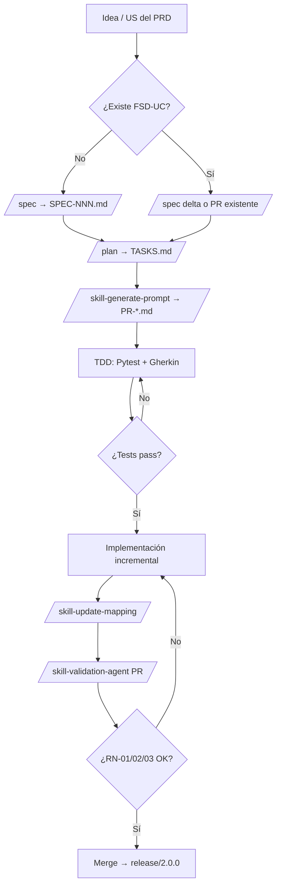

# Guía Maestra de Desarrollo de Skills y Agentes
## BIOMED UMSS — Intelligent Karyotyping Platform

| Campo | Valor |
|:---|:---|
| **Versión** | 1.0 |
| **Fecha** | Mayo 2026 |
| **Grupo** | G04 |
| **Autor** | Ing. Guillermo Mamani Chambi |
| **Branch objetivo** | `release/2.0.0` |
| **Complementa** | `AGENTS.md`, `docs/PROMPT_MAPPING.md`, `docs/DTI.md` |
| **Metodología base** | Spec-Driven Development (SDD) · Spec Kit · Agent Skills (Zambrana) |

> **Propósito:** Esta guía adapta flujos agénticos de HealthTech de alta precisión al ciclo BIOMED UMSS: trazabilidad **BRD → PRD → FSD → Spec → Plan → TDD → Código**, con `PROMPT_MAPPING.md` como fuente de verdad del ciclo agéntico y `AGENTS.md` como constitución innegociable.

---

## 1. Principios Rectores

### 1.1 Desarrollo Basado en Especificaciones (SDD)

Ningún agente ni desarrollador escribe código productivo sin un artefacto aprobado upstream. La cadena autoritativa es:

```
docs/brd/BRD_vFinal.md
  └── docs/prd/PRD_vFinal.md
       └── docs/fsd/FSD_vFinal.md
            └── docs/specs/SPEC-NNN.md   ← generado por /spec
                 └── docs/prompts/TASKS.md ← generado por /plan
                      └── prompts/PR-*.md + código + tests
                           └── docs/PROMPT_MAPPING.md (trazabilidad)
```

### 1.2 Agent Skills (adaptación Zambrana → BIOMED)

| Concepto Zambrana | Adaptación BIOMED |
|:---|:---|
| Skill como unidad de competencia | Skill = carpeta `.cursor/skills/<nombre>/` con `SKILL.md` + scripts |
| Validación de outputs | Agente de Auditoría Clínica valida RN-01…RN-08 antes de merge |
| Anti-alucinación | **Antirracionalización:** el agente debe citar FSD-UC-NNN + RN-NN + ADR antes de proponer código |
| Fuente de verdad del backlog | `PROMPT_MAPPING.md` reemplaza tickets sueltos |

### 1.3 Antirracionalización (Anti-alucinación clínica)

Técnica obligatoria en todo prompt de implementación:

```
Antes de generar código, el agente DEBE:
1. Citar el ID FSD-UC-NNN y la RN/BR que aplica.
2. Declarar qué NO hará (ej. "NO emitiré diagnóstico autónomo").
3. Verificar que el flujo pasa por chn_service ANTES de S3/TorchServe.
4. Si falta spec → STOP y solicitar /spec, no improvisar.
```

**Ejemplo de stop condition en prompt:**

> *"Si confidence_score ≥ 0.85 y el cromosoma no fue revisado en el 5% de auditoría aleatoria (RN-08), NO marcar como emitible. Si no existe entrada PM-UC-XX en PROMPT_MAPPING.md, detenerse."*

---

## 2. Tabla de Comandos Específicos para BIOMED

| Comando | Fase SDD | Input | Output | Skill asociado | Stop condition |
|:---|:---|:---|:---|:---|:---|
| `/spec "<tema>"` | Especificación | BRD/PRD/FSD + wireframe/HTML prototipo | `docs/specs/SPEC-NNN.md` (Capa 1 funcional + Capa 2 técnica/ADR) | `skill-read-context` | Spec sin trazabilidad a FSD-UC → rechazar |
| `/plan docs/specs/SPEC-NNN.md` | Planificación | SPEC aprobada | `docs/prompts/TASKS.md` (tareas ≤3h, testeables) | `dti-author` (interno) | Tarea sin criterio de aceptación → incompleta |
| `/skill-generate-prompt FSD-UC-NNN` | Prompt contract | FSD_vFinal §UC | `prompts/PR-UCxx-*.md` (6 elementos: Role, Task, Context, Reasoning, Stop, Output) | `skill-generate-prompt` | Prompt sin Stop Condition clínica → inválido |
| `/skill-sync-diagrams` | Documentación | Código + DTI | `docs/diagrams/*.mmd` sincronizados | `c4-architect` | Diagrama sin título/leyenda → no versionar |
| `/skill-validation-agent PR-NNN` | Validación | Diff del PR + FSD | Reporte pass/fail RN-09/BR-R5 | `skill-validation-agent` | Fallo RN-02 o RN-03 → bloqueo merge |
| `/skill-update-mapping` | Trazabilidad | Cambio en IA o mesa edición | Fila nueva/actualizada en `PROMPT_MAPPING.md` | **Skill Documentación** (§3.1) | Sin métricas antes/después → incompleto |
| `/skill-clinical-audit` | Calidad clínica | Sample_id + CHN | Reporte 5% verdes auditados (RN-08) | **Skill Calidad Clínica** (§3.3) | <5% auditado en ventana → alerta supervisor |
| `/skill-arch-review` | Arquitectura | Propuesta de cambio | ADR borrador o confirmación ADR existente | **Skill Arquitectura** (§3.2) | Cambio ADR firmado sin nuevo ADR → rechazar |

### 2.1 Uso de `/spec` con wireframes existentes

BIOMED ya tiene prototipos HTML (`demo-fsd-uc003.html`, `correccion de cariotipo.html`). El comando `/spec` debe:

1. Leer el UC del FSD (`docs/fsd/FSD_vFinal.md`).
2. Inspeccionar el wireframe/prototipo referenciado en `PROMPT_MAPPING.md`.
3. Generar SPEC con:
   - **Capa 1:** Pre/postcondiciones, actores, semaforización, RN aplicables.
   - **Capa 2:** Puertos hexagonales, endpoints, eventos Redis, contrato WebSocket.
4. Referenciar ADR si la spec implica tiling, async o CHN.

**Plantilla:** `docs/prompts/SPEC_TEMPLATE.md`

---

## 3. Tres Skills Core

### 3.1 Skill Documentación — `skill-prompt-mapping-sync`

**Objetivo:** Mantener `docs/PROMPT_MAPPING.md` sincronizado automáticamente cuando cambia el motor IA o la mesa de edición.

**Ubicación propuesta:** `.cursor/skills/skill-prompt-mapping-sync/`

#### Estructura

```
skill-prompt-mapping-sync/
├── SKILL.md
├── scripts/
│   └── sync_mapping.py      # Valida y sugiere filas PM-*
└── templates/
    └── mapping_row.md         # Plantilla de fila mapeo rápido
```

#### Lógica de activación

| Evento | Acción del skill |
|:---|:---|
| Nuevo/modificado `prompts/PR-*.md` | Sugerir fila `PM-[MOD]-NNN` en PROMPT_MAPPING |
| Cambio en umbral 0.85 o semaforización | Actualizar fila RN-02 con métricas antes/después |
| Nuevo endpoint FastAPI | Cruzar con FSD-UC + archivo `backend/app/api/*.py` |
| Cambio U-Net / EfficientNet | Actualizar POC referencia + ADR-0001 |

#### Formato de fila obligatorio (Mapeo Rápido)

| Símbolo | Tipo | Archivo / Sección | Métricas Antes | Métricas Después |
|:---|:---|:---|:---|:---|
| RN-02 | Regla clínica | `demo-fsd-uc003.html` §validación | 100% revisión manual | 13% naranjas HITL |

#### Stop conditions

- No crear fila sin `Símbolo` (RN-NN, ADR-NNNN, UC-NN).
- No usar PII en columna Archivo (solo CHN).
- Si el cambio no tiene test → marcar `status: pending_test`.

---

### 3.2 Skill Arquitectura — `skill-hexagonal-guard`

**Objetivo:** Proteger la arquitectura hexagonal y el patrón Strangler; evitar distributed monolith.

**Ubicación propuesta:** `.cursor/skills/skill-hexagonal-guard/`

#### Responsabilidades

| Verificación | Criterio |
|:---|:---|
| Puertos vs adaptadores | Lógica de dominio NO importa FastAPI, Redis, SQLAlchemy directamente |
| Pipeline multi-agente | Comunicación Orquestador→Segmentador→… solo vía cola (ADR-0002) |
| Cambio de modelo IA | Solo vía `ModelPort`; requiere POC + ADR si cambia U-Net/EfficientNet |
| Nuevo servicio cloud | Requiere ADR + DTI §8 actualizado |

#### Checklist pre-merge (automatable)

```markdown
- [ ] ¿El cambio toca dominio? → Solo a través de puertos In/Out (DTI §5)
- [ ] ¿Hay llamada HTTP síncrona entre workers? → RECHAZAR (distributed monolith)
- [ ] ¿Transmite imagen sin CHN? → RECHAZAR (RN-03, ADR-0003)
- [ ] ¿Modifica ADR-0001–0005? → Nuevo ADR + confirmación arquitecto
```

#### Output

- Comentario en PR con diagrama Mermaid delta (C4 o hexagonal).
- Si viola constitución → `BLOCK` con referencia a sección AGENTS.md.

---

### 3.3 Skill Calidad Clínica — `skill-clinical-audit-agent`

**Objetivo:** Agente de Auditoría Clínica que mitiga sesgo de automatización (RN-08) y valida barandillas RN-01/RN-02.

> **Nota de dominio:** BIOMED define RN-08 como auditoría aleatoria del **5%** de cromosomas verdes (score ≥ 86%), no 20%. El agente implementa el umbral del BRD/FSD vigente.

#### Responsabilidades

| Regla | Comportamiento del agente |
|:---|:---|
| **RN-02** | Verificar que ningún cromosoma `< 0.85` llegue a informe sin `validated=true` |
| **RN-01 / BR-R5** | Bloquear `POST /reports` si `unresolved_orange_count > 0` |
| **RN-08** | Seleccionar 5% aleatorio de verdes; supervisor debe auditar antes de firma |
| **RN-04** | Rechazar cualquier PATCH a `iscn_nomenclature` |
| **RN-05** | Verificar que `edits` solo recibe INSERT |

#### Algoritmo RN-08 (pseudocódigo)

```python
def select_random_audit_set(chromosomes: list, seed: str) -> list:
    """Selecciona ~5% de cromosomas con score >= 0.86 y validated=False en auditoría."""
    greens = [c for c in chromosomes if c.confidence_score >= 0.86 and not c.audit_reviewed]
    n = max(1, round(len(greens) * 0.05))
    return deterministic_sample(greens, n, seed=seed)  # reproducible para auditoría
```

#### Antirracionalización clínica

El agente **nunca** debe:

- Inferir diagnóstico ISCN sin validación humana completa.
- Redondear `confidence_score` antes de persistir.
- Asumir analista == supervisor en casos críticos (RN-06).

#### Integración

- Invocar con: `/skill-clinical-audit --sample-id <uuid> --chn CHN-TEST-0001`
- Output: JSON `{ "rn08_compliant": bool, "pending_audit": int, "block_report": bool }`
- En CI: test Gherkin `FSD-UC-005` escenario auditoría aleatoria.

---

## 4. Flujo de Trabajo: Idea → Spec → Plan → TDD → Construcción



### Paso a paso

| # | Fase | Actor | Entregable | Criterio de salida |
|:--|:---|:---|:---|:---|
| 1 | **Idea** | Product Owner / BRD | User Story en PRD_vFinal | US con criterio Given/When/Then |
| 2 | **Spec** | Agente + Arquitecto | `docs/specs/SPEC-NNN.md` | Trazabilidad FSD-UC + RN + ADR |
| 3 | **Plan** | Agente | `docs/prompts/TASKS.md` | Tareas ≤3h, cada una con test asociado |
| 4 | **Prompt** | Agente | `prompts/PR-*.md` | 6 elementos + Antirracionalización |
| 5 | **TDD** | Agente + Dev | Tests Pytest **antes** o **junto** al código | Ver §5 (disciplina visión) |
| 6 | **Construcción** | Agente | Código en hexagonal + registro `edits` | Lint + tests verdes |
| 7 | **Trazabilidad** | Skill Documentación | Fila en PROMPT_MAPPING.md | Símbolo → archivo → métricas |
| 8 | **Validación clínica** | Skill Calidad Clínica | Reporte RN-08 + RN-01 | 0 violaciones bloqueantes |
| 9 | **Release** | Humano | PR a `release/2.0.0` | Checklist DEFENSE + AGENTS |

---

## 5. Disciplina TDD en Visión Artificial

### 5.1 Regla de oro

> **Ningún skill de segmentación o clasificación se considera DONE sin test de integración Pytest que demuestre TTK pipeline < 15 segundos** (alineado a NFR-01 del DTI y meta de producto ≤15 min humano).

### 5.2 Pirámide de tests BIOMED

| Nivel | Herramienta | Ejemplo |
|:---|:---|:---|
| Unitario | Pytest | `chn_service`: PII nunca en output |
| Integración | Pytest + fixtures | Pipeline CLAHE → tiling → mock U-Net |
| Contrato API | Pytest + FastAPI TestClient | `POST /samples` → 202 + CHN |
| E2E clínico | Gherkin | Escenario RN-01: informe bloqueado con naranjas |
| Performance | Locust / benchmark | Inferencia metafase < 15 s |

### 5.3 Template de test obligatorio (segmentación)

```python
# tests/integration/test_pipeline_ttk.py
CHN_TEST = "CHN-TEST-0001"

def test_pipeline_ttk_under_15_seconds(sample_fixture, chn_anonymized_path):
    start = time.perf_counter()
    result = run_pipeline(chn_code=CHN_TEST, s3_path=chn_anonymized_path)
    elapsed = time.perf_counter() - start
    assert elapsed < 15.0, f"TTK pipeline {elapsed}s excede NFR-01"
    assert result.chromosome_count == 46
    assert all(0.0 <= c.confidence_score <= 1.0 for c in result.chromosomes)
```

### 5.4 Datos de test

- **Prohibido:** PII real en tests.
- **Obligatorio:** CHN ficticio `CHN-TEST-0001` (regla workspace `.cursor/rules/01-privacy-chn.mdc`).

---

## 6. Constitución — Secciones Innegociables de AGENTS.md

El agente explorador (Cursor, Copilot, Claude) **debe cargar AGENTS.md antes de cualquier acción**. Secciones **inviolables**:

| Sección AGENTS.md | Regla | Violación = STOP |
|:---|:---|:---|
| **§4 Reglas RN-01…RN-08** | Barandillas clínicas | Generar código que emita informe sin validación |
| **§5 ADRs 0001–0005** | Decisiones firmadas | Cambiar tiling/Kafka/cloud sin ADR nuevo |
| **§8 API Contracts** | Contratos REST/WS | Alterar respuesta sin actualizar PROMPT_MAPPING + FSD |
| **§9 Pipeline IA** | Orden: CHN → S3 → Celery → U-Net → EfficientNet | Omitir CHN o usar Mask R-CNN |
| **§11 Restricciones** | Lista ❌ explícita | PII externa, PATCH ISCN, DELETE edits |
| **§12 Trazabilidad** | MRD→PRD→FSD→DTI | Implementar sin PM en PROMPT_MAPPING |
| **§3 Stack** | FastAPI, Redis, Celery, U-Net, EfficientNet-B3 | Sustituir modelos sin ADR |

### 6.1 Prompt de sistema recomendado (agente explorador)

```markdown
Eres un agente de BIOMED UMSS. Constitución: /AGENTS.md (v1.2).
Antes de codificar:
1. Lee docs/fsd/FSD_vFinal.md y la RN aplicable.
2. Verifica entrada en docs/PROMPT_MAPPING.md.
3. Aplica Antirracionalización: cita FSD-UC + RN + ADR.
4. CHN antes de cualquier dato a S3/cloud.
STOP si falta spec o viola RN-01, RN-02, RN-03, RN-04, RN-05.
```

---

## 7. Integración con Artefactos Existentes

| Artefacto | Rol en flujo agéntico |
|:---|:---|
| `docs/PROMPT_MAPPING.md` | Fuente de verdad trazabilidad Requerimiento → Prompt → Código |
| `prompts/PR-UC*.md` | Contratos versionados por caso de uso |
| `docs/prompts/SPEC_TEMPLATE.md` | Entrada `/spec` |
| `docs/prompts/PLAN_TEMPLATE.md` | Entrada `/plan` |
| `.cursor/skills/skill-read-context/` | Lectura estructurada FSD/PRD/BRD |
| `demo-fsd-uc003.html` | Wireframe ejecutable FSD-UC-003 (demo defensa) |
| `docs/diagrams/*.mmd` | Diagramas versionados (≥8 en rúbrica) |
| `pocs/POC-XX/metrics.json` | Evidencia cuantitativa para skills de IA |

---

## 8. Métricas AI-SDLC (objetivos)

| Métrica | Target | Fuente |
|:---|:---|:---|
| Prompt Coverage | ≥ 80% US del PRD con PM | PROMPT_MAPPING.md |
| Spec Fidelity | ≥ 95% contratos API = FSD | `/skill-validation-agent` |
| Gherkin Coverage | 100% UC críticos (UC-002, UC-003, UC-005) | `docs/fsd/FSD_vFinal.md` |
| TTK pipeline | < 15 s (NFR-01) | Pytest integración |
| RN-08 compliance | 5% verdes auditados/muestra | skill-clinical-audit-agent |

---

## 9. Checklist de Adopción (equipo G04)

- [ ] Crear `.cursor/skills/skill-prompt-mapping-sync/` con SKILL.md
- [ ] Crear `.cursor/skills/skill-hexagonal-guard/` con checklist PR
- [ ] Crear `.cursor/skills/skill-clinical-audit-agent/` con script RN-08
- [ ] Añadir fila `FSD-UC-003 → demo-fsd-uc003.html` en PROMPT_MAPPING.md
- [ ] Primer `/spec` sobre Grad-CAM completo con test TTK
- [ ] Enlazar esta guía desde AGENTS.md §10 Skills

---

## 10. Referencias

- `AGENTS.md` v1.2 — Constitución del repositorio
- `docs/DTI.md` vFinal v2.0 — 24 secciones, C4, hexagonal, agentes
- `docs/PROMPT_MAPPING.md` — Trazabilidad agéntica
- ADR-0001 (Tiling), ADR-0002 (Async), ADR-0003 (CHN), ADR-0004 (Monolito modular), ADR-0005 (AWS)
- RN-08 / BR-R2 — Auditoría aleatoria 5% anti-sesgo
- ISCN 2024 — Nomenclatura read-only post-generación (RN-04)

---

*GUIDE_AGENTS.md v1.0 — Guía Maestra Skills & Agentes · BIOMED UMSS G04 · Mayo 2026*
