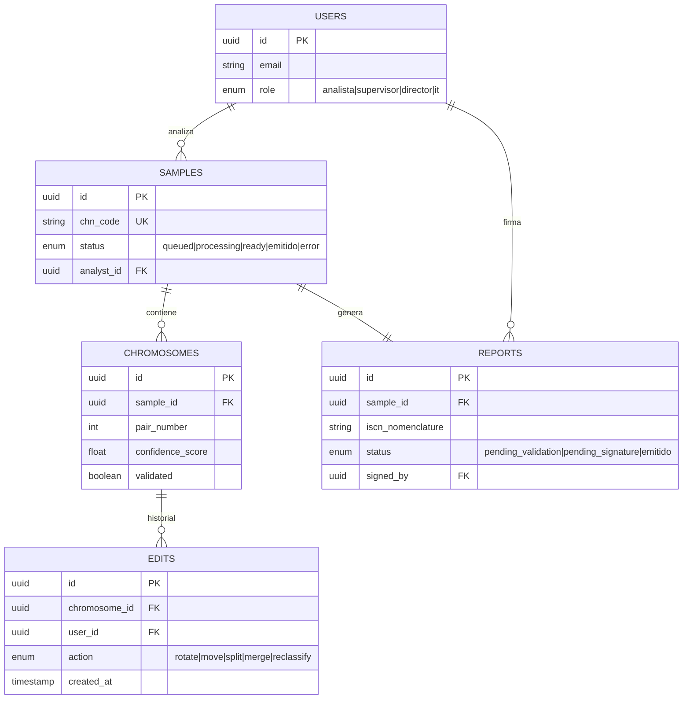

# Lightweight FSD (LFSD) v1.0
## BIOMED UMSS — Intelligent Karyotyping Platform
### Versión ágil y viva — para iteraciones tempranas

| Campo | Detalle |
|---|---|
| **Producto** | BIOMED UMSS – Intelligent Karyotyping |
| **Versión** | 1.0 |
| **Fecha** | Mayo 2026 |
| **Autor** | Ing. Guillermo Mamani Chambi |
| **Trazabilidad** | PRD_v1.md → FSD_v1.md (este documento es su versión ágil) |
| **Diferencia vs FSD** | Plan técnico resumido · Solo flujo principal · Trazabilidad UI/UX integrada |

---

## ¿Por qué un LFSD?

El LFSD es la especificación funcional mínima viable para iniciar el desarrollo con IA. Mientras el FSD_v1.md es el contrato exhaustivo, el LFSD es el documento **vivo** que el equipo usa sesión a sesión en el ciclo agéntico. Se actualiza con cada iteración.

**Regla de uso:** Si el FSD_v1.md y el LFSD difieren, el FSD_v1.md es la fuente de verdad.

---

## 1. Plan Técnico (Formato Corto)

```
Stack: React 18 + Vite + Konva.js | FastAPI 3.11 | Redis + Celery | TorchServe GPU
Arquitectura: SaaS Web · Async pipeline · Human-in-the-loop
DB: PostgreSQL 15+ (audit trail) + S3/MinIO (imágenes)
Auth: JWT + OAuth2 · Roles: analista / supervisor / director / IT
Deploy: Docker Compose · Escala horizontal con celery_worker=N
```

---

## 2. Casos de Uso Críticos (Flujo Principal + Gherkin Mínimo)

### UC-01 — Procesamiento asíncrono de muestra

**Flujo principal (resumido):**
1. Analista sube imagen → FastAPI asigna CHN → encola en Redis → retorna `202`
2. Celery Worker ejecuta: CLAHE → Mask R-CNN → ResNet50 → persiste en PostgreSQL
3. WebSocket notifica al cliente: `{status: "ready"}`
4. React renderiza mesa de edición con semaforización Softmax

**Criterios Gherkin mínimos:**
```gherkin
Scenario: Procesamiento exitoso
  Given imagen TIFF válida de 15MB con muestra registrada
  When el analista la sube al sistema
  Then recibe 202 Accepted en menos de 2 segundos
  And recibe notificación WebSocket "Borrador listo" en menos de 15 segundos
  And la mesa de edición muestra 46 cromosomas con semáforo de color
```

---

### UC-02 — Validación con semaforización

**Flujo principal (resumido):**
1. Analista abre mesa de edición → ve cromosomas verdes y naranjas
2. Revisa y edita cromosomas <85% → marca como validados
3. Al validar todos los naranjas → botón "Generar Informe" se desbloquea

**Criterios Gherkin mínimos:**
```gherkin
Scenario: Bloqueo por cromosoma pendiente
  Given existen cromosomas con score < 0.85 sin validar
  When el analista intenta generar el informe
  Then el botón permanece deshabilitado
  And el sistema muestra el número de cromosomas pendientes

Scenario: Desbloqueo tras validación completa
  Given todos los cromosomas < 0.85 han sido validados manualmente
  When el analista hace clic en "Generar Informe"
  Then el sistema genera la nomenclatura ISCN
  And el informe pasa a estado "pending_signature"
```

---

### UC-03 — Firma y emisión de informe

**Flujo principal (resumido):**
1. Supervisor recibe notificación → revisa audit trail
2. Aprueba y firma digitalmente → informe pasa a "emitido"
3. Informe disponible para exportación / envío LIS

**Criterios Gherkin mínimos:**
```gherkin
Scenario: Firma exitosa del supervisor
  Given todos los cromosomas validados y analista distinto al supervisor
  When el supervisor hace clic en "Firmar y emitir"
  Then el informe cambia a estado "emitido"
  And queda registrado con timestamp y ID del supervisor
```

---

## 3. Trazabilidad UI/UX — Prototipos M3 → LFSD

| Pantalla Módulo 3 | UC LFSD | User Stories PRD | Estado |
|---|---|---|---|
| `index.html` — Carga de muestra | UC-01 | US-01, US-02, US-03 | ✅ Prototipo listo |
| `correccion de cariotipo.html` — Mesa de edición | UC-02 | US-06 al US-10 | ✅ Prototipo listo |
| `supervisor.html` — Auditoría y firma | UC-03 | US-12, US-13, US-16 | ✅ Prototipo listo |
| `informe.html` — Visualización informe | UC-03 | US-14 | ✅ Prototipo listo |
| `crudmuestra.html` — Gestión de muestras | UC-01 | US-04 | ✅ Prototipo listo |
| `configuracion.html` — Admin/roles | — | US-17 | 🔄 Pendiente |

---

## 4. Modelo de Datos Core (Mermaid Básico)



---

## 5. Tasks de Alta Prioridad (Sprint 1)

| ID | Task | Estimación | Prompt ID |
|---|---|---|---|
| T-01 | Setup Docker Compose completo | 3h | PM-SETUP-01 |
| T-02 | Modelo de datos PostgreSQL | 2h | PM-DB-01 |
| T-03 | POST `/samples` + CHN + S3 | 3h | PM-UC01-API |
| T-05 | Celery task: Mask R-CNN | 5h | PM-UC01-SEG |
| T-06 | Celery task: ResNet50 + Softmax | 4h | PM-UC01-CLS |
| T-07 | WebSocket push notification | 2h | PM-WS-01 |
| T-09 | Semaforización visual React | 2h | PM-UC02-SEM |

---

## 6. NFR Mínimos Verificables

| NFR | Criterio | Check |
|---|---|---|
| Inferencia | <15s por muestra | k6 test con 5 muestras paralelas |
| Privacidad | Ningún PII en logs de TorchServe | Grep en logs post-procesamiento |
| Bloqueo | Informe bloqueado con cromosomas <85% pendientes | Prueba manual UC-02 |
| Audit trail | Cada edición registrada en tabla `edits` | SELECT COUNT en pytest |

---

## 7. Reglas de Negocio Esenciales

| Regla | Descripción |
|---|---|
| RN-01 | Informe requiere validación analista + firma supervisor |
| RN-02 | Cromosomas <85% sin validar bloquean exportación |
| RN-03 | Datos paciente → CHN antes de cualquier transmisión cloud |
| RN-04 | Analista ≠ supervisor en casos críticos |

---

## 8. Próximas Iteraciones (Backlog LFSD)

| Iteración | Feature | Dependencia |
|---|---|---|
| Sprint 2 | Muestreo anti-sesgo 10–20% verdes | T-06 completado |
| Sprint 2 | Score global de cariograma (inconsistencias) | T-06 + PG |
| Sprint 3 | Integración LIS (HL7 FHIR) | UC-03 estable |
| Sprint 3 | Dashboard director con métricas TAT | UC-01 estable |
| Sprint 4 | Federated learning entre laboratorios | Infraestructura multi-tenant |

---

*Documento vivo — actualizar con cada iteración de desarrollo*
*Trazabilidad: LFSD.md ← PRD_v1.md ← BRD_v2.md | LFSD.md → PROMPT_MAPPINGS.md*
