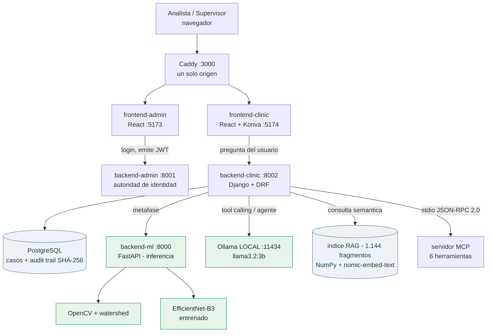

# BIOMED UMSS — Plataforma de Cariotipado Asistido por IA

**Un sistema que propone el cariotipo de una metafase y obliga a que un citogenetista lo valide antes de emitir el informe.**

| | |
|---|---|
| Equipo | Individual |
| Integrante | Mamani Chambi, Guillermo |
| Módulo | M6 — Integración de IA en Productos de Software |
| Docente | M.Sc. Luis Marcelo Garay Choqueribe |
| Repositorio | `https://github.com/guillemc92/karyoumss` — rama `feature/clinic-django-stack` |
| Fecha | 21/08/2026 |

---

## 1 · Resumen ejecutivo

El Laboratorio de Genética del IIBISMED (UMSS) analiza cariotipos a mano: un
citogenetista recorta cromosomas de una fotografía de metafase y los ordena en
24 pares. Cada caso son horas de trabajo, y el resultado es un informe clínico
que alguien firma.

Este producto automatiza la **propuesta**: segmenta la metafase, clasifica cada
cromosoma con un modelo entrenado sobre 48.000 recortes del propio laboratorio,
y presenta el resultado con un semáforo de confianza. La IA no diagnostica —
propone, y el analista corrige.

Sobre esa base clínica se construyó la capa que este módulo evalúa: consultas en
lenguaje natural sobre el estado del laboratorio y su documentación, resueltas
por un **agente con herramientas publicadas por MCP**. Se implementaron los seis
niveles de la escalera, del 0 al 5, cada uno resolviendo un problema concreto.

**Lo que funciona hoy:** el flujo completo, de la metafase al informe firmado con
nomenclatura ISCN. **Lo que no:** el sistema todavía cuesta más trabajo del que
ahorra — se midió, y el dato está en §8.

**El dato duro:** 6 herramientas publicadas por MCP, 1.144 fragmentos indexados,
596 pruebas automatizadas y **cinco instrumentos de medición reproducibles**.
Ninguna afirmación de este documento carece de un comando que la verifique.

---

## 2 · El problema y el producto

### 2.1 · El problema

Un cariotipo es la fotografía ordenada de los 46 cromosomas de una célula. Sirve
para diagnosticar síndrome de Down, Turner, Klinefelter, leucemias y esterilidad
de origen genético.

Obtenerlo exige que una persona identifique cada cromosoma en una imagen donde
aparecen amontonados, girados y superpuestos; los recorte; los clasifique en 24
categorías y los ordene por tamaño. **Es trabajo manual, lento y escaso**: en
Cochabamba hay pocos citogenetistas formados y cada caso les ocupa horas.

El cuello de botella no es el microscopio. Es el tiempo de un especialista.

### 2.2 · Cómo se resuelve hoy (sin el sistema)

El laboratorio trabaja con **Ikaros 7.0 de MetaSystems** para el recorte y el
ordenamiento, y redacta el informe final en Word a partir de una plantilla.

El archivo histórico lo confirma: de 462 informes revisados, **208 son documentos
escaneados** —el cariotipo está dibujado, no escrito— y 251 están redigitados. La
transición de papel a digital está a medias.

### 2.3 · El producto

Una plataforma web donde el analista registra una muestra, sube las metafases y
recibe una propuesta de cariotipo con un **semáforo de confianza por cromosoma**.
Corrige lo que haga falta sobre un lienzo interactivo, valida el caso, y un
supervisor lo firma con doble factor. El sistema emite entonces la nomenclatura
ISCN y un borrador de narrativa clínica.

| Usuario | Qué hace |
|---|---|
| **Analista citogenetista** | registra la muestra, corrige el cariotipo propuesto, valida el caso |
| **Supervisor clínico** | audita el 5% aleatorio, firma con MFA, emite el informe |
| **Administrador TI** | gestiona usuarios, permisos y configuración del modelo |

### 2.4 · Alcance de esta entrega

| Sí está implementado y se demuestra | Queda fuera de esta entrega |
|---|---|
| Segmentación y clasificación de metafases reales | Segmentación con U-Net — es diseño, no implementación |
| Semáforo de confianza y bloqueo de emisión | Análisis de 20 metafases por caso con consenso |
| Corrección manual: recortar, separar, unir, reclasificar | Anotación sobre la imagen de la metafase |
| Explicabilidad con Grad-CAM real | Estimación de bandas y solapamientos (ADR-0026, decidido) |
| Nomenclatura ISCN y narrativa clínica | Exportación del informe a PDF |
| Consultas en lenguaje natural, RAG, agente + MCP | Procesamiento asíncrono con Celery |

---

## 3 · Inteligencia artificial aplicada al proyecto

### 3.1 · Qué hace la IA en este producto

Hay **dos capas de IA distintas**, y conviene no confundirlas.

**La capa clínica — visión por computadora.** Convierte una fotografía de
metafase en una lista de cromosomas con su clase y su confianza. Segmentación con
OpenCV y watershed; clasificación con un EfficientNet-B3 entrenado sobre 48.000
recortes extraídos de los cariogramas del propio laboratorio.

**La capa conversacional — lenguaje.** Convierte una pregunta escrita por un
analista en una consulta ejecutada contra la base de datos o el corpus
documental, devolviendo siempre de dónde salió el dato.

La segunda es la que este módulo evalúa. La primera es el producto.

### 3.2 · Por qué IA y no una consulta SQL o un formulario

**Para la capa clínica no hay alternativa clásica.** Nadie ha escrito un `if` que
distinga un cromosoma 7 de un 8 en una fotografía. Es reconocimiento de formas: o
hay un modelo, o hay una persona.

**Para la capa conversacional sí la hay, y en parte se usa.** El sistema tiene un
camino sin modelo: si la pregunta contiene una palabra del catálogo, se ejecuta
la herramienta directamente. El modelo solo entra cuando el vocabulario no
coincide.

Lo que aporta el modelo, medido: **tolerancia a sinónimos**. «¿Cuáles necesitan
que el analista los mire de nuevo?» no comparte ni una palabra con
`CROMOSOMAS_PARA_REVISION`, y se resuelve igual. Un formulario con filtros
exigiría que el analista conociera el vocabulario del sistema.

Y hay algo que un formulario no da: **el sistema sabe decir que no sabe**. Ante
«¿cuál es el presupuesto del laboratorio?» responde que no puede, en vez de
devolver una lista de casos que no viene a cuento.

### 3.3 · Nivel de la escalera de integración alcanzado

| Nivel | Qué significa | ¿Lo tienen? | Dónde se ve en el sistema |
|---|---|:---:|---|
| 0 · Modelo como dependencia | una llamada, una respuesta | **Sí** | narrativa clínica del informe (`llm_client.py`) |
| 1 · Salida estructurada | JSON tipado y validado | **Sí** | esquema Pydantic con reintento (`llm_schemas.py`) |
| 2 · Tool calling | la IA ejecuta acciones del producto | **Sí** | enrutador de 4 caminos (`tool_router.py`) |
| 3 · RAG | responde con conocimiento propio y cita la fuente | **Sí** | 1.144 fragmentos (`rag_*.py`) |
| 4 · Agente + MCP | el modelo encadena pasos y descubre herramientas | **Sí** | bucle ReAct + 6 tools (`agente.py`, `servidor_mcp.py`) |
| 5 · Orquestación | flujo con estado, ramas y persistencia | **Parcial** | memoria conversacional (`agente_grafo.py`) — ver cap. 6 |

**¿Por qué ese nivel y no el siguiente?**

El nivel 4 se justifica con una pregunta que ningún nivel anterior resuelve solo:
*«¿hay cromosomas pendientes de revisar, y por qué hay que revisarlos?»*. La
primera mitad es estado —una herramienta contra la base—; la segunda es una regla
del laboratorio —el corpus—. El orden no está programado: lo decide el modelo.

Del nivel 5 se implementó **solo la memoria conversacional**, y el capítulo 6
explica por qué el resto no aplica a este dominio. No es falta de tiempo: es una
decisión firmada en dos ADR.

**Y en sentido contrario:** se propuso una arquitectura de **siete agentes** para
el pipeline de visión y **se rechazó**. Preprocesar → detectar → clasificar tiene
un orden fijo e inevitable; un orquestador que reparte siempre igual es una caja
de paso. Está firmado en ADR-0031.

### 3.4 · Riesgos propios de usar IA en este producto

| Riesgo | Qué pasaría si ocurre | Cómo se mitiga hoy |
|---|---|---|
| El modelo inventa un umbral o una cifra clínica | Un analista actúa sobre un dato falso creyéndolo del sistema | El modelo **solo elige una herramienta**; las cifras salen de una consulta a la base. Pantalla y traza muestran la tabla de origen |
| El modelo atribuye a una fuente algo que no dijo | Pérdida de confianza en todo el sistema | Ocurrió y está documentado: dio un umbral del 90% cuando el real es 85%. Corregido reforzando el prompt; la traza permite detectarlo |
| El cariotipo propuesto es incorrecto | Diagnóstico erróneo | Semáforo con umbral 0,85: un solo cromosoma naranja **bloquea la emisión** del informe (RN-01/RN-02) |
| El agente modifica datos clínicos | Un acto clínico sin responsable identificado | La única herramienta de escritura **nunca ejecuta**, ni con confirmación (§5.3) |
| Fuga de datos del paciente a un tercero | Incumplimiento de RN-03 | El modelo corre **local** con Ollama. No hay clave de API ni egreso de datos |
| El proveedor del modelo cae | El sistema deja de responder | Degradación elegante: el camino por vocabulario sigue funcionando sin modelo (RN-07) |

---

## 4 · Arquitectura de la solución

### 4.1 · Diagrama de arquitectura



**Por dónde viaja la pregunta del usuario:** navegador → Caddy → `backend-clinic`
→ el enrutador decide el camino → si hace falta el modelo, va a Ollama **local**
→ la respuesta se construye con datos de PostgreSQL o del índice → vuelve con la
herramienta usada y la tabla de origen visibles en pantalla.

### 4.2 · Stack tecnológico

| Capa | Tecnología | Versión | Por qué se eligió |
|---|---|---|---|
| Backend clínico | Django + DRF | 5.0.6 | ORM maduro para un dominio con muchas reglas de negocio |
| Motor de inferencia | FastAPI | — | servicio aparte: la visión escala distinto que el CRUD |
| Visión | OpenCV + PyTorch | — | watershed clásico + EfficientNet-B3 |
| Modelo de lenguaje | Ollama + `llama3.2:3b` | fija, nunca `latest` | **local**: RN-03 prohíbe el egreso de datos clínicos |
| SDK | `openai` | ≥1.0 | Ollama expone API compatible; el código no se ata al proveedor |
| Embeddings | `nomic-embed-text` | 768 dims | local, por la misma razón |
| Índice vectorial | NumPy | — | 1.144 fragmentos: la fuerza bruta sobra (§5.4) |
| Grafo del agente | LangGraph | 1.2.11 | solo para la memoria conversacional (cap. 6) |
| Frontend | React + Vite + Konva.js | 18 / 5 | Konva para el lienzo interactivo del cariograma |
| Identidad | JWT emitido por `backend-admin` | — | autoridad única del sistema (ADR-0020) |

### 4.3 · Flujo de una petición, de principio a fin

1. El analista escribe «¿qué cromosomas están naranjas?» en `/clinic/consultas`
2. El navegador hace `POST /api/clinic/tools/query/` con el JWT
3. `tool_router.py` busca coincidencias con el vocabulario del catálogo
4. **Si coincide** → se ejecuta la herramienta **sin llamar al modelo** (camino `KEYWORD`)
5. **Si no coincide** → *interviene el modelo*: recibe las descripciones de las 6 herramientas y **solo elige un nombre** (camino `LLM`)
6. **Si es una pregunta de documentación** → va al corpus: se embebe, se recuperan candidatos y *el modelo hace de juez* sobre si responden (camino `RAG`)
7. **Si nada aplica** → responde que no sabe y publica el catálogo (camino `SIN_MATCH`)
8. La herramienta consulta PostgreSQL — **el dato nunca sale del modelo**
9. La respuesta vuelve con `camino`, `tool` y `source` visibles en pantalla

---

## 5 · Herramientas y niveles de integración implementados

### 5.1 · Modelo de lenguaje

| Uso | Proveedor | Modelo | Por qué ese | Costo aprox. |
|---|---|---|---|---|
| Enrutado, RAG, agente, narrativa | Ollama **local** | `llama3.2:3b` | RN-03 prohíbe el egreso de datos clínicos | **$0** — corre en la máquina del laboratorio |
| Embeddings del corpus | Ollama **local** | `nomic-embed-text` | misma razón; 768 dimensiones | $0 |

**¿Modelo de respaldo?** No. Y si Ollama cae, el sistema **no deja de
responder**: el camino por vocabulario resuelve las preguntas del dominio sin
modelo, y el RAG se degrada a «no puedo fundamentar» en vez de volcar el
fragmento más parecido. Es una decisión, no un descuido: un respaldo en la nube
violaría RN-03.

**Parámetros y por qué esos valores:**

| Parámetro | Valor | Por qué |
|---|---|---|
| `temperature` | **0.0** | Elegir herramienta es una decisión técnica: la misma pregunta debe dar la misma respuesta, o el sistema deja de ser auditable |
| `MAX_PASOS` | **6** | Tope del bucle del agente. Sin tope, un agente confundido quema tokens en círculos |
| `timeout` | 240 s | Un 3B en CPU tarda 27-200 s por respuesta del RAG |
| Candidatos al juez | 3 × 900 caracteres | Medido: con 5 × 2.000 el modelo se ahogaba y se abstenía en 11 de 12 preguntas cubiertas |

### 5.2 · Publicación del código

| Qué | Dónde | Notas |
|---|---|---|
| Repositorio | `github.com/guillemc92/karyoumss` | rama `feature/clinic-django-stack` |
| Decisiones de arquitectura | `docs/adr/` | 32 ADR firmados |
| Índice del RAG | `backend-clinic/apps/samples/rag_data/` | versionado con el código |

**Sin claves en el repositorio.** El modelo es local: no existe clave de API que
filtrar. Los ficheros `.env` están en `.gitignore`, verificado.

**Cómo se levanta el proyecto:**

```bash
# 1 · motor de inferencia
cd backend-ml      && python -m uvicorn app.main:app --port 8000
# 2 · autoridad de identidad
cd backend-admin   && .venv/Scripts/python manage.py runserver 127.0.0.1:8001 --noreload
# 3 · backend clínico
cd backend-clinic  && CLINIC_LLM_ENABLED=true .venv/Scripts/python manage.py runserver 127.0.0.1:8002 --noreload
# 4 y 5 · las dos SPA
cd frontend-admin  && npm run dev
cd frontend-clinic && MSYS_NO_PATHCONV=1 VITE_BASE_PATH=/clinic/ npm run dev
# 6 · proxy que las une en un solo origen (para compartir la sesión)
caddy run --config Caddyfile.dev        # entrar por http://localhost:3000
```

### 5.3 · Tooling (Nivel 2 — tool calling)

| Nombre | Qué hace | L/E | Parámetros | ¿Confirmación? |
|---|---|:---:|---|:---:|
| `cromosomas_para_revision` | cromosomas naranjas pendientes | lee | — | no |
| `casos_pendientes_firma` | casos validados esperando supervisor | lee | — | no |
| `casos_reportados` | casos cerrados y firmados | lee | — | no |
| `casos_en_proceso` | muestras que el sistema está analizando | lee | — | no |
| `buscar_documentacion` | consulta el corpus (RAG) | lee | `pregunta: str` | no |
| `preparar_validacion_de_caso` | prepara la validación de un caso | **escribe** | `chn_code: str`, `confirmado: bool` | **nunca ejecuta** |

**Qué pasa con la herramienta de escritura.** No es que pida confirmación: **no
ejecuta nunca**, ni siquiera con `confirmado=true`.

En el laboratorio del módulo, `cancelar_pedido` sí ejecuta con confirmación. La
diferencia no es de implementación sino de dominio: cancelar una compra es
reversible y lo autoriza su dueño; **validar un cariotipo es un acto clínico que
firma un profesional con su identidad**. RN-01 exige validación manual del
analista y firma del supervisor con MFA; RN-06 exige que no sean la misma
persona. Un proceso automático no es un analista identificado ni puede aportar un
segundo factor.

Lo que el agente sí hace es **preparar el trabajo**: decir qué caso es, qué
bloquea la validación y qué pasaría al validarlo.

El guardrail vive **dentro de la herramienta**, no en el bucle: así viaja con
ella por MCP a cualquier cliente que la descubra.

**Cómo se describen las herramientas al modelo** — descripción real, la que viaja
por el protocolo:

```
Prepara la validación de un caso: informa de qué bloquea la validación y qué
ocurriría al validarlo. ESCRITURA: llamar siempre con confirmado=false para
obtener el plan. La ejecución real la hace una persona identificada desde la
aplicación — un agente no puede validar un cariotipo.
```

**¿Cómo se sabe que el modelo elige bien?** Se mide, con un banco de **56
preguntas etiquetadas** escritas como las diría un analista, no como las
escribiría quien ya conoce el catálogo.

```bash
python manage.py eval_enrutado
```

| Medición | Resultado |
|---|---|
| Banco intacto | **44/56 (79%)** |
| Banco al día — 3 preguntas que ahora resuelve el RAG | 47/56 (84%) |

**Qué pasó cuando eligió mal.** El primer banco tenía 30 preguntas y dio **97%**.
Al ampliarlo con preguntas fuera de alcance escritas *con el vocabulario del
dominio* —«¿quién tiene permiso para firmar?»— cayó a **80%**. El 97% era un
espejismo: las preguntas fáciles no compartían ni una palabra con el catálogo, y
abstenerse ante ellas es trivial.

### 5.4 · RAG (Nivel 3 — recuperación aumentada)

**Qué conocimiento se indexó y por qué.** La documentación que el laboratorio usa
para decidir, no texto genérico:

| Fuente | Fragmentos | Por qué está |
|---|---:|---|
| ISCN 2024 | 711 | el estándar internacional de nomenclatura |
| ADR del proyecto | 337 | las decisiones y su justificación |
| FSD | 37 | los casos de uso |
| BRD | 33 | las reglas de negocio |
| Guía de agentes | 26 | convenciones internas |

| Aspecto | Decisión | Por qué |
|---|---|---|
| Origen | documentación propia del proyecto y el estándar ISCN | es lo que el laboratorio consulta de verdad |
| Cantidad indexada | **1.144 fragmentos** | — |
| Troceado | por secciones, con solape | un artículo del ISCN no se parte a la mitad |
| Embeddings | `nomic-embed-text`, 768 dims | local (RN-03) |
| Vector store | **NumPy por fuerza bruta** | 1.144×768 se resuelve en microsegundos; Chroma añade una base binaria que no se versiona bien en git |
| top-k | 3 al juez, 8 recuperados | medido: con 5 fragmentos largos el modelo se ahogaba |
| Umbral | 0,50 de **recuperación**, no de decisión | ver abajo |

**El umbral no decide, y eso se midió.** Tres señales, sobre 18 preguntas:

| Señal | Cubiertas por el corpus | Fuera del corpus |
|---|---|---|
| similitud top-1 | 0,601 – 0,695 | 0,608 – 0,662 |
| margen top1−top2 | 0,000 – 0,033 | 0,006 – 0,024 |
| dispersión del top-5 | 0,002 – 0,019 | 0,004 – 0,018 |

**Las tres se solapan.** No hay corte posible: el coseno mide parecido temático y
todo el corpus habla del mismo dominio. Por eso el índice **recupera** con umbral
bajo y **el modelo hace de juez** sobre si los fragmentos responden.

**Cómo cita la fuente** — salida real:

```
También hay material relacionado en:
  - FSD: FSD_vFinal.md — 5. Reglas de negocio (61.6%)
  - ADR: 0020-sso-backend-admin-autoridad-jwt.md — Contexto (60.0%)
```

**Qué hace cuando NO encuentra la respuesta** — la pregunta importante:

```
PREGUNTA: ¿Cuál es el teléfono del doctor Rojas?
responde=False   MOTIVO: el corpus no cubre la pregunta

El corpus no cubre esa pregunta. Lo más parecido que contiene es:
  - ADR: 0011-rol-administrador.md — Contexto (62.9%)
  - BRD: BRD_vFinal.md — 14. Restricciones y supuestos (57.7%)
```

No responde igual: **dice que no sabe y ofrece dónde mirar**. Y ninguna
sugerencia afirma pertinencia — solo dice «esto es lo más parecido que hay»,
porque el puntaje no predice si un fragmento responde.

**Medición de la cadena completa:** `python manage.py eval_rag --con-juez` →
**16/18 (89%)**; 10/12 en preguntas cubiertas y **6/6 en abstención**.

### 5.5 · Agente + MCP (Nivel 4)

**Qué hace el agente que el tool calling simple no podía.** Encadenar. La
pregunta *«¿hay cromosomas pendientes de revisar, y por qué hay que
revisarlos?»* tiene dos mitades: una es estado —herramienta contra la base—, la
otra es una regla —el corpus—. **El orden no está programado en ninguna parte**:
lo decide el modelo.

| Herramienta | Origen | Qué hace | L/E | ¿Vía MCP? |
|---|---|---|:---:|:---:|
| `cromosomas_para_revision` | base clínica | naranjas pendientes | lee | sí |
| `casos_pendientes_firma` | base clínica | validados sin firmar | lee | sí |
| `casos_reportados` | base clínica | casos cerrados | lee | sí |
| `casos_en_proceso` | base clínica | en análisis | lee | sí |
| `buscar_documentacion` | RAG interno | recupera fragmentos con su fuente | lee | sí |
| `preparar_validacion_de_caso` | base clínica | prepara la validación | **escribe** | sí |

**Cómo se conecta el agente con el resto del sistema.** De dos maneras, y el
bucle no cambia ni una línea:

```
local:   schemas=agente_acciones.schemas()   ejecutar=agente_acciones.ejecutar
vía MCP: schemas=conexion.descubrir_tools()  ejecutar=conexion.ejecutar_tool
```

El bucle **no sabe qué herramientas existen**: recibe los schemas y una función
`ejecutar`. Ese desacople es lo que permite cambiar el enchufe sin tocar la
lógica.

| Dato del servidor MCP | Valor |
|---|---|
| Nombre | `biomed` |
| Transporte | **stdio** — proceso hijo, JSON-RPC 2.0 |
| Herramientas publicadas | **6** |
| Clientes que lo consumen | el agente del sistema y `cliente_mcp.py` |
| Descubrimiento | **`tools/list`** — ninguna escrita a mano |

`cliente_mcp.py` lo demuestra: descubre y ejecuta las 6 herramientas **sin
importar Django ni el catálogo**, hablando solo el protocolo.

**Control del bucle.** `MAX_PASOS = 6`. Si se alcanza, se corta y **queda
registrado como corte en la traza** — no se disfraza de respuesta. Probado con un
modelo simulado que nunca para.

**Traza.** Cada paso se registra con su tipo —acción, observación, respuesta— y
el consumo de tokens. `POST /agente` la devuelve completa. No es depuración: sin
ella no se puede saber si el agente encadenó de verdad o rellenó el hueco
inventando.

**La demostración de encadenamiento** (`manage.py demo_agente`):

```
[01] pregunta     ¿Hay cromosomas pendientes de revisar, y por qué?
[02] accion       CROMOSOMAS_PARA_REVISION({})
[03] observacion  {'herramienta': 'CROMOSOMAS_PARA_REVISION', 'n': 50, ...}
[04] accion       buscar_documentacion({'pregunta': 'por qué revisar naranjas'})
[05] observacion  {'encontrado': True, 'fuentes': [{'documento': 'FSD...'}]}
[06] respuesta    Hay 50 cromosomas pendientes...
```

**Y lo que no funcionó, medido.** La primera versión hacía **una** consulta y se
inventaba la segunda mitad: dio un umbral del 90% —el real es 85%— y lo encabezó
con «según la herramienta de consulta». Inventar es grave; **atribuirlo a una
fuente que no lo dijo, más**. Solo se ve mirando la traza. Corregido reforzando
las instrucciones con el ejemplo concreto.

---

## 6 · Orquestación (Nivel 5)

**Se implementó parcialmente, y la parte que falta es una decisión, no una
carencia de tiempo.**

### 6.1 · Qué hace el orquestador

`agente_grafo.py` implementa el bucle del agente como un grafo de estados de
LangGraph con **checkpoints persistentes por `thread_id`**.

| Paso / nodo | Qué hace | Qué datos lee | Qué datos escribe |
|---|---|---|---|
| `pensar` | pregunta al modelo con el historial y los schemas | historial completo del hilo | mensaje del modelo: texto, o petición de herramientas |
| `actuar` | ejecuta lo que el modelo pidió | la petición de herramientas | observaciones, como mensajes `tool` |
| *(condicional)* | decide si volver a pensar o terminar | último mensaje del hilo | — |

### 6.2 · Las decisiones del flujo (ramas)

Conviene ser preciso aquí, porque la distinción entre rama técnica y rama de
negocio es justo lo que decide si un orquestador está justificado.

| Punto de decisión | Condición | Camino A | Camino B |
|---|---|---|---|
| Tras `pensar` | ¿el modelo pidió herramientas? | ir a `actuar` | terminar y responder |
| Tras `actuar` | siempre | volver a `pensar` | — |
| Tope de recursión | pasos ≥ 13 | cortar y registrarlo en la traza | — |

**Las ramas de este orquestador son TÉCNICAS, y hay que decirlo.** Por sí solas
no justificarían un orquestador.

**Las ramas de NEGOCIO existen, pero deliberadamente no viven aquí.** El flujo
clínico se bifurca de verdad: *«¿hay cromosomas naranjas sin resolver?»* decide
si un caso puede pasar a supervisor; *«¿cae en el 5% de auditoría?»* decide si
requiere revisión adicional. Esas ramas viven en **la máquina de estados del
dominio, en PostgreSQL**, con un audit trail encadenado por SHA-256.

Moverlas a los checkpoints del orquestador crearía **una segunda fuente de verdad
para un proceso auditado**: cuando un inspector pregunte en qué estado estaba un
caso, no puede haber dos respuestas. Es una objeción de **cumplimiento**, no de
complejidad. Firmado en ADR-0031 y ADR-0032.

### 6.3 · Cómo comprende la intención del usuario

**Con una mezcla, y el orden importa.** Primero se buscan palabras del catálogo
—sin modelo—; solo si no coincide nada interviene el modelo.

| Intención | Ejemplo de frase del usuario | A dónde lleva el flujo |
|---|---|---|
| Consultar estado | «¿qué cromosomas están naranjas?» | herramienta de consulta a la base |
| Consultar documentación | «¿qué significa que esté naranja?» | corpus documental (RAG) |
| Fuera de alcance | «¿cuál es el presupuesto?» | «no sé» + catálogo de lo que sí puede |

**En qué formato devuelve la intención el modelo.** JSON tipado con
`strict: true`: solo puede devolver un nombre de un `enum` cerrado más un motivo.
No hay texto libre que interpretar, y por tanto no hay nada que parsear a mano.

**Qué pasa cuando no reconoce la intención.** Existe el camino `SIN_MATCH`: dice
que no sabe y publica el catálogo de lo que sí puede responder. **No es un
error**: es la respuesta correcta cuando el dato no está en el sistema.

**¿Se midió?** Sí: banco de **56 preguntas** etiquetadas, **44 correctas (79%)**.
Desglosado: dentro de alcance 33/38 (87%), fuera de alcance 11/18 (61%).

El desglose importa más que el total: fallar dentro de alcance manda al usuario a
«no sé»; **fallar fuera le entrega datos reales que no responden su pregunta**,
que es mucho peor.

### 6.4 · Estado y persistencia

**Qué guarda el estado del flujo:** la lista de mensajes del hilo — pregunta del
usuario, peticiones de herramientas, observaciones y respuestas.

**¿Sobrevive si se reinicia el proceso?** **Sí.** Se guarda en
`agente_memoria.sqlite3` bajo un `thread_id`, en un fichero **separado de la base
clínica** — mezclarlos sería justo la confusión que este diseño evita.

**Medido** (`manage.py eval_memoria`, 10 pares de pregunta y repregunta):

| Grupo | Nivel 4 (sin memoria) | Nivel 5 (con memoria) |
|---|---|---|
| Conversación — exigen memoria | **0/8** | **4/8** |
| Dato — control, reconsultables | 0/2 | 0/2 |

El grupo de conversación aísla lo que aporta la memoria: sus repreguntas apuntan
a lo que el agente **dijo** —«repite el último que dijiste»—, así que reconsultar
no sirve. El nivel 4 acierta cero de ocho.

El grupo de control existe para que el banco **pueda dar la razón al nivel 4**:
sin él, solo cabrían preguntas que el nivel 5 gana.

**4 de 8 no es 8 de 8, y la causa está identificada.** El checkpoint persiste
siempre —probado con un modelo simulado—; lo que falla es que `llama3.2:3b` lo
aproveche: vuelve a consultar las herramientas en vez de leer el historial.

Se intentó corregir con el prompt y **empeoró: bajó a 2/8**. El modelo obedeció
media instrucción —dejó de llamar a la herramienta— pero no empezó a leer el
historial. Se revirtió. **A un modelo de 3B no le basta con autorizarle a
recordar.** El límite es el modelo, no la arquitectura.

---

## 7 · Evidencias

Cada capacidad afirmada en el capítulo 5 tiene aquí su evidencia, y cada
evidencia tiene un comando que la reproduce delante de quien lo pida.

| Capacidad afirmada | Evidencia | Comando |
|---|---|---|
| Nivel 0-1: narrativa con salida estructurada | JSON validado y reintento ante error | `manage.py demo_llm` |
| Nivel 2: los 4 escenarios de la consigna | happy path, sinónimo, fuera de alcance, modelo apagado | `manage.py demo_tools` |
| Código y salida en una sola pantalla | lee el código con `inspect.getsource` de la fuente real | `manage.py demo_codigo_salida` |
| Nivel 3: el RAG cita, y sabe abstenerse | las dos ramas con sus porcentajes | `manage.py demo_sugerencias` |
| Nivel 4: el agente encadena, con traza | pensamiento → acción → observación + tokens | `manage.py demo_agente` |
| Servidor MCP con 6 herramientas | publica por stdio, JSON-RPC 2.0 | `python servidor_mcp.py` |
| Cliente que descubre sin importar nada | `tools/list` puro, sin Django | `python cliente_mcp.py` |
| Nivel 5: memoria frente a sin memoria | 0/8 contra 4/8, desglosado por grupo | `manage.py eval_memoria` |
| El enrutador acierta 44/56 | banco de 56 preguntas etiquetadas | `manage.py eval_enrutado` |
| El RAG acierta 16/18 | cadena completa con el juez | `manage.py eval_rag --con-juez` |
| El flujo clínico completo | metafase real → ISCN → narrativa, 7 etapas | `manage.py demo_flujo_clinico` |
| Coste de corrección por caso | 64 acciones frente a 46 a mano | `python training/eval_correccion.py` |
| 596 pruebas verdes, 84,87% cobertura | suite completa | `pytest` |

**Salida real del flujo completo** (`demo_flujo_clinico`, 19/08/2026):

```
ETAPA 1 - La IA analiza una metafase real
    tiempo                     26.7 s
    modelo                     opencv-watershed-v0+efficientnet-b3-metaclass-v3
    cromosomas detectados      48  (lo normal son 46)
    confianza media            0.548

ETAPA 2 - La semaforizacion decide que NO puede avanzar
    verdes                     4
    naranjas                   44   <-- bloquean el informe

ETAPA 6 - La nomenclatura ISCN - la calcula CODIGO, no el modelo
    ISCN emitido               47,XY,+21
    lo genera                  generate_iscn(), funcion determinista
```

**Validación contra la realidad del laboratorio.** El motor ISCN se contrastó con
**231 informes clínicos reales** del archivo: acepta **45 de 51** nomenclaturas
distintas. De los 6 rechazos, **4 son erratas de transcripción en informes ya
emitidos** —falta la coma en `47,XY+21[20]`— y 2 son notación que aún no soporta:
el marcador `+m` y el separador `;`.

---

## 8 · Conclusiones y trabajo futuro

### Qué funciona hoy

El flujo completo, verificado de punta a punta con metafases reales: registro,
segmentación, clasificación, semáforo, corrección manual con explicabilidad,
validación del analista, auditoría del 5%, firma con MFA, nomenclatura ISCN y
narrativa clínica. Los seis niveles de la escalera están implementados y cada uno
tiene un comando que lo demuestra.

### Qué NO funciona todavía, y por qué

**El sistema cuesta más trabajo del que ahorra.** Medido contra el cariograma del
experto sobre 20 casos: **mediana de 64 acciones de corrección frente a 46 de
hacerlo a mano. En 20 de 20 casos, la IA cuesta más.**

Y la medición corrigió un diagnóstico que se daba por cerrado: se asumía que el
cuello de botella era la segmentación, pero **la estructura son 4 de esas 64
acciones (6%)**. El grueso está en resolver naranjas (34), que nace del umbral y
de la obligación de consultar la explicabilidad antes de aceptar.

**No se analizan 20 metafases por caso.** El laboratorio sí, y por eso su informe
dice `47,XY,+21[20]`. Aquí `Karyotype` es uno-a-uno con `Sample`: se analiza la
primera imagen. **Es lo que separa esto de un informe clínico emitible.**

**La segmentación no es U-Net.** Es OpenCV con watershed, declarado sin
ambigüedad en la cadena de versión que emite el servicio:
`opencv-watershed-v0+efficientnet-b3-metaclass-v3`.

**El pipeline corre síncrono.** Una metafase pesada bloquea el hilo de la
petición.

### Qué se aprendió que no se esperaba

**El instrumento falla antes que el sistema medido.** Cinco veces la primera
medición fue inválida por un defecto del medidor, no del sistema: un prompt que
hacía al juez peor que no tenerlo (39% frente a 56%), un ground truth donde solo
el 43% de los casos era plausible, un timeout que borraba la corrida entera,
testigos de un solo dígito que inflaban el resultado por ambos lados, y un modelo
que volcaba la observación cruda y pasaba por acierto.

De ahí salió una regla: **el número es lo último en lo que hay que creer**. Antes
de interpretarlo hay que mirar caso por caso si los aciertos son aciertos.

Y un corolario que costó una conclusión falsa: **si se puede correr el A/B, no
razonar sobre el diff**. Un análisis a ojo dijo que había cuatro regresiones en
el enrutador; reproducir el estado anterior en un worktree de git demostró que la
regresión real eran dos.

### Trabajo futuro, priorizado

1. **Resolución de naranjas en bloque** — recorta unas 30 de las 64 acciones
   **sin tocar ningún modelo**. Es la palanca más barata y ataca la mitad del
   coste medido.
2. **Caso multi-metafase con consenso** — es lo que produce el `[20]` y lo que
   convierte esto en un informe emitible.
3. **Detector con U-Net o YOLO** — el dataset ya permite generar metafases
   sintéticas con máscaras exactas a partir de los 50.864 recortes reales, lo que
   convierte un problema de etiquetado en uno de cómputo.
4. **Celery** — para que la inferencia deje de bloquear la petición.
5. **Estimación de solapamientos** (ADR-0026, ya decidido) — Ikaros la muestra
   como métrica y permite descartar una metafase antes de invertir tiempo en
   ella.
