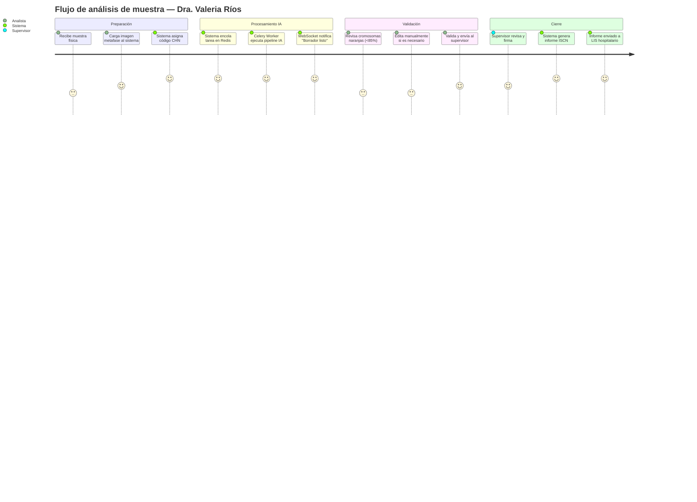
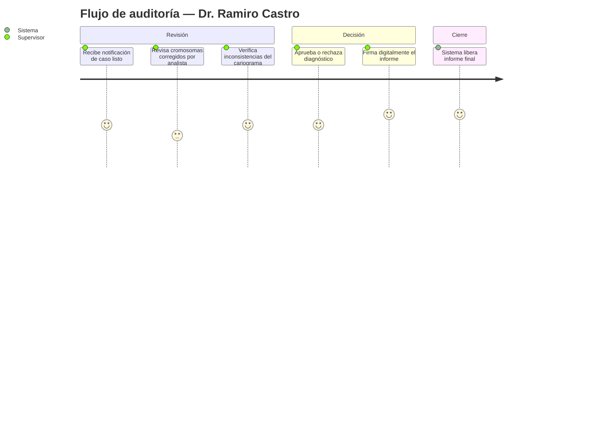

# Product Requirements Document (PRD) v1.0
## BIOMED UMSS — Intelligent Karyotyping Platform

| Campo | Detalle |
|---|---|
| **Producto** | BIOMED UMSS – Intelligent Karyotyping |
| **Versión** | 1.0 |
| **Fecha** | Mayo 2026 |
| **Autor** | Ing. Guillermo Mamani Chambi |
| **Trazabilidad** | BRD_v2.md §1–§10 |
| **Estado** | Draft |

---

## 1. Resumen del Producto

| Campo | Detalle |
|---|---|
| **Problema** | El análisis citogenético manual toma 30–45 min/muestra, provoca fatiga visual extrema y riesgo de errores diagnósticos |
| **Usuarios** | Citogenetistas (analistas), Supervisores clínicos, Directores de laboratorio |
| **Solución** | Plataforma web SaaS con IA (Human-in-the-loop) que automatiza la segmentación, clasificación y ensamblado del cariotipo |
| **Valor** | Reducción TTK de 45 min → <15 min · Precisión >97% · Cero errores por omisión |

---

## 2. Objetivos del Producto

| ID | Objetivo | Métrica de éxito | Vinculación BRD |
|---|---|---|---|
| OBJ-01 | Reducir el TTK de 45 a <15 minutos | TTK <15 min medido en piloto | BRD §5 |
| OBJ-02 | Eliminar errores diagnósticos por omisión | Tasa de error = 0% en validación supervisada | BRD §5 |
| OBJ-03 | Lograr adopción efectiva de plataforma | >80% usuarios completan flujo inicial | BRD §5 |
| OBJ-04 | Garantizar privacidad de datos del paciente | 100% muestras procesadas con código CHN | BRD §8.3 |
| OBJ-05 | Proveer transparencia algorítmica al especialista | Semaforización visible en 100% de cromosomas | BRD §4.1 |

---

## 3. Alcance (Scope)

### ✅ In Scope — v1.0

| Feature | Descripción |
|---|---|
| F-01 | Registro de muestras con anonimización CHN |
| F-02 | Carga y procesamiento de imágenes de metafase (>10MB, TIFF/PNG) |
| F-03 | Segmentación automática de cromosomas (Mask R-CNN, IoU >95%) |
| F-04 | Clasificación automática de pares 1–22, X, Y (ResNet50, >97%) |
| F-05 | Semaforización de confianza Softmax (umbral 85%) |
| F-06 | Mesa de edición interactiva (drag & drop, rotar, unir, dividir) |
| F-07 | Generación automática de nomenclatura ISCN |
| F-08 | Bloqueo de informe si existen cromosomas <85% sin validar |
| F-09 | Flujo de doble validación (analista + firma supervisor) |
| F-10 | Notificación en tiempo real vía WebSocket |
| F-11 | Panel de auditoría y audit trail en PostgreSQL |

### ❌ Out of Scope — v1.0
- Secuenciación genómica (NGS)
- Integración directa con microscopios
- Aplicación móvil nativa
- Modo offline completo
- Módulo de facturación/suscripción

---

## 4. Personas y User Journeys

### Persona 1 — Dra. Valeria Ríos (Analista Citogenetista)



### Persona 2 — Dr. Ramiro Castro (Supervisor / Garante Clínico)



---

## 5. User Stories (INVEST)

### Módulo: Gestión de Muestras

| ID | Historia | Prioridad |
|---|---|---|
| US-01 | Como **analista**, quiero cargar una imagen de metafase en formatos TIFF/PNG de hasta 50MB, para que el sistema la procese automáticamente sin rechazarla | Must |
| US-02 | Como **analista**, quiero que el sistema asigne automáticamente un código CHN único a cada muestra, para garantizar la anonimización antes del procesamiento cloud | Must |
| US-03 | Como **analista**, quiero ver el estado de procesamiento de cada muestra (en cola, procesando, listo, error), para gestionar mi carga de trabajo sin necesidad de hacer refresh | Must |
| US-04 | Como **director**, quiero ver un dashboard con el número de muestras procesadas por día/semana, para monitorear el rendimiento del laboratorio | Should |

### Módulo: Pipeline de IA y Visualización

| ID | Historia | Prioridad |
|---|---|---|
| US-05 | Como **analista**, quiero recibir una notificación instantánea cuando el borrador de cariotipo esté listo, para no tener que esperar frente a una barra de carga | Must |
| US-06 | Como **analista**, quiero ver cada cromosoma con un borde de color (verde/naranja) según su score de confianza, para saber exactamente dónde enfocar mi revisión | Must |
| US-07 | Como **analista**, quiero que los cromosomas con confianza <85% aparezcan destacados en una lista de revisión prioritaria, para no omitir ninguno | Must |
| US-08 | Como **analista**, quiero poder arrastrar y soltar cromosomas en la mesa de edición para reorganizarlos, para corregir errores de ensamblado sin herramientas externas | Must |
| US-09 | Como **analista**, quiero poder rotar, unir y dividir fragmentos de cromosomas, para manejar casos complejos de superposición | Must |
| US-10 | Como **analista**, quiero que el sistema me impida emitir un informe si existen cromosomas <85% sin validar, para garantizar la completitud del análisis | Must |

### Módulo: Generación de Informes

| ID | Historia | Prioridad |
|---|---|---|
| US-11 | Como **analista**, quiero que el sistema genere automáticamente la nomenclatura ISCN basada en el orden final de cromosomas, para evitar errores de codificación manual | Must |
| US-12 | Como **supervisor**, quiero revisar el historial de ediciones del analista (audit trail) antes de firmar, para verificar que el proceso fue correcto | Must |
| US-13 | Como **supervisor**, quiero firmar digitalmente el informe desde la plataforma, para habilitar su envío al sistema hospitalario LIS | Must |
| US-14 | Como **analista**, quiero poder exportar el informe en PDF con la nomenclatura ISCN y la imagen del cariotipo, para su archivo físico o digital | Should |

### Módulo: Seguridad y Auditoría

| ID | Historia | Prioridad |
|---|---|---|
| US-15 | Como **personal de IT**, quiero que todos los datos del paciente sean reemplazados por el código CHN antes de salir del entorno local, para cumplir con normativas de privacidad | Must |
| US-16 | Como **supervisor**, quiero que cada edición humana quede registrada con timestamp en la base de datos de forma inalterable, para garantizar la trazabilidad diagnóstica | Must |
| US-17 | Como **director**, quiero que el sistema requiera doble validación (analista + supervisor distintos) en casos marcados como críticos, para evitar conflicto de interés diagnóstico | Should |

---

## 6. Criterios de Aceptación (Gherkin)

### US-06 — Semaforización de confianza

```gherkin
Feature: Visualización de confianza algorítmica por cromosoma

  Scenario: Cromosoma con alta confianza
    Given el pipeline de IA ha clasificado un cromosoma con score 0.92
    When el analista abre la mesa de edición
    Then el cromosoma debe mostrar un borde verde
    And debe aparecer en la sección "Validados" de la lista lateral
    And el analista puede validarlo con un clic sin edición obligatoria

  Scenario: Cromosoma con baja confianza
    Given el pipeline de IA ha clasificado un cromosoma con score 0.78
    When el analista abre la mesa de edición
    Then el cromosoma debe mostrar un borde naranja grueso
    And debe aparecer en la lista "Revisión obligatoria" destacada
    And el botón "Generar Informe" debe estar deshabilitado

  Scenario: Bloqueo por cromosomas pendientes
    Given existen 3 cromosomas con score < 0.85 no validados por el analista
    When el analista intenta generar el informe
    Then el sistema debe mostrar el mensaje "Existen 3 cromosomas pendientes de revisión"
    And el botón de exportación debe permanecer deshabilitado
```

### US-02 — Anonimización CHN

```gherkin
Feature: Anonimización de datos del paciente

  Scenario: Asignación automática de código CHN
    Given el analista ha ingresado los datos del paciente (nombre, edad, ID)
    When guarda el registro de la muestra
    Then el sistema debe generar un código CHN único (ej. CHN-2026-0001)
    And los datos personales no deben transmitirse al motor de IA en la nube
    And el código CHN debe ser el único identificador visible en TorchServe

  Scenario: Intento de exportar sin CHN
    Given existe una muestra sin código CHN asignado
    When el analista intenta procesar la imagen
    Then el sistema debe rechazar la operación
    And debe mostrar el mensaje "La muestra debe tener un código CHN antes de procesarse"
```

### US-13 — Firma digital del supervisor

```gherkin
Feature: Firma digital de informes

  Scenario: Firma exitosa
    Given todos los cromosomas han sido validados por el analista
    And el supervisor ha revisado el audit trail completo
    When el supervisor hace clic en "Firmar y emitir informe"
    Then el informe debe quedar firmado con timestamp y ID del supervisor
    And el estado de la muestra debe cambiar a "Emitido"
    And el informe debe estar disponible para envío al LIS

  Scenario: Bloqueo por analista y supervisor iguales (caso crítico)
    Given la muestra está marcada como "caso crítico"
    And el analista y el supervisor tienen el mismo ID de usuario
    When el supervisor intenta firmar
    Then el sistema debe rechazar la firma
    And debe mostrar "Esta muestra requiere validación por un supervisor distinto al analista"
```

---

## 7. Priorización MoSCoW y RICE

### MoSCoW

| Must Have | Should Have | Could Have | Won't Have (v1) |
|---|---|---|---|
| F-01 al F-11 | Dashboard director | Integración LIS | App móvil |
| US-01 al US-07 | Exportación PDF | Notificaciones email | NGS |
| US-10 al US-13 | Modo oscuro UI | Historial de versiones | Offline completo |
| US-15 al US-16 | US-17 doble validación | Estadísticas por analista | Facturación |

### RICE — Top 5 Features

| Feature | Reach | Impact | Confidence | Effort | RICE Score |
|---|---|---|---|---|---|
| F-05 Semaforización Softmax | 10 | 3 | 90% | 2 | **135** |
| F-06 Mesa de edición interactiva | 10 | 3 | 85% | 3 | **85** |
| F-08 Bloqueo por baja confianza | 10 | 3 | 95% | 1 | **285** |
| F-02 Procesamiento imágenes >10MB | 8 | 2 | 80% | 3 | **43** |
| F-09 Doble validación | 9 | 3 | 90% | 2 | **121** |

---

## 8. Requerimientos No Funcionales (NFR)

| ID | Categoría | Requerimiento |
|---|---|---|
| NFR-01 | Rendimiento | Tiempo de inferencia <15s por muestra en condiciones estándar |
| NFR-02 | Rendimiento | Latencia de notificación WebSocket <500ms tras finalizar inferencia |
| NFR-03 | Disponibilidad | Uptime >99.5% en horario laboral (7am–8pm) |
| NFR-04 | Seguridad | Datos de paciente anonimizados (CHN) antes de transmisión cloud |
| NFR-05 | Seguridad | Audit trail inalterable en PostgreSQL con timestamp por edición |
| NFR-06 | Escalabilidad | Sistema debe soportar 10 muestras simultáneas sin degradación |
| NFR-07 | Compatibilidad | Compatible con Chrome, Firefox, Edge (versiones últimas 2 años) |
| NFR-08 | Accesibilidad | Interfaz usable sin instalación local, solo navegador moderno |

---

## 9. Matriz de Trazabilidad

| User Story | BRD (Requisito) | FSD (Feature) |
|---|---|---|
| US-01, US-02 | BRD §4.2 RN-04 | FSD F-01, F-02 |
| US-05, US-06 | BRD §4.1 Transparencia | FSD F-05, F-10 |
| US-07, US-08, US-09 | BRD §4.2 §3 | FSD F-06 |
| US-10, US-11 | BRD §4.3 RN-03 | FSD F-07, F-08 |
| US-12, US-13 | BRD §4.3 RN-01 | FSD F-09, F-11 |
| US-15, US-16 | BRD §8.3 RC3, RC4 | FSD F-01, F-11 |

---

*Trazabilidad: PRD_v1.md ← BRD_v2.md | PRD_v1.md → FSD_v1.md*
