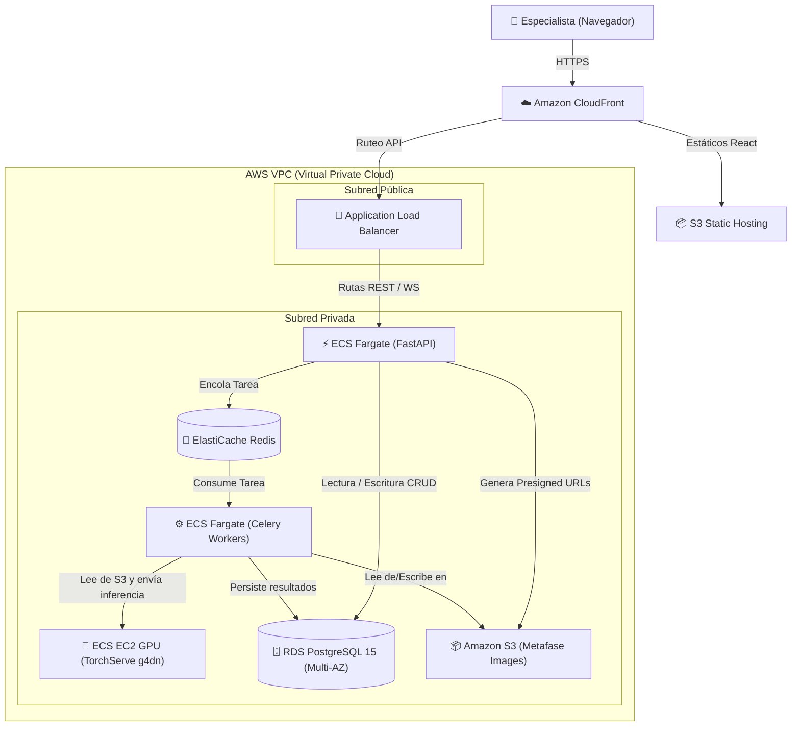

# ADR 0005: Selección de Proveedor Cloud y Estilo de Despliegue para BIOMED UMSS

## Contexto
La plataforma de diagnóstico citogenético **BIOMED UMSS** requiere un entorno de producción que cumpla con altos estándares de disponibilidad, escalabilidad y seguridad.
Dado que el pipeline de IA (segmentación con U-Net y clasificación con EfficientNet-B3) consume recursos de GPU de manera intensiva e irregular, y que las reglas de negocio exigen anonimización total en el borde (Código CHN) y auditorías inalterables, es necesario definir un proveedor cloud y un estilo de despliegue que soporte este modelo mixto e híbrido de procesamiento.

## Decisión
Se adopta **Amazon Web Services (AWS)** como el proveedor cloud autoritativo y una arquitectura de despliegue **Container-Native (Docker/ECS)** administrada.

Los componentes se mapean a los servicios de AWS de la siguiente manera:

1. **Capa de Presentación (React SPA):** Alojada de forma estática en **Amazon S3** y distribuida a nivel global mediante **Amazon CloudFront** para minimizar la latencia de carga inicial y asegurar HTTPS nativo.
2. **Capa de Aplicación y Orquestación (FastAPI):** Desplegada en contenedores sobre **Amazon ECS (Elastic Container Service)** con el modo **AWS Fargate** (serverless) para autogestionar el escalado horizontal según la demanda de conexiones HTTP/WebSockets.
3. **Capa Asíncrona (Redis Broker):** Implementada mediante **Amazon ElastiCache para Redis** (modo clúster desactivado, multi-AZ con failover automático) para garantizar baja latencia y alta confiabilidad en la cola de Celery.
4. **Capa de Inferencia IA (TorchServe + Workers Celery):**
   * Los **Celery Workers** se ejecutan en **Amazon ECS Fargate** para el procesamiento de imágenes ligero (CLAHE, tiling, NMS).
   * El servidor de inferencia **TorchServe** se despliega en ECS sobre instancias de contenedores optimizadas para GPU (**Amazon EC2 de la familia g4dn.xlarge** con GPUs NVIDIA T4) utilizando Auto Scaling Groups (ASG) para escalar a cero cuando no hay procesamiento activo, optimizando costos.
5. **Capa de Persistencia (PostgreSQL):** Ejecutada sobre **Amazon RDS para PostgreSQL 15** en configuración Multi-AZ para backups automáticos diarios, replicación síncrona en zona de respaldo y conmutación por error automatizada.
6. **Almacenamiento de Imágenes:** Las imágenes de metafase crudas y procesadas se almacenan en un bucket de **Amazon S3** privado con cifrado del lado del servidor (SSE-S3) y acceso controlado mediante políticas de IAM temporales (URLs firmadas de corta duración).
7. **Seguridad y Redes:** Aislamiento completo en una **AWS VPC** privada, utilizando subredes públicas para el **Application Load Balancer (ALB)** y subredes privadas para la base de datos, Redis y TorchServe. Protección perimetral con **AWS WAF** (Web Application Firewall) contra ataques OWASP Top 10.

## Trade-offs

### Pros
* **Escalabilidad de GPU Eficiente:** Utilizar ECS EC2 ASG permite encender instancias de GPU solo cuando hay tareas pendientes en la cola de Celery y apagarlas tras un periodo de inactividad, evitando el alto costo fijo de mantener hardware GPU encendido 24/7.
* **Alta Disponibilidad Out-of-the-Box:** Multi-AZ en RDS y ElastiCache garantiza una disponibilidad del 99.99% para la base de datos clínica y la cola de mensajes.
* **Seguridad y Cumplimiento:** AWS facilita la implementación de controles exigidos por la norma **21 CFR Part 11** de la FDA y la Ley 164 de Bolivia (cifrado en reposo AES-256, logs de auditoría en AWS CloudTrail y políticas de mínimo privilegio de IAM).
* **Mantenimiento Operativo Bajo:** Al delegar la administración del sistema operativo y la infraestructura física de la base de datos (RDS) y Redis (ElastiCache) a AWS, el equipo puede concentrarse en el desarrollo del pipeline de IA y la mesa de edición.

### Contras
* **Costo Operativo en la Nube:** El costo de las instancias de GPU de AWS (`g4dn.xlarge` a ~$0.526/hora) y los servicios administrados es mayor que el alojamiento en un servidor físico local básico.
* **Vendor Lock-in:** El uso de características nativas de AWS como las URLs firmadas de S3, RDS, y ElastiCache acopla parcialmente la capa de infraestructura a AWS, aunque la lógica del core (FastAPI/React) se mantiene 100% portable mediante Docker.

## Consecuencias
* Se requiere configurar scripts de Terraform (IaC) para la creación reproducible de los entornos de `dev`, `stg` y `prd`.
* La transmisión cloud de imágenes de metafase a S3 se realiza exclusivamente **después** de que el módulo local del frontend / API ejecuta la anonimización y asigna el código CHN. Los metadatos de paciente nunca se almacenan en S3 ni en RDS, minimizando riesgos de filtración.
* Se debe implementar un pipeline de CI/CD que compile las imágenes Docker de la API y el Worker, y las suba a **AWS ECR** antes de actualizar las tareas de ECS.
