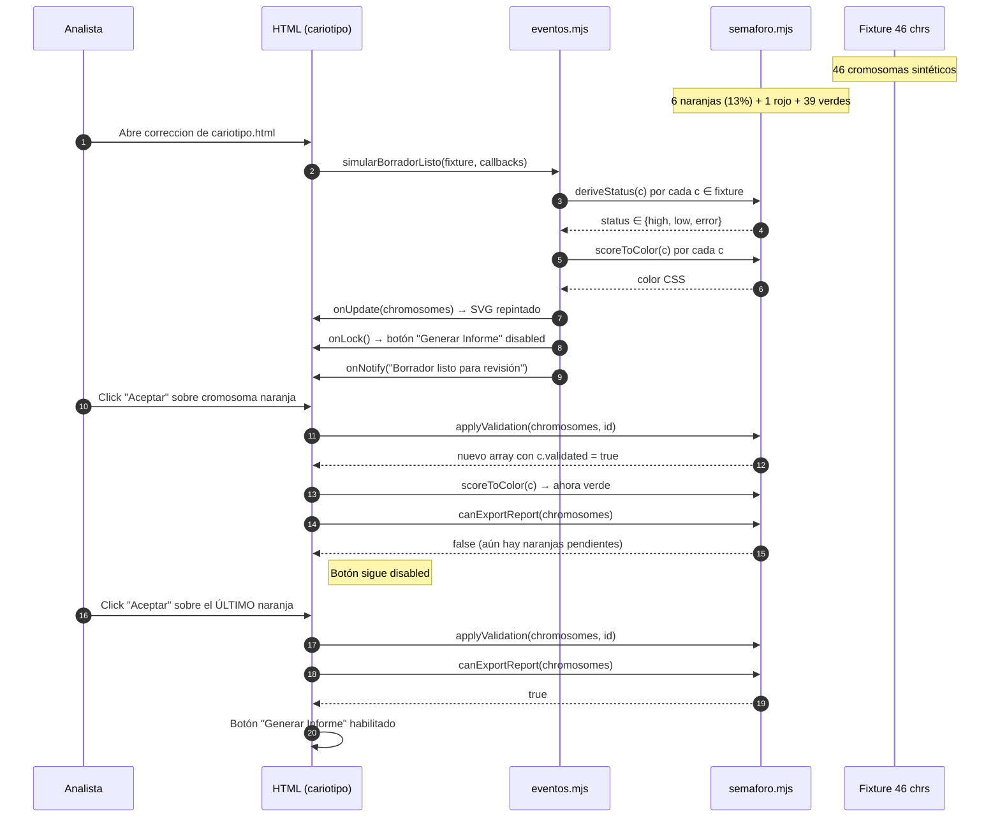

# DESIGN-006 — Semaforización Visual del Cariotipo

| Campo | Valor |
|:---|:---|
| **ID** | DESIGN-006 |
| **Versión** | 1.0 |
| **Fecha** | 23/06/2026 |
| **Autor** | Ing. Guillermo Mamani Chambi (G04) |
| **Spec origen** | `docs/specs/SPEC-006-semaforizacion.md` (borrador) |
| **ADRs anclados** | ADR-0006 (Semaforización) |
| **FSD-UCs** | FSD-UC-002 (Segmentación/clasificación/semaforización), FSD-UC-004 (Bloqueo y validación) |
| **Reglas clínicas** | RN-02 (bloqueo por score < 0.85), BR-02 (semaforización), BR-03 (bloqueo de informe), BR-R5 (no-emisión sin firma) |
| **Rama objetivo** | `feature/demo-semaforizacion-spec006` → PR a `release/2.0.0` |

---

## 1. Contexto y problema

La regla clínica **RN-02** exige que ningún cromosoma con `confidence_score < 0.85` llegue a un informe sin validación manual explícita del Analista. En el flujo de FSD-UC-002, la IA produce 46 cromosomas con scores; el sistema debe **bloquear la exportación** del informe ISCN (BR-R5) mientras exista al menos un cromosoma naranja o rojo sin `validated=true`.

**Problema de UX:** el analista no puede revisar 46 puntajes uno por uno. Necesita una **señalización visual** (semáforo) que priorice la atención y un **bloqueo binario** del botón "Generar Informe" que traduzca RN-02 en una affordance obvia.

**Resultado esperado:** en menos de 5 segundos, un analista identifica visualmente qué cromosomas requieren atención y por qué el sistema no le deja generar el informe.

---

## 2. Arquitectura del componente

### 2.1 Capas

```
┌──────────────────────────────────────────────────────────┐
│  Capa 1 — Presentación (correccion de cariotipo.html)    │
│  - SVG inline por cromosoma con stroke dinámico          │
│  - CSS .glow-orange para llamar atención                 │
│  - Botón "Aceptar validación" + "Generar Informe"        │
└──────────────────────────────────────────────────────────┘
                           │ DOM events
                           ▼
┌──────────────────────────────────────────────────────────┐
│  Capa 2 — Módulos puros JS (testeables sin DOM)          │
│  - frontend/semaforo.mjs                                 │
│      • scoreToColor(score) → "#1e8868" | "#d45100" | …  │
│      • deriveStatus(score) → "high" | "low" | "error"    │
│      • canExportReport(chromosomes) → boolean            │
│      • applyValidation(chromosomes, id) → new array      │
│  - frontend/eventos.mjs                                  │
│      • simularBorradorListo(chromosomes, callbacks)      │
└──────────────────────────────────────────────────────────┘
                           │ payload JSON
                           ▼
┌──────────────────────────────────────────────────────────┐
│  Capa 3 — Fuente de datos (mockeada en demo)             │
│  - tests/fixtures/46-chromosomes-fixture.mjs             │
│  - 46 cromosomas sintéticos reproducibles                │
│  - Distribución esperada: 6 naranjas (13%), 1 rojo, 39 v │
└──────────────────────────────────────────────────────────┘
```

### 2.2 Decisiones de diseño

| Decisión | Alternativa descartada | Justificación |
|:--|:--|:--|
| **Módulo puro JS** separado del HTML | Lógica embebida en `<script>` del HTML | Testabilidad sin jsdom; cobertura medible con Vitest |
| **SVG inline con `setAttribute('stroke', …)`** | Konva.js real | Konva requiere bundler; SVG es observable por jsdom con la misma forma de contrato que Konva.Shape.stroke() |
| **CSS `.glow-orange` con `filter: drop-shadow()`** | Animación JS de outline | Animación JS no testeable; CSS filter es declarativo y verificable con getComputedStyle |
| **`canExportReport` como función pura** | Computed property en objeto | Función pura permite tests aislados de la UI; sigue el patrón de la guía `docs/GUIDE_AGENTS.md §3.2` (puertos in/out) |
| **Fixture determinista de 46 cromosomas** | Random en cada test | Reproducibilidad de auditoría clínica; el docente puede validar el mismo output |

### 2.3 Contratos de estado (interfaz del módulo `semaforo.mjs`)

```js
// @ts-check

/**
 * Mapea un score numérico a un color CSS de la paleta institucional.
 * @param {number} score - confianza ∈ [0, 1] o null/undefined
 * @returns {"#1e8868" | "#d45100" | "#E30613"} hex CSS color
 */
export function scoreToColor(score) { … }

/**
 * Mapea un score numérico al estado semántico del semáforo.
 * @param {number} score - confianza ∈ [0, 1] o null/undefined
 * @returns {"high" | "low" | "error"}
 */
export function deriveStatus(score) { … }

/**
 * Determina si el informe ISCN puede ser generado/exportado.
 * Regla BR-R5: requiere TODOS los cromosomas con score ≥ 0.85
 *              O validados manualmente.
 * @param {ReadonlyArray<{confidence_score: number, validated: boolean}>} chromosomes
 * @returns {boolean} true si y solo si NINGÚN cromosoma está bloqueante
 */
export function canExportReport(chromosomes) { … }

/**
 * Inmutable: retorna un nuevo array con el cromosoma `id` marcado como validado.
 * NO muta el array de entrada.
 * @template {{id: string, validated: boolean}} T
 * @param {ReadonlyArray<T>} chromosomes
 * @param {string} id
 * @returns {T[]} nuevo array con la validación aplicada
 * @throws {Error} si `id` no existe en el array
 */
export function applyValidation(chromosomes, id) { … }
```

### 2.4 Contrato de eventos (`eventos.mjs`)

```js
/**
 * Simula la recepción del payload WebSocket "Borrador listo".
 * Llama a los callbacks provistos en el orden:
 *   1. onUpdate(chromosomes) — repintar SVG/glow
 *   2. onLock()              — deshabilitar botón "Generar Informe"
 *   3. onNotify(msg)         — toast "Borrador listo para revisión"
 *
 * En el demo NO usa WebSocket real; el payload es el fixture de 46.
 * En producción este contrato se reemplaza por la lectura del WS real
 * sin cambiar los callbacks.
 */
export function simularBorradorListo(chromosomes, { onUpdate, onLock, onNotify }) { … }
```

---

## 3. Diagrama de secuencia (Mermaid)



---

## 4. Tabla de eventos UI

| Evento DOM | Trigger | Acción | Función pura invocada |
|:--|:--|:--|:--|
| `DOMContentLoaded` | Carga inicial del HTML | Llama `simularBorradorListo` con el fixture | (todas) |
| `click` en "Aceptar" | Click sobre cromosoma naranja seleccionado | Marca `validated=true` y re-pinta | `applyValidation` + `scoreToColor` + `canExportReport` |
| `click` en "Generar Informe" (disabled) | Click cuando hay naranjas pendientes | Muestra alert de bloqueo clínico (no genera) | `canExportReport` (debe retornar `false`) |
| `click` en "Generar Informe" (enabled) | Click cuando todos están validados/verdes | Placeholder: en demo, muestra toast "Informe generado" | `canExportReport` (debe retornar `true`) |
| `error: img-load` | Fallo de carga de crop | Marca cromosoma como `error` con borde rojo | `deriveStatus(null) === "error"` |

---

## 5. Mapeo a SPEC-006 — Criterios de Aceptación

| CA | Descripción | Componente responsable | Test que lo cubre |
|:--|:--|:--|:--|
| **CA-1** | Score 0.72 → borde naranja | `scoreToColor` + SVG `stroke` | `semaforo.test.mjs::scoreToColor_below_threshold_is_orange` |
| **CA-2** | Score 0.91 → borde verde | `scoreToColor` + SVG `stroke` | `semaforo.test.mjs::scoreToColor_above_threshold_is_green` |
| **CA-3** | Botón "Generar Informe" disabled con naranja sin validar | `canExportReport` + listener DOM | `dom-bloqueo.test.mjs::boton_generar_informe_arranca_disabled` |
| **CA-4** | Click "Aceptar" sobre el último naranja rehabilita | `applyValidation` + `canExportReport` | `dom-bloqueo.test.mjs::boton_se_habilita_al_validar_ultimo_naranja` |
| **CA-5** | Color cambia instantáneamente al recibir "Borrador listo" | `eventos.mjs` + DOM update | `eventos-mock.test.mjs::simularBorradorListo_repaintar_inmediatamente` |

---

## 6. Criterios de calidad (no funcionales)

| ID | Métrica | Objetivo | Verificación |
|:--|:--|:--|:--|
| **NFR-013** | Cobertura de tests en `semaforo.mjs` y `eventos.mjs` | ≥ 90 % (lines/funcs/branches/statements) | `npx vitest run --coverage` |
| **NFR-014** | Latencia de `canExportReport` con 46 cromosomas | < 1 ms por invocación | Test de performance con `performance.now()` |
| **NFR-015** | Inmutabilidad de `applyValidation` | Array de entrada NO mutado | `semaforo.test.mjs::applyValidation_no_muta_input` |
| **NFR-016** | Determinismo del fixture | 46 chrs reproducibles bit-a-bit | Hash SHA-256 del fixture en CI |

---

## 7. Riesgos y mitigaciones (específicos del diseño)

| # | Riesgo | Mitigación en diseño |
|:--|:--|:--|
| 1 | El `correccion de cariotipo.html` no carga limpio en jsdom por CDNs | Módulo `semaforo.mjs` **NO** depende del HTML; se testea en aislamiento. Para tests DOM, se usa `dom-harness.mjs` con HTML mínimo |
| 2 | La función `canExportReport` ignora el flag `error` (rojo) y permite exportar | Especificación explícita: rojo con `validated=false` también bloquea. Test dedicado en `semaforo.test.mjs::canExportReport_bloquea_con_error_sin_validar` |
| 3 | El docente espera un sistema React+Konva real, no HTML+JS | El módulo `semaforo.mjs` es TypeScript-ready con JSDoc; la migración a React es reutilización directa del módulo |
| 4 | El fixture de 46 cromosomas no es reproducible entre ejecuciones | Inicialización con `seed` determinista (`mulberry32(42)`); SHA-256 del fixture se publica en CI |

---

## 8. Out of scope (explícito)

- Backend FastAPI real (la demo es frontend con payload mockeado).
- WebSocket real (sustituido por `simularBorradorListo`).
- Persistencia en PostgreSQL (estado vive en memoria del navegador).
- Audit trail Merkle (no aplica a esta demo; la regla RN-05 la cubre ADR-0008 en otro sprint).
- MFA / firma digital (no aplica a esta demo; la regla BR-R5 la cubre FSD-UC-006 en otro sprint).
- React + Konva + Zustand (se reutilizaría el módulo `semaforo.mjs`; el wrapper React es trabajo futuro).

---

## 9. Trazabilidad documental

```
BRD §3 (necesidad clínica) y §7 (mecanismos anti-sesgo)
  └── PRD-US-003/US-004 (User Stories)
       └── FSD-UC-002 §4.2 (caso de uso principal)
       └── FSD-UC-004 §4.4 (caso de uso bloqueo)
            └── ADR-0006 (decisión arquitectónica)
                 └── SPEC-006 (este sprint)
                      └── DESIGN-006 (este doc) ← TÚ ESTÁS AQUÍ
                           ├── prompts/PR-UC02-SEM-V2.md (Día 5)
                           ├── prompts/PR-UC02-SEM-UI.md (Día 5)
                           ├── prompts/PR-UC02-SEM-EXPORT.md (Día 5)
                           ├── frontend/semaforo.mjs (Día 2)
                           ├── frontend/eventos.mjs (Día 4)
                           ├── tests/unit/semaforo.test.mjs (Día 2)
                           ├── tests/unit/dom-bloqueo.test.mjs (Día 3)
                           ├── tests/unit/eventos-mock.test.mjs (Día 4)
                           └── tests/e2e/demo-flujo.test.mjs (Día 4)
                                └── PROMPT_MAPPING.md (Día 5)
                                     └── AGENTS.md v1.3 con RN-09 (Día 1) ← TÚ ESTÁS AQUÍ
                                          └── FSD §10 NFR-013 (Día 6)
                                               └── docs/aportes/release-2.0.0.md (Día 6)
```

---

*DESIGN-006 v1.0 — Sprint Demo 23-29/06/2026 · Ing. Guillermo Mamani Chambi (G04)*
