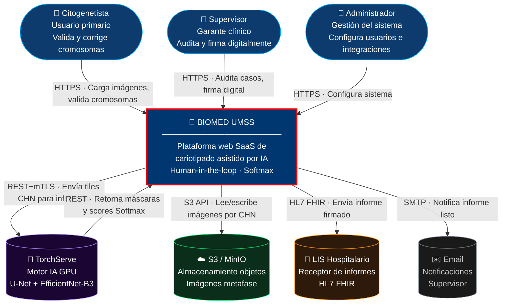
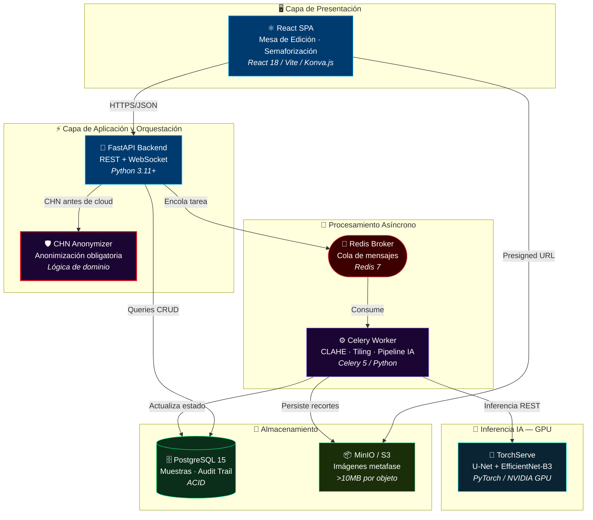
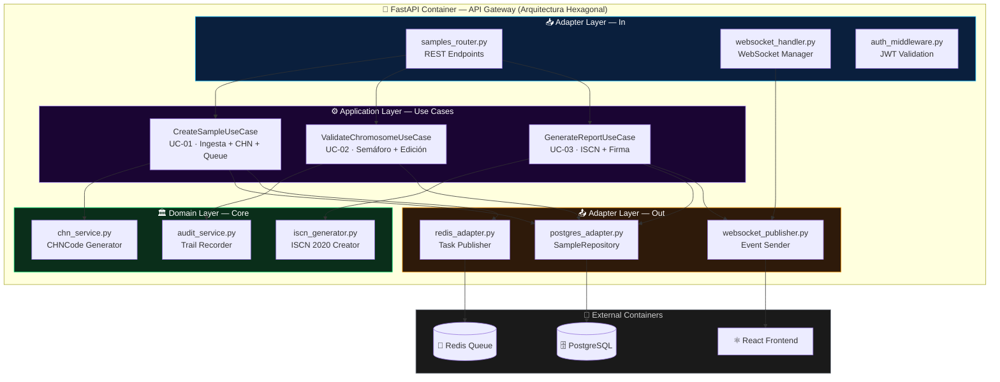
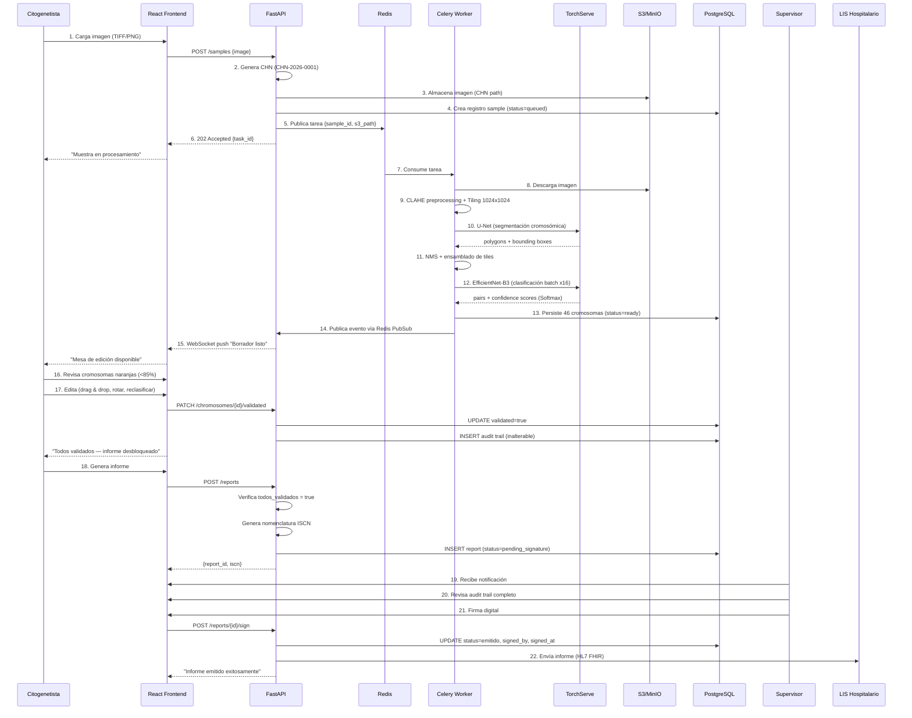
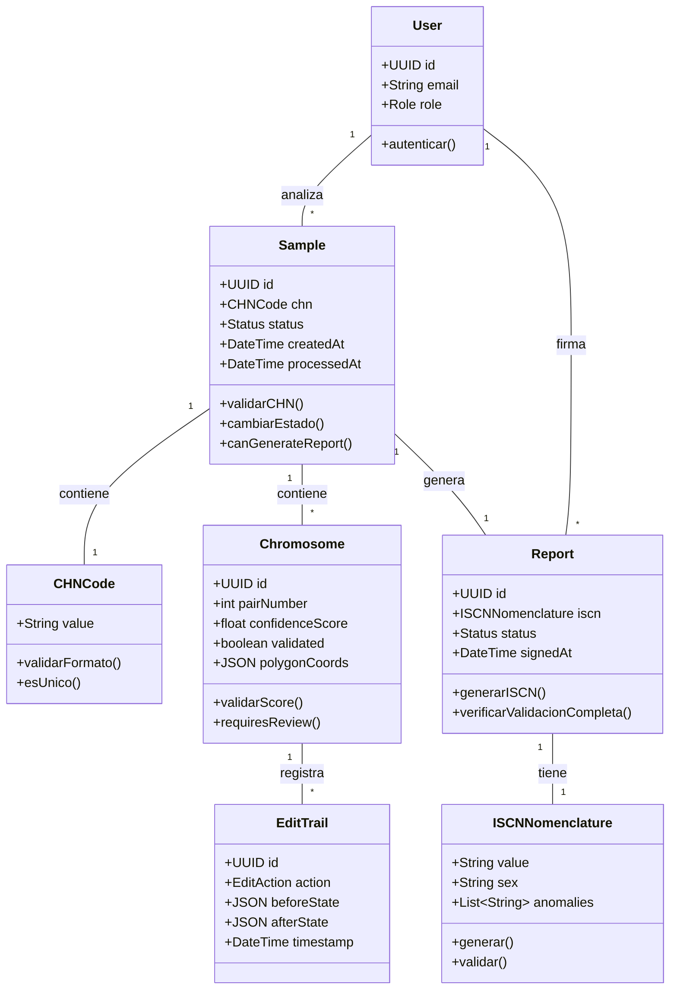

# Documento Técnico Inicial del Producto (DTI) — v1.0
## BIOMED UMSS — Intelligent Karyotyping Platform

| Campo | Valor |
|:---|:---|
| **Producto** | BIOMED UMSS – Intelligent Karyotyping |
| **Grupo** | G04 |
| **Versión** | v1.2 (sincronizado con MD folder — BRD v3.5, PRD v2, FSD v2, MRD v1) |
| **Fecha** | 13/05/2026 |
| **Arquitecto responsable** | Ing. Guillermo Mamani Chambi |
| **Stakeholders** | UMSS, IIBISMED-UMSS, laboratorios citogenéticos |
| **Estado** | Para revisión docente |
| **BRD** | `docs/BRD_v3.5.md` *(versión definitiva — v3.5)* |
| **MRD** | `docs/MRD_v1.md` *(nuevo — mercado, TAM/SAM/SOM)* |
| **PRD** | `docs/PRD_v2.md` *(versión definitiva — v2.0)* |
| **FSD** | `docs/FSD_v2.md` *(versión definitiva — v2.0)* |
| **LFSD** | `docs/LFSD.md` |
| **PROMPT_MAPPINGS** | `docs/PROMPT_MAPPINGS.md` |
| **Referencia C4** | https://c4model.com/ · Simon Brown |

---

## §0. Metadatos y Estado del Documento

### 0.1 Propósito del DTI

Este documento es el **contrato técnico inicial** del producto BIOMED UMSS. Debe ser legible tanto por ingenieros humanos como por agentes de IA. Acompaña obligatoriamente al archivo `AGENTS.md` en la raíz del repositorio.

**Audiencia dual:**
- **Humanos:** arquitectos, desarrolladores, QA, product managers, docentes del módulo
- **Agentes IA:** Claude, Cursor Agent, Copilot, agentes custom del proyecto

**Regla de oro:** Si una decisión arquitectónica significativa no está aquí (o referenciada desde aquí), no existe.

### 0.2 Estado de las secciones

| Sección | Estado | Entregable |
|:---|:---|:---|
| §0 Metadatos | ✅ | Completado |
| §1 Visión del Producto | ✅ | Completado |
| §2 C4 Nivel 1 (Contexto) | ✅ | Completado |
| §3 C4 Nivel 2 (Contenedores) | ✅ | Completado |
| §4 C4 Nivel 3 (Componentes FastAPI) | ✅ | Completado |
| §5 Data Flow Diagram | ✅ | Completado |
| §6 Modelo de Dominio | ✅ | Completado |
| §7 NFRs Consolidados | ✅ | Completado |
| §8 ADRs Registrados | ✅ | 3 ADRs documentados |
| §9 Estado de Cumplimiento | ✅ | Completado |
| §10 Próximos pasos | ✅ | Completado |

### 0.3 Trazabilidad a documentos fuente

| Documento | Versión | Secciones relevantes |
|:---|:---|:---|
| BRD_v3.5.md | **3.5 (definitivo)** | §1–§9 (problema, BMC, SMART, RACI, XAI, 21 CFR Part 11) |
| MRD_v1.md | **1.0 (nuevo)** | TAM/SAM/SOM, segmentación, personas, discovery |
| PRD_v2.md | **2.0 (definitivo)** | Constitution, Epics, XAI Saliency Maps, scope |
| FSD_v2.md | **2.0 (definitivo)** | U-Net, EfficientNet-B3, Grad-CAM, Audit Trail hash chain |
| LFSD.md | 1.0 | §2–§5 (UC críticos, tasks, NFR mínimos) |
| PROMPT_MAPPINGS.md | 1.0 | PM-UC01-API, PM-UC01-SEG, PM-UC01-CLS |
| Informe Final M2 | v2.4.1 | §2.4 Stakeholders, §6 Riesgos, §7 Conclusiones |

---

## §1. Visión del Producto

### 1.0 Resumen Ejecutivo

**BIOMED UMSS** representa un cambio de paradigma en el diagnóstico citogenético mediante la implementación de una arquitectura de **Inteligencia Aumentada**. A diferencia de los sistemas tradicionales, esta plataforma utiliza un pipeline asíncrono basado en **Arquitectura Hexagonal**, desacoplando el motor de inferencia (**U-Net + EfficientNet-B3**) de las reglas de negocio clínicas (estándar ISCN 2024).

El valor técnico reside en la transición de un flujo de trabajo manual y fatigante a uno de **atención dirigida**, donde la IA procesa la segmentación y clasificación en segundo plano, permitiendo al especialista enfocarse exclusivamente en la validación de casos complejos detectados mediante semaforización de confianza. Con un enfoque de **Privacidad por Diseño (Código CHN)** y una infraestructura escalable en contenedores, el sistema garantiza una reducción del **Time to Karyotype (TTK)** de 45 a menos de 15 minutos, asegurando precisión diagnóstica y cumplimiento normativo sin precedentes en la región.

### 1.1 Problema

El análisis citogenético tradicional presenta tres fallas estructurales (BRD_v2.md §2.1, Informe M2 §1):

1. **Ineficiencia temporal:** El recorte manual, segmentación y clasificación de cromosomas demanda entre 30 y 45 minutos por muestra.
2. **Fatiga cognitiva y riesgo clínico:** La atención visual sostenida provoca fatiga extrema en los especialistas, incrementando la probabilidad de errores diagnósticos.
3. **Barreras de acceso tecnológico:** Sistemas como Ikaros o CytoVision cuestan >USD 20,000, requieren hardware dedicado y no permiten colaboración remota.

**Riesgo adicional (Informe M2 §6.1):** Sesgo de automatización — el especialista podría confiar ciegamente en la IA, omitiendo la verificación de cromosomas no marcados como dudosos.

### 1.2 Usuarios Objetivo

| Rol | Credenciales (dev) | Responsabilidades | Pantallas asociadas |
|:---|:---|:---|:---|
| **Citogenetista** | cito / cito | Validación diagnóstica, corrección de clasificaciones, generación de informes | crudmuestra.html, registrarmuestrafinal.html, correccion de cariotipo.html, informe.html |
| **Supervisor** | super / super | Auditoría de casos, revisión de métricas, firma digital | supervisor.html |
| **Administrador** | admin / admin | Configuración de usuarios, modelos IA, integraciones, seguridad | configuracion.html |

### 1.3 Propuesta de Valor

> **"Automatiza el 80% del trabajo mecánico. El especialista se concentra en lo que importa: el diagnóstico."**

| Ventaja | Descripción | Evidencia |
|:---|:---|:---|
| Automatización inteligente | Borrador automático editable en <3 segundos | Informe M2 §2.3 |
| Atención dirigida | Solo 13% de pares requieren revisión manual | Informe M2 §7 |
| Transparencia algorítmica | Confidence scores visuales por cromosoma (Softmax) | Informe M2 §7 |
| Human-in-the-loop | Bloqueo de informe hasta validación completa | Informe M2 §6.1 |
| Accesibilidad web | 100% web, sin hardware dedicado | BRD_v2.md §4.1 |

### 1.4 Métricas de Éxito

| ID | Métrica | Baseline | Meta v1 | Fuente |
|:---|:---|:---|:---|:---|
| NS-01 | **TTK (Time to Karyotype)** | 45 min | ≤15 min | BRD v3.5 §7, Informe M2 §1 |
| KPI-01 | **Sensibilidad diagnóstica** | Variable | **>99%** | BRD v3.5 §8 *(actualizado)* |
| KPI-02 | Throughput por laboratorio | — | ≥500 muestras/mes | BRD v3.5 §8 |
| KPI-03 | Tiempo en modo degradado | — | <5% mensual | BRD v3.5 §8 |
| KPI-04 | Tasa corrección manual | ~100% | <15% | Informe M2 §7 (13% logrado) |
| KPI-05 | Payback period | — | 18–24 meses | MRD v1.0 §3.1 |

### 1.5 Restricciones de Negocio Clave

| ID | Restricción | Origen |
|:---|:---|:---|
| RC1 | Ningún informe puede emitirse sin validación del analista Y firma del supervisor | BRD §8.3 |
| RC2 | Sistema no exporta informe con cromosomas <85% confianza no validados | BRD §8.3 |
| RC3 | Datos de pacientes deben anonimizarse (CHN) antes de cualquier procesamiento cloud | BRD §8.3 |
| RC4 | Informes deben seguir nomenclatura ISCN vigente | BRD §8.3 |
| RC5 | 7 pantallas funcionales cubren todo el flujo | Informe M2 §7 |

### 1.6 Stack Tecnológico Autoritativo

| Capa | Tecnología | Versión | Justificación |
|:---|:---|:---|:---|
| Frontend | React + Vite + Konva.js | 18 / 5 / 9 | Componentes reactivos, canvas interactivo |
| Backend API | FastAPI | 0.115+ | Asíncrono nativo, compatible con ecosistema CV |
| Cola de tareas | Redis + Celery | 7 / 5 | Desacoplamiento frontend/AI, escalabilidad horizontal |
| Motor IA | TorchServe / NVIDIA Triton | 0.12+ | Serving de modelos PyTorch en GPU con batching |
| Segmentación | **U-Net** | PyTorch 2.0+ | Segmentación semántica cromosómica (FSD v2) |
| Clasificación | **EfficientNet-B3** | PyTorch 2.0+ | Clasificación pares 1–22, X, Y (FSD v2) |
| XAI | **Grad-CAM** | — | Saliency maps para explicabilidad y anti-sesgo |
| Base de datos | PostgreSQL | 15+ | Integridad referencial, audit trail, ACID |
| Almacenamiento | S3 / MinIO | — | Imágenes de metafase de alta resolución |
| Contenedores | Docker + Docker Compose | — | Reproducibilidad, escalabilidad horizontal |

---

## §2. Contexto del Sistema — C4 Nivel 1 (System Context)

### 2.1 System Context Diagram

### 2.2 Tabla de Actores y Sistemas Externos

| Actor / Sistema | Tipo | Criticidad | Interacción principal | SLA esperado |
|:---|:---|:---|:---|:---|
| **Citogenetista** | Persona | Alta | Carga imágenes, valida cromosomas, corrige IA | N/A |
| **Supervisor** | Persona | Alta | Audita casos, firma digital, revisa métricas | N/A |
| **Administrador** | Persona | Media | Configura usuarios, modelos IA, integración LIS | N/A |
| **TorchServe** | Sistema externo | Crítica | Inferencia IA (segmentación + clasificación) | <15s por muestra |
| **S3 / MinIO** | Sistema externo | Alta | Almacenamiento de imágenes de metafase | <3s upload/download |
| **LIS Hospitalario** | Sistema externo | Media | Recepción de informes finales | Asíncrono (no bloquea) |
| **Email** | Sistema externo | Baja | Notificaciones a supervisor | <5 min |

---

## §3. Arquitectura de Alto Nivel — C4 Nivel 2 (Container Diagram)

### 3.1 Diagrama de Contenedores (por capas)

### 3.2 Descripción de cada Contenedor

| Contenedor | Tecnología | Responsabilidad | ¿Por qué esta capa? |
|:---|:---|:---|:---|
| **React SPA** | React 18 + Vite + Konva.js | Interfaz de usuario: mesa de edición, carga de imágenes, dashboard | Necesidad de canvas interactivo (drag & drop de cromosomas) |
| **FastAPI** | FastAPI Python 3.11+ | Orquestador REST: autenticación JWT, coordinación de flujos | Asíncrono nativo, ideal para WebSockets y alta concurrencia |
| **CHN Anonymizer** | Lógica de aplicación | Anonimización: genera CHN-YYYY-NNNN, valida unicidad | Debe ejecutarse ANTES de cualquier transmisión cloud (ADR-0003) |
| **Redis Broker** | Redis 7 | Message broker: cola de tareas asíncronas | Ligero, compatible con Celery, baja latencia |
| **Celery Worker** | Celery 5 + Python | Procesador de imágenes: CLAHE, tiling, coordinación con IA | Escala horizontalmente, desacopla inferencia del API |
| **TorchServe** | TorchServe + NVIDIA Triton | Inferencia de modelos: **U-Net** (segmentación), **EfficientNet-B3** (clasificación) | Serving nativo de PyTorch, batching automático |
| **PostgreSQL** | PostgreSQL 15 | Datos clínicos: muestras, cromosomas, reportes, audit trail | ACID, integridad referencial, permisos granulares |
| **MinIO/S3** | S3-compatible | Almacenamiento de objetos: imágenes de metafase y recortes | Imágenes grandes (>10MB) no deben ir a la BD |

### 3.3 Justificación de la Arquitectura por Capas

| Capa | Contiene | Principio aplicado |
|:---|:---|:---|
| **Presentación** | React SPA | Interfaz de usuario, sin lógica de negocio |
| **Aplicación** | FastAPI + CHN Anonymizer | Orquestación, autenticación, anonimización temprana |
| **Asíncrono** | Redis + Celery | Desacoplamiento, escalabilidad horizontal |
| **IA** | TorchServe | Inferencia en GPU, separada del flujo principal |
| **Persistencia** | PostgreSQL + S3 | Separación de datos estructurados (SQL) y no estructurados (objetos) |

---

## §4. C4 Nivel 3 (Component Diagram) — Contenedor FastAPI

> Siguiendo la recomendación de Simon Brown, solo dibujamos el Nivel 3 para el contenedor más crítico: **FastAPI (API Gateway)**.

### 4.1 Diagrama de Componentes (Arquitectura Hexagonal)

### 4.2 Mapeo Componente → Código (1:1)

| Componente | Archivo en el código | Responsabilidad |
|:---|:---|:---|
| `samples_router.py` | `backend/app/api/samples.py` | Endpoints REST: POST /samples, GET /samples |
| `websocket_handler.py` | `backend/app/ws/websocket_manager.py` | Gestión de conexiones WebSocket por sample_id |
| `auth_middleware.py` | `backend/app/core/auth.py` | Validación JWT, extracción de user_id |
| `CreateSampleUseCase` | `backend/app/services/sample_service.py` | Lógica de creación de muestra + CHN + encolado |
| `ValidateChromosomeUseCase` | `backend/app/services/chromosome_service.py` | Validación de cromosoma + audit trail |
| `GenerateReportUseCase` | `backend/app/services/report_service.py` | Generación de ISCN + cambio de estado |
| `chn_service.py` | `backend/app/services/chn_service.py` | Generación de CHN-YYYY-NNNN, unicidad |
| `iscn_generator.py` | `backend/app/services/iscn_generator.py` | Generación de nomenclatura ISCN 2020 |
| `audit_service.py` | `backend/app/services/audit_service.py` | Registro inalterable de ediciones |
| `postgres_adapter.py` | `backend/app/db/repositories.py` | CRUD de samples, chromosomes, reports |
| `redis_adapter.py` | `backend/app/tasks/publisher.py` | Publicación de tareas en Redis queue |
| `websocket_publisher.py` | `backend/app/ws/event_publisher.py` | Push de eventos al frontend vía WebSocket |

### 4.3 Nota sobre Nivel 3

Según Simon Brown:
- **No dibujar Nivel 3 para todos los contenedores** — solo para los más complejos
- **Debe haber mapeo 1:1 con el código** — cada componente debe poder encontrarse en el repositorio
- **Generar Nivel 4 (código) automáticamente desde el IDE** — no dibujar manualmente

En BIOMED, los otros contenedores (React SPA, Celery Worker, PostgreSQL) son suficientemente simples como para no requerir diagrama de componentes en esta versión.

---

## §5. Data Flow Diagram — Del Raw al Reporte Final

### 5.1 Flujo de Datos (Secuencia Completa — 22 pasos)

---

## §6. Modelo de Dominio (Entities, Value Objects, Aggregates)

### 6.1 Diagrama de Clases del Dominio

### 6.2 Diccionario de Dominio (Aggregates, Entities, Value Objects)

| Tipo | Nombre | Atributos clave | Invariantes | Ciclo de vida |
|:---|:---|:---|:---|:---|
| **Aggregate Root** | Sample | id, chn, status, createdAt | CHN único; status solo cambia en orden definido | Creado → Encolado → Procesando → Listo → Error/Emitido |
| **Value Object** | CHNCode | value (string) | Formato CHN-YYYY-NNNN, único en sistema | Inmutable, generado al crear Sample |
| **Entity** | Chromosome | id, pairNumber, confidenceScore, validated, polygonCoords | confidenceScore ∈ [0,1]; validated cambia solo una vez | Pertenece a Sample, creado durante inferencia |
| **Aggregate Root** | Report | id, iscn, status, signedAt | Solo llega a "emitido" si está firmado por supervisor | Generado al validar todos los Chromosomes |
| **Value Object** | ISCNNomenclature | value, sex, anomalies | Formato estándar ISCN 2020, read-only | Generado automáticamente, no editable |
| **Entity** | EditTrail | id, action, beforeState, afterState, timestamp | Inalterable (solo INSERT); user_id del JWT | Cada edición humana crea un registro |
| **Value Object** | Role | name (enum) | Valores: citogenetista, supervisor, administrador | Inmutable, asignado al User |

### 6.3 Reglas de Dominio — Invariantes

| Regla | Implementación | Ubicación |
|:---|:---|:---|
| CHNCode debe ser único | Búsqueda en DB antes de crear Sample | `CHNService` |
| `confidenceScore < 0.85` → `requires_review = true` | Setter de Chromosome | `Chromosome` entity |
| Report solo se genera si todos los Chromosomes están validados | Método `canGenerateReport()` | `Sample` aggregate |
| EditTrail nunca se actualiza ni elimina | Permisos DB: `REVOKE UPDATE, DELETE` | Migración SQL |
| ISCNNomenclature es read-only después de generado | No exponer endpoint PATCH | API design |

---

## §7. NFRs Consolidados con Métricas Verificables

| ID | Categoría | Requerimiento | Métrica | Umbral | Verificación | Origen |
|:---|:---|:---|:---|:---|:---|:---|
| NFR-01 | Rendimiento | Tiempo de inferencia por muestra | p95 | <15s | k6 load test + CloudWatch | BRD §5 |
| NFR-02 | Rendimiento | Latencia de notificación WebSocket | p95 | <500ms | Playwright timing | PRD NFR-02 |
| NFR-03 | Disponibilidad | Uptime del sistema | % mensual | ≥99.5% | UptimeRobot / Grafana | BRD §8 |
| NFR-04 | Seguridad | Anonimización de datos | % muestras con CHN | 100% | Auditoría de logs (grep PII) | BRD §8.3 RC3 |
| NFR-05 | Seguridad | Audit trail inalterable | Permisos DB | Solo INSERT | REVOKE UPDATE, DELETE | PRD NFR-05 |
| NFR-06 | Escalabilidad | Muestras concurrentes | Throughput | ≥10 simultáneas | k6 + Docker Compose scale | FSD NFR-06 |
| NFR-07 | Compatibilidad | Navegadores soportados | Cobertura | Chrome 120+, Firefox 121+, Edge 120+ | Pruebas de regresión | BRD §8.3 RC5 |
| NFR-08 | Cumplimiento | Nomenclatura ISCN | % informes válidos | 100% | Validación automática | BRD §8.3 RC4 |

---

## §8. ADRs Registrados

### ADR-0001 — Adopción de Tiling para manejo de imágenes de alta resolución

| Campo | Valor |
|:---|:---|
| **Estado** | ✅ Aceptada |
| **Fecha** | 13/05/2026 |
| **Archivo** | `docs/adr/0001-tiling-gpu-memory-management.md` |
| **Decisión** | Dividir imágenes >4000px en tiles de 1024×1024 con overlap de 64px |
| **Riesgo mitigado** | GPU Out Of Memory (OOM), latencia en procesamiento de imágenes grandes |

**Contexto:** Las imágenes de metafase superan los 10MB y pueden llegar a resoluciones de 8000×6000px. Cargarlas completas en la VRAM de la GPU provoca error OOM y el procesamiento falla.

**Alternativas consideradas:**

| Alternativa | Resultado |
|:---|:---|
| Reducir resolución de entrada | Descartada — pierde información diagnóstica crítica |
| Procesar en CPU | Descartada — 10x más lento, incompatible con NFR-01 |
| Tiles 1024×1024 con overlap 64px + NMS | ✅ Elegida — balance entre memoria GPU y precisión en bordes |

**Consecuencias:** Overhead de 1-2s por ensamblado de tiles; sin pérdida de información en bordes gracias a Non-Maximum Suppression.

---

### ADR-0002 — Pipeline Asíncrono con Redis/Celery

| Campo | Valor |
|:---|:---|
| **Estado** | ✅ Aceptada |
| **Fecha** | 13/05/2026 |
| **Archivo** | `docs/adr/0002-async-pipeline-redis-celery.md` |
| **Decisión** | Desacoplar inferencia IA del frontend usando Redis como broker y Celery como worker |
| **Riesgo mitigado** | Bloqueo del hilo principal HTTP, falta de escalabilidad |

**Contexto:** El frontend no debe bloquearse durante la inferencia de IA (puede tomar hasta 15s). Un flujo síncrono provocaría timeout en el cliente y colapso del servidor ante múltiples solicitudes.

**Alternativas consideradas:**

| Alternativa | Resultado |
|:---|:---|
| (A) Síncrono (FastAPI directo) | Descartada — bloquea hilo, no escala, timeout en producción |
| (B) Redis + Celery | ✅ Elegida — simplicidad operativa, escalabilidad horizontal |
| (C) Kafka | Descartada — sobredimensionado para el volumen esperado |

**Consecuencias:** +5-7s de overhead por encolado, pero el frontend nunca bloquea. Escalabilidad con un solo comando: `docker compose up --scale celery_worker=N`.

---

### ADR-0003 — CHN Anonimización en el Borde (Privacy by Design)

| Campo | Valor |
|:---|:---|
| **Estado** | ✅ Aceptada |
| **Fecha** | 13/05/2026 |
| **Archivo** | `docs/adr/0003-chn-edge-anonymization.md` |
| **Decisión** | Asignar código CHN antes de cualquier transmisión a servicios cloud |
| **Riesgo mitigado** | Cumplimiento Ley 164 Bolivia, GDPR equivalente |

**Contexto:** Los datos de pacientes no pueden salir del entorno local según normativas de salud. TorchServe puede correr en infraestructura cloud; si recibiera PII y sufriera una brecha, la responsabilidad legal recaería sobre BIOMED UMSS.

**Alternativas consideradas:**

| Alternativa | Resultado |
|:---|:---|
| (A) Anonimización en cloud | Descartada — los datos ya salieron del entorno local, viola la normativa |
| (B) Anonimización en el borde (CHN) | ✅ Elegida — TorchServe nunca ve PII, trazabilidad mantenida por CHN |
| (C) No anonimizar | Descartada — riesgo regulatorio inaceptable |

**Consecuencias:** TorchServe nunca procesa PII. La tabla de correspondencia CHN↔datos reales existe únicamente en PostgreSQL local, con backup seguro y separado.

---

## §9. Estado de Cumplimiento vs. Plantilla DTI

| Requisito de la plantilla | Estado en v1.0 | Evidencia |
|:---|:---|:---|
| Visión del producto + métricas | ✅ | §1 |
| C4 Nivel 1 (Contexto) | ✅ | §2 |
| C4 Nivel 2 (Contenedores) | ✅ | §3 |
| C4 Nivel 3 (Componentes) | ✅ | §4 |
| Data Flow Diagram | ✅ | §5 |
| Modelo de dominio (Aggregates, Entities, VOs) | ✅ | §6 |
| NFRs con umbrales y verificación | ✅ | §7 |
| ≥3 ADRs aceptadas | ✅ | §8 (3 ADRs documentados) |
| Trazabilidad a BRD/PRD/FSD | ✅ | §0.3 |

---

## §10. Próximos Pasos

| Tarea | Responsable | Fecha |
|:---|:---|:---|
| Revisión por pares (otro grupo) | Grupo par | 14/05/2026 |
| Feedback docente e iteración | Arquitecto | 15/05/2026 |
| Generar AGENTS.md desde este DTI | Arquitecto | 16/05/2026 |
| Sincronizar con PROMPT_MAPPINGS.md | Arquitecto | 16/05/2026 |
| Documentar ADR-0001 completo (tiling) | Arquitecto | 17/05/2026 |

---

*Documento completado — versión v1.0 (lista para entrega)*
*Trazabilidad: DTI_borrador.md ← BRD_v2.md ← PRD_v1.md ← FSD_v1.md ← Informe Final M2*
*Referencia C4: https://c4model.com/ · Simon Brown — "Visualising Software Architecture"*
