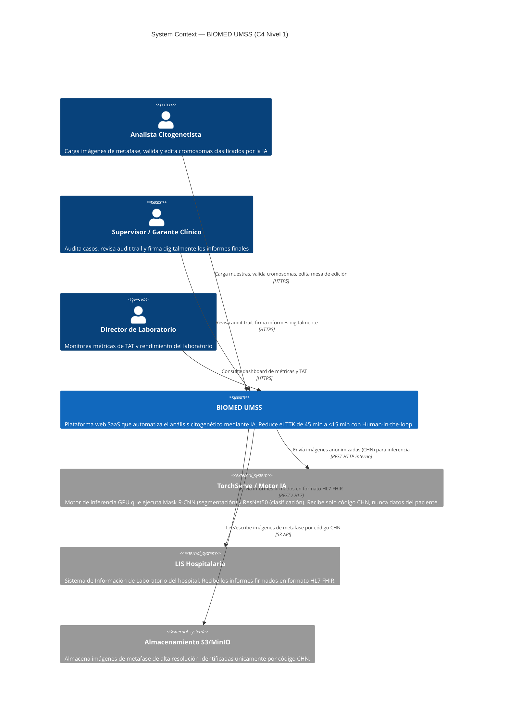

# DTI — Documento Técnico de Infraestructura
## BIOMED UMSS — Intelligent Karyotyping Platform
### Borrador v0.1 — C4 Model Nivel 1 (System Context)

| Campo | Detalle |
|---|---|
| **Proyecto** | BIOMED UMSS – Intelligent Karyotyping |
| **Versión** | 0.2 (enriquecido con video Simon Brown) |
| **Fecha** | Mayo 2026 |
| **Autor** | Ing. Guillermo Mamani Chambi |
| **Trazabilidad** | FSD_v1.md §2 · BRD_v2.md §4 |
| **Referencia** | C4 Model — https://c4model.com/ · Video: Simon Brown — "Visualising Software Architecture" |
| **Estado** | Borrador — pendiente revisión de equipo |

---

## §0 — Introducción y Marco C4

### §0.1 ¿Qué es el C4 Model?

El C4 Model es un enfoque de diagramación de arquitectura de software creado por **Simon Brown**, diseñado para resolver la "crisis de comunicación" en ingeniería de software: el abandono del UML dejó un vacío que fue llenado por diagramas informales y ambiguos — lo que Brown llama **"garbage diagrams"**.

La filosofía central es: **"abstracciones primero, notación después"**. Brown usa la metáfora de los **mapas geográficos**: así como un mapa puede mostrarse a distintos niveles de zoom (país → ciudad → calle → edificio), la arquitectura debe visualizarse a diferentes niveles de detalle para contar historias técnicas a distintas audiencias sin perder la conexión con el código real.

El C4 Model proporciona un conjunto de **abstracciones jerárquicas** independientes de notación y herramientas para comunicar la arquitectura de un sistema en distintos niveles de detalle.

El nombre "C4" proviene de sus cuatro niveles de abstracción:

| Nivel | Diagrama | Abstracción | Audiencia |
|---|---|---|---|
| 1 | **System Context** | El sistema y su entorno | Técnicos y no técnicos |
| 2 | **Container** | Unidades desplegables dentro del sistema | Técnicos |
| 3 | **Component** | Bloques que componen cada container | Desarrolladores |
| 4 | **Code** | Detalle de implementación (clases, funciones) | Desarrolladores |

### §0.2 Las 4 Abstracciones del C4 Model

Definiciones exactas según Simon Brown en el video:

| Abstracción | Definición exacta (Simon Brown) | Ejemplo BIOMED |
|---|---|---|
| **Person** | Usuario humano que interactúa con el sistema; representa roles o personas | Citogenetista, Supervisor, Director |
| **Software System** | Nivel más alto de abstracción. Algo que entrega valor a sus usuarios, ya sea interno o externo a la organización | BIOMED UMSS, LIS Hospitalario, TorchServe |
| **Container** | ⚠️ **No es Docker**. Es una unidad de ejecución o almacenamiento — algo que necesita estar "en ejecución" para que el sistema funcione (app web, app móvil, base de datos, sistema de archivos) | React App, FastAPI API, Redis, PostgreSQL |
| **Component** | Agrupación lógica de funciones relacionadas (módulos o paquetes) dentro de un container, con interfaz limpia y fronteras bien definidas | CHN Anonymizer, ISCN Generator, WebSocket Manager |
| **Code** | Elementos de implementación más granulares: clases, interfaces, esquemas de BD | Clases Python, TypeScript interfaces |

> **Nota crítica del video:** El diagrama de Componentes (Nivel 3) debe tener un **mapeo 1:1** con la estructura real del código fuente. Si el diagrama no refleja el código, pierde valor como herramienta de ingeniería.

### §0.3 Los 4 Diagramas — Características según el Video

| Nivel | Diagrama | Alcance | Audiencia | Nota del video |
|---|---|---|---|---|
| 1 | **System Context** | El sistema como caja negra + usuarios + sistemas externos | Técnicos y no técnicos | Herramienta más poderosa para alinear stakeholders comerciales, product owners y devs |
| 2 | **Container** | Descompone el sistema en apps y almacenes de datos. Muestra elecciones tecnológicas y comunicación entre procesos (IPC) | Técnicos | Muestra llamadas de red entre containers |
| 3 | **Component** | Zoom dentro de un container para mostrar sus componentes internos | Desarrolladores | **Mapeo 1:1 obligatorio con estructura real del código** |
| 4 | **Code** | Diagramas de clases, interfaces, esquemas | Desarrolladores | Brown recomienda **generarlos automáticamente desde el IDE**, no dibujarlos a mano — se vuelven obsoletos rápidamente |

### §0.4 Buenas Prácticas del Video (Simon Brown)

| Práctica | Descripción |
|---|---|
| **Títulos explícitos** | Todo diagrama debe declarar claramente su tipo y alcance. Ej: "System Context Diagram for BIOMED UMSS" |
| **Leyendas obligatorias** | No asumir que colores o formas son obvios. Siempre incluir leyenda con la semántica visual |
| **Flechas con intención** | Usar flechas **unidireccionales** con verbos de acción específicos. Ej: "hace llamadas a la API de..." — evitar el término vago "usa" |
| **Texto sobre estética** | El diagrama debe tener sentido incluso sin color ni forma. La descripción textual corta dentro de las cajas es vital |
| **Arquitectura como código** | Brown desaconseja Visio/Lucidchart por falta de semántica arquitectónica. Recomienda **PlantUML con macros C4** o Structurizr DSL |

### §0.5 Ejemplo del Video: Internet Banking System

Simon Brown usa un **Sistema de Banca por Internet** para demostrar los 4 niveles:
- **Nivel 1:** Cliente bancario → Sistema → Mainframe Banking System + Email System
- **Nivel 2:** Single Page App (Angular) + App Móvil (Xamarin) + API Backend (Java/Spring MVC) + PostgreSQL
- **Nivel 3 (dentro del API):** Sign-in Controller, Security Component, Mainframe Banking Facade
- **Nivel 4:** Diagrama de clases del Mainframe Facade (generado desde IDE)

### §0.6 Scope de este Documento

Este borrador cubre **exclusivamente el Nivel 1 (System Context Diagram)** del C4 Model para BIOMED UMSS. Los niveles 2, 3 y 4 se desarrollarán en versiones posteriores del DTI.

---

## §1 — C4 Nivel 1: System Context Diagram (BIOMED UMSS)

### §1.1 Propósito

El **System Context Diagram** es el punto de partida de la documentación de arquitectura. Permite dar un paso atrás y ver el panorama completo: cómo el sistema BIOMED UMSS encaja en su entorno, quiénes lo usan y con qué sistemas externos se comunica.

> *"A good starting point for diagramming and documenting a software system, allowing you to step back and see the big picture."* — c4model.com

**Principio guía:** El diagrama prioriza **personas y sistemas** sobre tecnologías, protocolos y detalles de bajo nivel. Está diseñado para ser comprensible tanto por el equipo técnico como por stakeholders no técnicos.

### §1.2 Diagrama — System Context (Mermaid)

### §1.3 Elementos del Diagrama

#### Personas (Users)

| ID | Nombre | Descripción | Interacción con BIOMED |
|---|---|---|---|
| P-01 | **Analista Citogenetista** | Usuario primario. Carga imágenes, valida y edita la clasificación de cromosomas propuesta por la IA. Perfil: Dra. Valeria Ríos, 42 años, ~60 muestras/mes | Lee y escribe vía interfaz web |
| P-02 | **Supervisor / Garante Clínico** | Audita los casos procesados, revisa el historial de ediciones y firma digitalmente el informe antes de su emisión | Lee y escribe vía interfaz web |
| P-03 | **Director de Laboratorio** | Monitorea KPIs operativos (TAT, volumen de muestras, errores) sin interactuar con el flujo diagnóstico | Solo lectura (dashboard) |

#### Sistema Principal

| ID | Nombre | Descripción |
|---|---|---|
| S-00 | **BIOMED UMSS** | Plataforma web SaaS de cariotipado asistido por IA. Gestiona el ciclo completo: ingesta de muestras, procesamiento IA asíncrono, validación humana, generación de nomenclatura ISCN y emisión de informes. Garantiza anonimización CHN antes de cualquier transmisión externa. |

#### Sistemas Externos

| ID | Nombre | Tipo | Descripción | Relación con BIOMED |
|---|---|---|---|---|
| SE-01 | **TorchServe / Motor IA** | Sistema externo (interno al stack) | Servidor de modelos PyTorch (Mask R-CNN + ResNet50) que corre en GPU. Recibe únicamente el código CHN como identificador — nunca datos del paciente | BIOMED envía imágenes para inferencia; recibe polígonos y scores |
| SE-02 | **LIS Hospitalario** | Sistema externo (tercero) | Sistema de Información de Laboratorio del hospital cliente. Recibe los informes finales firmados en formato HL7 FHIR | BIOMED envía informe post-firma del supervisor |
| SE-03 | **S3 / MinIO** | Servicio de almacenamiento | Almacén de objetos para imágenes de metafase de alta resolución (>10MB, TIFF/PNG). Identificadas por código CHN, nunca por datos del paciente | BIOMED lee al procesar; escribe al recibir la imagen |

### §1.4 Flujos Principales Identificados

| # | Flujo | Actores | Sistemas involucrados |
|---|---|---|---|
| F-01 | Ingesta de muestra y anonimización | Analista → BIOMED | BIOMED → S3 |
| F-02 | Procesamiento asíncrono por IA | BIOMED (interno) | BIOMED → TorchServe |
| F-03 | Notificación en tiempo real | BIOMED → Analista | WebSocket (interno) |
| F-04 | Validación y edición humana | Analista ↔ BIOMED | BIOMED ↔ PostgreSQL |
| F-05 | Auditoría y firma del informe | Supervisor → BIOMED | BIOMED → PostgreSQL |
| F-06 | Emisión al sistema hospitalario | BIOMED → LIS | BIOMED → LIS (HL7 FHIR) |

### §1.5 Límites del Sistema (System Boundary)

**Dentro del límite de BIOMED UMSS:**
- Interfaz web React (Frontend)
- API FastAPI (Backend)
- Cola de tareas Redis + Celery Workers
- Base de datos PostgreSQL (audit trail, muestras, informes)
- WebSocket Manager (notificaciones)
- CHN Anonymizer (módulo de privacidad)
- ISCN Generator (generación de nomenclatura)

**Fuera del límite (sistemas externos):**
- Motor de inferencia TorchServe (aunque es parte del stack, opera como sistema externo al core BIOMED)
- LIS Hospitalario del cliente
- S3 / MinIO (almacenamiento de objetos)
- Equipos de microscopía (fuera de scope v1.0)

---

## §2 — Decisiones Arquitectónicas Candidatas a ADR

Se identifican las siguientes decisiones como candidatas a formalizar en **Architecture Decision Records (ADR)**:

### ADR Candidato #1 — Arquitectura Asíncrona con Redis + Celery

| Campo | Detalle |
|---|---|
| **Título** | Uso de cola de mensajes Redis + Celery para desacoplar inferencia IA del ciclo HTTP |
| **Contexto** | Las imágenes de metafase (>10MB) requieren 5–15 segundos de procesamiento GPU. Un flujo síncrono bloquearía el hilo HTTP de FastAPI, haría timeout al cliente y no escalaría ante múltiples solicitudes concurrentes. |
| **Decisión (propuesta)** | Adoptar Redis como message broker y Celery como framework de tareas distribuidas. FastAPI retorna `202 Accepted` inmediatamente y notifica el resultado vía WebSocket al completar. |
| **Consecuencias positivas** | Frontend nunca bloquea · Escalabilidad horizontal con `celery_worker=N` · Reintentos automáticos ante fallos de TorchServe |
| **Consecuencias negativas** | Mayor complejidad operativa · Requiere monitoreo de la cola (dead-letter queue) · Debugging más difícil en flujos asíncronos |
| **Alternativas consideradas** | FastAPI `BackgroundTasks` (no escala), Celery con RabbitMQ (mayor overhead), llamada síncrona con timeout extendido (no viable clínicamente) |
| **Estado** | Candidato — pendiente formalización en ADR-001 |

---

### ADR Candidato #2 — Anonimización en el Borde (Edge Anonymization) con Código CHN

| Campo | Detalle |
|---|---|
| **Título** | Anonimización obligatoria de datos del paciente antes de transmisión al motor de IA |
| **Contexto** | El motor de inferencia TorchServe puede correr en infraestructura cloud o de terceros. Los datos del paciente (nombre, edad, ID) son datos sensibles protegidos por normativas de salud (equivalente HIPAA/GDPR). Si TorchServe recibiera datos reales y sufriera una brecha, la responsabilidad legal recaería sobre BIOMED UMSS. |
| **Decisión (propuesta)** | Implementar el módulo CHN Anonymizer como paso obligatorio y bloqueante antes de cualquier operación que involucre transmisión fuera del entorno local. El código CHN (formato: CHN-YYYY-NNNN) es el único identificador que fluye hacia TorchServe y S3. La tabla de correspondencia CHN ↔ datos reales solo existe en PostgreSQL local, nunca en logs externos. |
| **Consecuencias positivas** | Cumplimiento normativo garantizado · TorchServe nunca procesa PII · Reducción de superficie de ataque · Confianza institucional para hospitales |
| **Consecuencias negativas** | Paso adicional en el pipeline que introduce latencia mínima (~ms) · Gestión de la tabla de correspondencia CHN requiere backup seguro |
| **Alternativas consideradas** | Cifrado de campos individuales (más complejo, no elimina el dato), tokenización reversible con terceros (introduce dependencia externa), procesamiento 100% on-premise (no escala ni permite diagnóstico remoto) |
| **Estado** | Candidato — pendiente formalización en ADR-002 |

---

## §3 — Próximos Pasos (Backlog DTI)

| Versión | Contenido pendiente |
|---|---|
| DTI v0.2 | C4 Nivel 2: Container Diagram (React, FastAPI, Redis, Celery, TorchServe, PostgreSQL, S3) |
| DTI v0.3 | C4 Nivel 3: Component Diagram — FastAPI (CHN Anonymizer, ISCN Generator, WebSocket Manager, Celery Publisher) |
| DTI v1.0 | ADR-001 y ADR-002 formalizados · NFR verificados · Deployment diagram (Docker Compose) |

---

*Trazabilidad: DTI_borrador.md ← FSD_v1.md ← PRD_v1.md ← BRD_v2.md*
*Referencia: C4 Model — https://c4model.com/ (Introducción, Abstracciones, Diagramas)*
